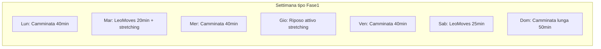

# Piano di trasformazione fisica — Benessere

## Contesto e valutazione iniziale

| Parametro | Valore | Nota |
|-----------|--------|------|
| Altezza / Peso | 190 cm / ~120 kg | BMI ~33,2 (obesità classe I) |
| Età | 50-59 anni | Recupero più lento: progressione graduale |
| Condizioni | Ipertensione, affaticamento cronico | Richiedono monitoraggio e approccio conservativo |
| Baseline attività | 10 camminate/sett. (30-45 min), corsa blanda occasionale, stretching, Leo Moves principianti | Ottima base: già oltre le linee guida minime OMS |

**Peso obiettivo realistico (12 mesi):** 105-110 kg (−10/15 kg), con tasso sostenibile di 0,5-0,8 kg/settimana. Obiettivo intermedio a 3 mesi: 115 kg.

**Disclaimer medico (obbligatorio nel documento):** il piano non sostituisce il medico. Con ipertensione serve un controllo pre-esercizio (ECG, valutazione farmaci se presenti, esami del sangue per escludere cause dell'affaticamento: ferro, B12, TSH, glicemia, apnea notturna).

---

## Architettura del progetto

Il workspace [`Benessere`](C:\ProgettiAzure\Codex\Benessere) è vuoto. Struttura proposta:

```
Benessere/
├── README.md                    # Come usare piano + app
├── docs/
│   ├── PIANO-BENESSERE.md       # Piano completo (nutrizione, allenamento, fasi)
│   └── TRACKER-SETTIMANALE.md   # Template stampabile settimanale
└── app/
    ├── index.html
    ├── css/styles.css
    └── js/app.js
```

---

## Parte 1 — Documento [`docs/PIANO-BENESSERE.md`](docs/PIANO-BENESSERE.md)

### Sezione A: Nutrizione equilibrata (ipertensione + perdita peso)

Approccio **Mediterraneo + DASH** (Documenti linee guida ipertensione: riduzione sodio, aumento potassio).

**Principi già corretti da mantenere:**
- Riduzione carboidrati raffinati, dolci, alcol, bevande gassate
- Aumento frutta, verdura, acqua

**Aggiustamenti per sbloccare il peso e gestire l'affaticamento:**

1. **Calorie target:** ~2.000-2.200 kcal/giorno (deficit moderato ~500 kcal). Non scendere sotto 1.800 kcal per evitare peggioramento dell'affaticamento.
2. **Proteine:** 120-140 g/giorno (~1 g/kg peso attuale) — preservano massa muscolare durante il deficit e aumentano sazietà.
3. **Fibre:** minimo 30 g/giorno (verdura a ogni pasto, legumi 3-4 volte/settimana, cereali integrali).
4. **Sodio:** max 2 g/giorno (~5 g sale) — evitare insaccati, snack salati, brodi pronti.
5. **Potassio:** banane, spinaci, patate, fagioli, avocado — aiuta la pressione (se farmaci ACE-inibitori: verificare con medico).
6. **Idratazione:** 2-2,5 L acqua/giorno; limitare caffeina dopo le 14.

**Schema pasti tipo (da adattare):**

| Pasto | Composizione |
|-------|-------------|
| Colazione | Proteina (uova/yogurt greco) + frutta + fibre (avena integrale o pane integrale) |
| Spuntino | Frutta secca (30 g) o frutta fresca |
| Pranzo | ½ piatto verdura + ¼ proteina magra (pollo, pesce, legumi) + ¼ carboidrato integrale |
| Spuntino pomeridiano | Yogurt o hummus + verdure crude |
| Cena | Simile al pranzo, porzioni leggermente più piccole; cena entro 2-3 ore prima del sonno |

**Regole pratiche:**
- Regola del piatto (metodo Harvard Plate)
- Meal prep domenicale (2-3 pranzi pronti → riduce scelte impulsive)
- 1 pasto libero/settimana (non 1 giorno intero) per sostenibilità

### Sezione B: Attività fisica progressiva

**Principi per ipertensione + affaticamento:**
- Priorità all'aerobico moderato (camminata) — riduce PA di 5-8 mmHg
- Evitare sforzo isometrico intenso e breath-holding (Leo Moves: preferire varianti facili)
- Monitorare PA prima/dopo attività nelle prime 4 settimane
- Riposo attivo quando affaticamento > 7/10

**Programma settimanale (Fase 1 — settimane 1-8):**



| Giorno | Attività | Durata | Intensità |
|--------|----------|--------|-----------|
| Lun/Mer/Ven | Camminata | 40 min | RPE 4-5 (parli fluentemente) |
| Mar/Sab | Leo Moves (playlist principianti) | 20-25 min | Variante facile, no dolore |
| Gio | Stretching + mobilità | 15-20 min | Recupero |
| Dom | Camminata lunga | 45-50 min | Ritmo costante |
| Opzionale | Corsa blanda | max 20 min, 1x/sett. | Solo se PA post-esercizio OK e ginocchia indolori |

**Progressione Fase 2 (settimane 9-16):**
- Camminate → inclini o ritmo leggermente più svelto
- Leo Moves: passare alla playlist intermedia quando 3 sessioni consecutive senza affaticamento eccessivo
- Aggiungere 1 sessione forza a corpo libero strutturata (squat a sedia, push-up a muro, plank 20-30 sec × 3)

**Progressione Fase 3 (mesi 5-12):**
- Obiettivo: 150+ min aerobico/settimana (già quasi raggiunto)
- 2 sessioni forza/settimana
- Corsa blanda fino a 30 min, 2x/sett. se articolazioni reggono

**Segnali di stop (da includere nel documento):**
- Dolore toracico, vertigini, nausea durante sforzo
- PA sistolica > 180 o diastolica > 110 durante o dopo esercizio
- Affaticamento che non migliora con 2 giorni di riposo

### Sezione C: Sonno, recupero e gestione affaticamento

- Sonno: 7-8 ore, orario fisso ±30 min
- Sveglia luce naturale entro 30 min dal risveglio
- Screentime zero 60 min prima di dormire
- Magnesio alimentare (noci, semi di zucca, verdure a foglia verde)
- Valutare screening apnea del sonno se russamento/sonno non ristoratore

### Sezione D: Monitoraggio e revisione

**Metriche settimanali:**
- Peso (media 7 giorni, non singola pesata)
- Circonferenza vita (obiettivo < 102 cm)
- PA media (mattina a riposo)
- Energia percepita (scala 1-10)
- Minuti attività totali

**Revisione ogni 4 settimane:** adattare calorie (−100 se plateau > 3 settimane e energia OK) o aggiungere riposo se affaticamento peggiora.

---

## Parte 2 — App locale [`app/`](app/)

**Stack:** HTML/CSS/JS statico, dati in `localStorage`, UI in italiano, design pulito e leggibile (mobile-friendly per inserimento rapido).

**Funzionalità MVP:**

1. **Dashboard giornaliera**
   - Peso (kg)
   - Pressione arteriosa (sistolica/diastolica) — critico per ipertensione
   - Energia percepita (1-10)
   - Note libere

2. **Log attività**
   - Tipo: camminata / corsa / Leo Moves / stretching / altro
   - Durata (minuti)
   - Intensità percepita (RPE 1-10)

3. **Log alimentazione semplificato**
   - Checkbox obiettivi giornalieri (non conteggio calorie complesso):
     - 5 porzioni frutta/verdura
     - Proteina a ogni pasto principale
     - Acqua ≥ 2 L
     - Sodio controllato (no cibi ultra-processati)
     - Pasto libero (sì/no)

4. **Riepilogo settimanale**
   - Media peso, totale minuti attività per tipo
   - Giorni obiettivi alimentari raggiunti
   - Media PA se registrata

5. **Persistenza ed export**
   - Salvataggio automatico in `localStorage`
   - Export/import JSON per backup

**Schizzo UI (single page, tab navigation):**

```
[ Oggi | Attività | Alimentazione | Settimana | Impostazioni ]
```

**Implementazione tecnica essenziale in [`app/js/app.js`](app/js/app.js):**
- Modello dati: `{ date: "2026-07-03", weight, bp: {sys, dia}, energy, activities: [], nutrition: {...} }`
- Array `history[]` in localStorage key `benessere-data`
- Calcolo medie settimanali lato client
- CSS con variabili per tema chiaro, font di sistema, touch target ≥ 44px

---

## Parte 3 — [`docs/TRACKER-SETTIMANALE.md`](docs/TRACKER-SETTIMANALE.md)

Template markdown stampabile con griglia 7 giorni × colonne (peso, PA, attività, checklist alimentare, energia, note). Utile come backup cartaceo quando non si usa l'app.

---

## Fasi di implementazione (sviluppo progetto)

### Fase dev 1 — Documentazione
- Scrivere `PIANO-BENESSERE.md` completo con tutte le sezioni sopra
- Scrivere `TRACKER-SETTIMANALE.md` e `README.md`

### Fase dev 2 — App MVP
- Creare `index.html` con struttura tab e form
- Implementare CRUD giornaliero + localStorage in `app.js`
- Styling responsive in `styles.css`
- Test manuale: aprire `index.html` nel browser, inserire 7 giorni di dati fittizi, verificare persistenza e riepilogo

### Fase dev 3 — Raffinamenti leggeri
- Grafico trend peso (canvas o CSS bar chart semplice, no librerie esterne)
- Validazione input (peso 40-300, PA 60-250)
- Messaggio iniziale con disclaimer medico

---

## Cosa NON fare (scope contenuto)

- Nessun backend, login o database remoto
- Nessun conteggio calorie automatico (troppo complesso per MVP; checklist obiettivi basta)
- Nessuna integrazione wearable (Apple Health, etc.)
- Nessuna raccomandazione di farmaci o integratori specifici

---

## Verifica successo

| Criterio | Target a 3 mesi |
|----------|-----------------|
| Peso | ≤ 115 kg |
| Camminate | Mantenute ≥ 8/settimana |
| Leo Moves | 2 sessioni/settimana costanti |
| PA a riposo | Trend in calo (se monitorata col medico) |
| Energia | Miglioramento percepito ≥ +2 punti su scala 1-10 |
| Tracking | ≥ 5 giorni/settimana registrati nell'app |
