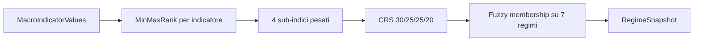
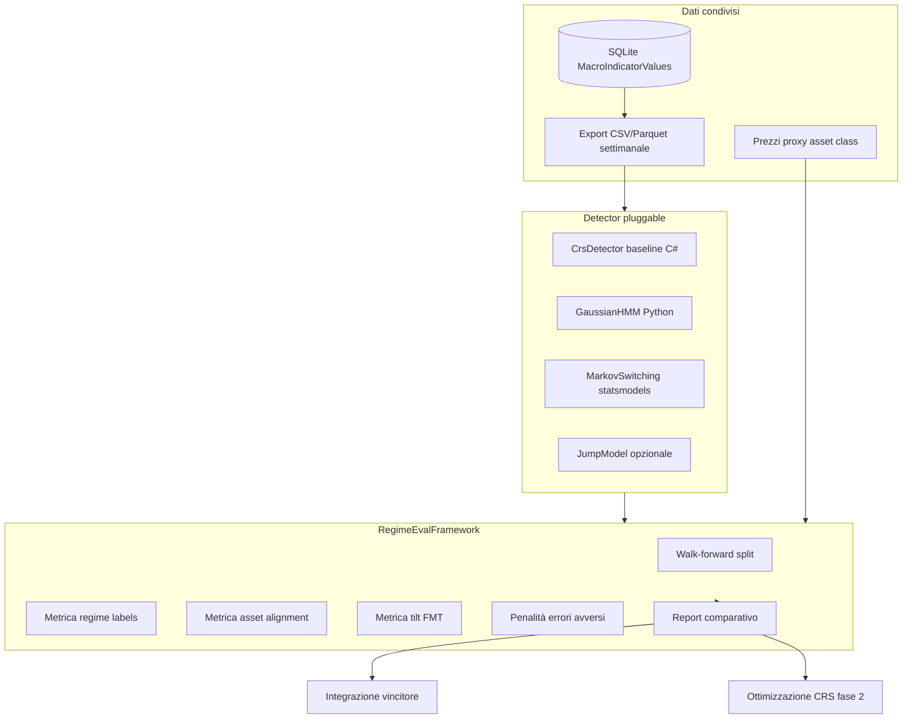

# Miglioramento calcolo regime macro

## Contesto attuale

Il sistema implementa un **Composite Regime Score (CRS)** in C# con pipeline:



File chiave:
- Orchestrazione: [`RegimeDetectionService.cs`](src/PortfolioMonitor.Infrastructure/RegimeDetection/RegimeDetectionService.cs)
- Scoring e classificazione: [`MacroIndicator.cs`](src/PortfolioMonitor.Domain/Entities/MacroIndicator.cs) (`ComputeRank`, `RegimeSnapshot.Compute`, `RegimeDefinitions` hardcoded)
- Replay storico: `ComputeRangeAsync` (settimanale) — unico strumento esistente, **nessun backtesting strutturato**
- Spec FMT: [`docs/012_Framework_macro_tattico_Claude.md`](docs/012_Framework_macro_tattico_Claude.md) — diverge parzialmente dal codice (es. Monetary senza Taylor rule, 23 indicatori con peso 0)

**Gap principali da colmare:**
- Pesi indicatori, pesi CRS e soglie regime sono **fissi nel codice/DB** senza validazione out-of-sample
- Nessun progetto test / nessun modulo research
- Nessuna interfaccia pluggable per confrontare detector alternativi

---

## Scelte confermate

| Scelta | Valore |
|--------|--------|
| Priorità prima fase | **Benchmark OSS** (Percorso B) |
| Criterio di successo | **Multi-metrica** (regime + asset returns + tilt FMT + bias conservativo) |

---

## Architettura target



**Principio guida (FMT §1.4):** la funzione obiettivo composite **penalizza asimmetricamente** i falsi negativi su regimi avversi (Stagflation, DeflationBust) rispetto ai falsi positivi su regimi favorevoli.

---

## Fase 0 — Preparazione minima del core C# (1 sprint breve)

Prerequisito per benchmark equo e per la fase 2 di ottimizzazione.

1. **Estrarre parametri hardcoded** da [`MacroIndicator.cs`](src/PortfolioMonitor.Domain/Entities/MacroIndicator.cs):
   - Pesi CRS (30/25/25/20) → `RegimeScoringConfig` (JSON o tabella DB)
   - `RegimeDefinitions` → configurazione esterna versionabile
   - Mantenere default identici al comportamento attuale

2. **Introdurre interfaccia detector** in Application layer:
   ```csharp
   interface IRegimeDetector {
       Task<RegimeDetectionResult> DetectAsync(DateOnly date, RegimeDetectorContext ctx, CancellationToken ct);
   }
   ```
   - `CrsRegimeDetector` = refactor di logica attuale in `RegimeDetectionService`
   - `RegimeDetectionService` resta orchestratore (fetch dati, persistenza)

3. **Endpoint export dati research** (API o CLI):
   - `GET api/regime/research/export?from=&to=` → indicator values + snapshots + metadata indicatori
   - Formato: CSV/Parquet per consumo Python

4. **Allineamento doc vs codice**: tabella gap FMT ↔ implementazione in `docs/regime-calibration-notes.md` (solo delta, non duplicare FMT)

---

## Fase 1 — Framework di valutazione + benchmark OSS (priorità)

### 1.1 Modulo research Python

Nuova cartella: [`research/regime-eval/`](research/regime-eval/)

```
research/regime-eval/
  pyproject.toml          # statsmodels, hmmlearn, pandas, pyarrow, scikit-learn
  config/
    ground_truth.yaml     # periodi NBER, crisi, etichette FMT manuali
    assets.yaml           # VWCE, IEF/AGG, GLD, DBC proxy
    walk_forward.yaml     # train 10y / test 2y / step 1y
  src/
    data_loader.py        # legge export da PortfolioMonitor
    detectors/
      crs_replica.py      # replica esatta formula C# (validazione parity)
      hmm_gaussian.py     # 3-4 stati, feature macro
      markov_switching.py # statsmodels MarkovRegression
      growth_inflation_quadrant.py  # rule-based FMT semplificato
    metrics/
      regime_labels.py    # vs NBER + etichette curate
      asset_alignment.py  # rendimenti condizionati al regime
      tilt_simulation.py  # simula pesi FMT da RegimeController
      conservative_bias.py
      composite_score.py  # aggregazione pesata multi-metrica
    walk_forward.py
    run_benchmark.py      # CLI entry point
  notebooks/
    01_parity_check.ipynb
    02_benchmark_results.ipynb
  reports/                # output HTML/JSON (gitignored tranne template)
```

**Perché Python separato:** l'ecosistema OSS regime (statsmodels, hmmlearn) è Python-native; evita di portare subito librerie ML in produzione C#. Il modulo research produce **parametri e raccomandazioni**, non sostituisce il runtime web.

### 1.2 Shortlist candidati OSS da valutare

| Tier | Candidato | Motivo | Integrabilità |
|------|-----------|--------|---------------|
| **A** | **CRS baseline** (nostro) | Riferimento | Già in produzione |
| **A** | **Gaussian HMM** ([ShrishDhuria/macro_regime](https://github.com/ShrishDhuria/macro_regime) pattern) | Walk-forward documentato, 3 stati interpretabili, feature macro | Media — mapping stati→regimi FMT |
| **A** | **Markov Switching** (statsmodels) | Standard econometrico, Hamilton filter, ben testato | Media — 2-4 regimi latenti |
| **B** | **Growth/Inflation quadrant** (ispirato [finskills/macro-regime-detector](https://github.com/finskills/macro-regime-detector)) | Interpretabile, allineato FMT | Alta — rule-based portabile in C# |
| **B** | **Jump Model** ([nxd914/allocation-focused-regime](https://github.com/nxd914/allocation-focused-regime)) | Allocation-focused, walk-forward + Sharpe opt | Bassa — JAX, regimi factor-based diversi |
| **C** | RAMPA, MacroDynamiX | Troppo complessi / chiusi | Solo riferimento metodologico |

**Esclusi dalla shortlist iniziale:** pipeline RL (RAMPA), skill/API commerciali (finskills), MS-VAR accademico (chirinda) — utili come lettura, non come integrazione diretta.

### 1.3 Protocollo walk-forward (anti-overfitting)

- **Frequenza:** settimanale (allineata a `ComputeRangeAsync`)
- **Split rolling:** train 10 anni → test 2 anni → avanzamento 1 anno (configurabile)
- **Vincoli:**
  - Rank bounds e pesi calibrati **solo su train**
  - Nessun peek su test per selezione iperparametri
  - Report separato in-sample vs out-of-sample
- **Feature set comune:** stessi 19 indicatori attivi (peso > 0) + opzionale subset ridotto (5 feature HMM: growth proxy, inflation proxy, HY spread, yield curve, VIX)

### 1.4 Metriche composite (pesi suggeriti)

| Metrica | Cosa misura | Fonte ground truth | Peso indicativo |
|---------|-------------|-------------------|-----------------|
| **Regime accuracy** | Concordanza con etichette | NBER recession, periodi crisi curati (2008, 2011, 2015, 2020, 2022), matrice FMT | 25% |
| **Asset alignment** | Regime predetto vs rendimenti relativi attesi | Proxy: VWCE, IEF, GLD, DBC — rendimenti 4-13 sett. post-classificazione | 25% |
| **Tilt simulation** | Performance simulata tilt FMT vs baseline strategica | Tabella allocazione in [`RegimeController.cs`](src/PortfolioMonitor.Web/Controllers/RegimeController.cs) | 30% |
| **Conservative bias** | Penalità asimmetrica errori avversi | FMT §1.4: FN su Stagflation/DeflationBust ×3 vs FP su Goldilocks | 20% |

**Composite score** = somma pesata normalizzata per fold walk-forward; ranking finale = media OOS (out-of-sample) only.

### 1.5 Deliverable Fase 1

- Report benchmark JSON + notebook riassuntivo con ranking detector
- Test parity C# ↔ Python su 50 date campione (CRS deve matchare entro ε)
- Raccomandazione documentata: **integrare / adottare idee / scartare** per ogni candidato
- Decision gate prima di Fase 2

---

## Fase 2 — Integrazione del vincitore OSS

Strategia per gradi (dalla più semplice alla più invasiva):

1. **Enrichment (consigliato come primo step):** secondo segnale "regime confidence" in UI — es. HMM concorda/disconcorda con CRS; nessun cambio allocazione automatica
2. **Hybrid classifier:** usare HMM/Markov per calibrare soglie fuzzy `RegimeDefinitions` offline; applicare parametri calibrati al CRS esistente
3. **Detector alternativo:** nuovo `IRegimeDetector` in produzione con feature flag `Regime:PrimaryDetector = Crs|HMM|Ensemble`

**Mapping regimi latenti → FMT:** tabella di mapping configurabile (es. HMM state 0 = RiskOff → {DeflationBust, Stagflation}) con probabilità; evita forzare 7 regimi FMT su 3 stati HMM.

---

## Fase 3 — Ottimizzazione interna pesi/soglie (Percorso A)

Riutilizza **lo stesso** `research/regime-eval/` — cambia solo lo spazio di ricerca:

**Parametri ottimizzabili:**
- `Weight` per indicatore (per sub-indice, somma normalizzata a 1)
- `RankMinValue` / `RankMaxValue` (con vincoli: min < max, range plausibile ±20% dal valore storico)
- Pesi CRS sub-indici (Growth/Inflation/Risk/Monetary)
- Soglie `RegimeDefinitions` (±0.05 per fold)

**Algoritmo:**
- Grid search / Bayesian optimization (optuna) su train fold
- Selezione su composite score OOS
- **Regularization:** penalità L2 su deviazione dai pesi FMT originali (evita overfitting estremo)
- Output: profilo parametri "calibrated v2" versionato in DB/JSON, confrontabile con default

**Salvaguardie anti-overfitting (obbligatorie):**
- Walk-forward obbligatorio (no ottimizzazione full-sample)
- Stability test: parametri simili tra fold adiacenti
- Sanity check: regime distribution non degenerata (no >80% singolo regime)
- Review manuale prima di promuovere in produzione

---

## Dipendenze e rischi

| Rischio | Mitigazione |
|---------|-------------|
| Overfitting su dati storici | Walk-forward + penalità deviazione FMT + report IS/OOS separati |
| Parity C#/Python | Test automatico su date campione prima di ogni benchmark |
| HMM non interpretabile | Mapping configurabile + visualizzazione probabilità in UI |
| Dati mancanti pre-2000 | Backtest window configurabile (default: 2005–2025) |
| Rank bounds fissi attuali | Durante eval, opzione `useRollingBounds=true` per confronto |

---

## Ordine di implementazione consigliato

1. Fase 0 — parametri configurabili + export API + interfaccia `IRegimeDetector`
2. Fase 1.1–1.3 — scaffold Python + parity check CRS
3. Fase 1.4 — implementare 3 detector (CRS replica, HMM, Markov) + metriche composite
4. Fase 1.5 — primo benchmark walk-forward + report
5. Decision gate → Fase 2 (integrazione) o Fase 3 (ottimizzazione interna) in base ai risultati

**Stima effort:** Fase 0 ~2-3 giorni, Fase 1 completa ~1-2 settimane, Fase 2/3 dipendono dall'esito benchmark.
