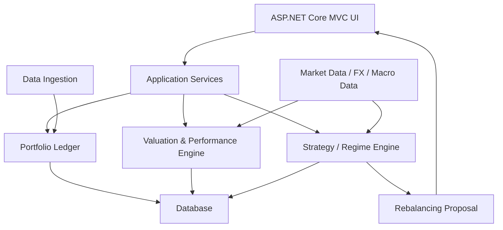

# Pianificazione iniziale del sistema informativo

## Obiettivo

Costruire un sistema informativo per la gestione di portafogli finanziari personali, sviluppato in C# con interfaccia web ASP.NET Core MVC.

Il sistema avra' due nuclei principali:

1. Gestione del portafoglio.
2. Gestione della strategia di portafoglio regime-aware.

Il primo nucleo deve fornire un ledger affidabile, auditabile e multivaluta. Il secondo nucleo usera' dati di portafoglio, dati macroeconomici e dati di mercato per produrre scenari, bande target e proposte di ribilanciamento.

## Scelta tecnologica

La soluzione sara' sviluppata come applicazione web ASP.NET Core MVC.

Runtime consigliato:

- .NET 10 LTS, perche' e' la versione LTS piu' recente.
- C# come linguaggio principale.
- Entity Framework Core per accesso dati e migrations.
- Database relazionale, inizialmente SQLite o SQL Server LocalDB in sviluppo, con possibilita' di passare a SQL Server/PostgreSQL.
- Razor Views per l'interfaccia MVC.
- Test con xUnit o NUnit.

## Architettura logica



## Struttura della solution

```text
Finance.sln
  src/
    Finance.Web/              ASP.NET Core MVC, Razor, controllers, views
    Finance.Application/      Use case, DTO, validation, orchestration
    Finance.Domain/           Entita', value object, regole di dominio
    Finance.Infrastructure/   EF Core, repository, import, provider dati
    Finance.Analytics/        Performance, rischio, allocazione, regime models
  tests/
    Finance.Domain.Tests/
    Finance.Application.Tests/
    Finance.Analytics.Tests/
```

## Moduli funzionali

### 1. Gestione portafoglio

Funzionalita' principali:

- Anagrafica owner, portafogli, conti, strumenti, asset class e valute.
- Registrazione di acquisti e vendite.
- Registrazione di depositi e prelievi.
- Gestione di dividendi, cedole, interessi, commissioni e tasse.
- Calcolo delle posizioni correnti.
- Calcolo del costo medio e del cost basis.
- Gestione cash per valuta.
- Calcolo del profitto e perdita realizzato.
- Calcolo del profitto e perdita non realizzato.
- Calcolo rendimento TWR e XIRR/MWR.
- Dashboard patrimonio, allocazione, performance, rischio e flussi.
- Grafici prezzi e andamento del valore del portafoglio.

### 2. Valuation e performance

Funzionalita' principali:

- Prezzi storici degli strumenti.
- Tassi FX storici.
- Valorizzazione giornaliera del portafoglio.
- Snapshot giornalieri delle posizioni.
- Performance in valuta locale e valuta base.
- Separazione tra effetto prezzo, effetto income ed effetto cambio.
- Benchmark nella stessa valuta base del portafoglio.
- Metriche di rischio: volatilita', drawdown, Sharpe, Sortino, tracking error.

### 3. Data ingestion e qualita' dati

Funzionalita' principali:

- Import manuale.
- Import CSV broker.
- Import JSON/XML in una fase successiva.
- Mapping configurabile delle colonne.
- Rilevamento transazioni duplicate.
- Controllo prezzi mancanti.
- Controllo FX mancanti.
- Riconciliazione quantita' strumenti.
- Riconciliazione saldo cash.
- Tracciamento della provenance dei dati.

### 4. Strategia di portafoglio regime-aware

Funzionalita' principali:

- Definizione della policy strategica personale.
- Target allocation per asset class.
- Bande minime e massime per ogni asset class.
- Feature store macro e market.
- Classificazione del regime macro/market.
- Stato operativo: espansione, espansione inflazionistica, rallentamento, recessione/stress, ripresa, incerto/transizione.
- Output probabilistico del regime, non solo label discreta.
- Regole di isteresi per evitare eccessivo turnover.
- Scenario engine per rischio, rendimento e correlazioni condizionati al regime.
- Allocation engine vincolato.
- Proposte di ribilanciamento.
- Report mensile spiegabile.

### 5. Rebalancing

Funzionalita' principali:

- Calcolo drift rispetto al target.
- Proposta di ribilanciamento semplice.
- Soglie minime di intervento.
- Cash buffer.
- Min trade size.
- Stima costi, imposte e slippage.
- No-sell rebalancing.
- Blocco o riduzione del ribilanciamento in caso di segnale incerto.

## Modello dati iniziale

Entita' minime:

- Owner
- Portfolio
- Account
- Instrument
- AssetClass
- Currency
- Transaction
- CorporateAction
- Price
- FxRate
- HoldingSnapshot
- CashFlow
- Benchmark
- TargetAllocation
- PerformanceSeries

Entita' aggiuntive consigliate:

- ImportBatch
- DataSource
- AuditEvent
- PortfolioPolicy
- RegimeObservation
- RegimeSignal
- AllocationProposal
- RebalanceRecommendation

## Campi minimi per transazione

Ogni transazione deve memorizzare almeno:

- Data trade.
- Data settlement.
- Tipo transazione.
- Strumento.
- Quantita'.
- Prezzo.
- Valuta prezzo.
- Importo lordo.
- Commissioni.
- Tasse.
- Conto cash.
- Conto titoli.
- FX applicato.
- Note.
- Import source.
- Identificativo broker.

## Regole operative sui rendimenti

Il sistema deve implementare almeno:

- TWR giornaliero.
- TTWROR o variante equivalente.
- XIRR per portafoglio e account.
- Rendimento per periodo selezionabile.
- Rendimento annualizzato.
- Rendimento cumulato.
- Rendimento money-weighted per obiettivo personale.
- Benchmark nella stessa valuta base.
- Decomposizione per flussi, prezzo, income e FX.

Regole pratiche:

- Usare TWR per confrontare strategia e benchmark.
- Usare MWR/XIRR per valutare l'esperienza effettiva dell'investitore.
- Separare flussi esterni da operazioni interne.
- Trattare dividendi e cedole in modo coerente.
- Calcolare performance su base giornaliera quando possibile.
- Salvare snapshot giornalieri per riproducibilita'.
- Non mescolare rendimento pre-tax e after-tax senza etichetta esplicita.

## Regole operative sulla multivaluta

Il sistema deve:

- Salvare ogni transazione nella valuta originale.
- Salvare il cambio storico usato.
- Distinguere valuta strumento, valuta conto e valuta base.
- Calcolare performance in valuta locale e valuta base.
- Separare effetto cambio da effetto prezzo.
- Gestire cash residuale in ogni valuta.
- Usare fonti FX tracciabili e versionate.

## Regole operative per la strategia

Il regime macroeconomico deve essere trattato come informazione di contesto ad alta utilita' ma ad alta incertezza.

Regole principali:

- Non usare un singolo indicatore per dichiarare il regime.
- Richiedere conferma multi-dimensionale: crescita, inflazione, credito, trend, volatilita'.
- Usare probabilita' e soglie.
- Cambiare regime operativo solo dopo conferme successive.
- Introdurre isteresi: soglia di ingresso diversa dalla soglia di uscita.
- Mantenere uno stato incerto/transizione quando i segnali sono misti.
- Salvare sempre il motivo della classificazione.
- Modificare bande e budget di rischio, non l'identita' strategica dell'investitore.
- Vietare allocazioni estreme salvo policy esplicita.
- Limitare turnover mensile/trimestrale.
- Valutare costi e fiscalita' prima di ribilanciare.

## Roadmap

### Fase 1: Fondamenta

- Creare solution ASP.NET Core MVC.
- Creare progetti Domain, Application, Infrastructure, Analytics e Web.
- Configurare EF Core.
- Configurare database di sviluppo.
- Creare layout UI iniziale.
- Creare seed dati minimi: EUR, USD, asset class principali, portafoglio demo.

### Fase 2: Ledger portafoglio

- CRUD portafogli.
- CRUD conti.
- CRUD strumenti.
- CRUD transazioni.
- Gestione depositi e prelievi.
- Gestione acquisti e vendite.
- Calcolo posizioni correnti.
- Storico operazioni.
- Audit trail.

### Fase 3: Valutazione e performance

- Gestione prezzi storici.
- Gestione tassi FX storici.
- Snapshot giornalieri.
- Calcolo P&L realizzato.
- Calcolo P&L non realizzato.
- Calcolo TWR.
- Calcolo XIRR.
- Grafici valore portafoglio, allocazione e rendimenti.

### Fase 4: Import e qualita' dati

- Import CSV broker.
- Mapping colonne configurabile.
- Rilevamento duplicati.
- Controlli su prezzi mancanti.
- Controlli su FX mancanti.
- Riconciliazione saldo cash.
- Riconciliazione quantita' strumenti.

### Fase 5: Strategia base

- Definire policy strategica target per asset class.
- Definire bande min/max.
- Calcolare drift rispetto al target.
- Generare proposta di ribilanciamento semplice.
- Visualizzare differenza fra allocazione corrente e target.

### Fase 6: Macro-regime engine

- Creare feature store macro/mercato.
- Implementare classificazione iniziale rule-based.
- Gestire stato incerto/transizione.
- Memorizzare probabilita' e motivazioni del regime.
- Generare report mensile regime-aware.

### Fase 7: Strategia avanzata

- Introdurre HMM/clustering.
- Calcolare scenari per regime.
- Implementare backtest walk-forward.
- Implementare ottimizzazione vincolata.
- Aggiungere stress test.
- Aggiungere controllo turnover, costi e fiscalita'.

## Primo passo operativo

Il primo passo operativo sara' creare lo scaffold della solution MVC e il modello dominio/EF Core.

La priorita' e' costruire un ledger affidabile: senza dati di portafoglio coerenti, i moduli di performance, rischio e strategia non possono produrre risultati attendibili.
