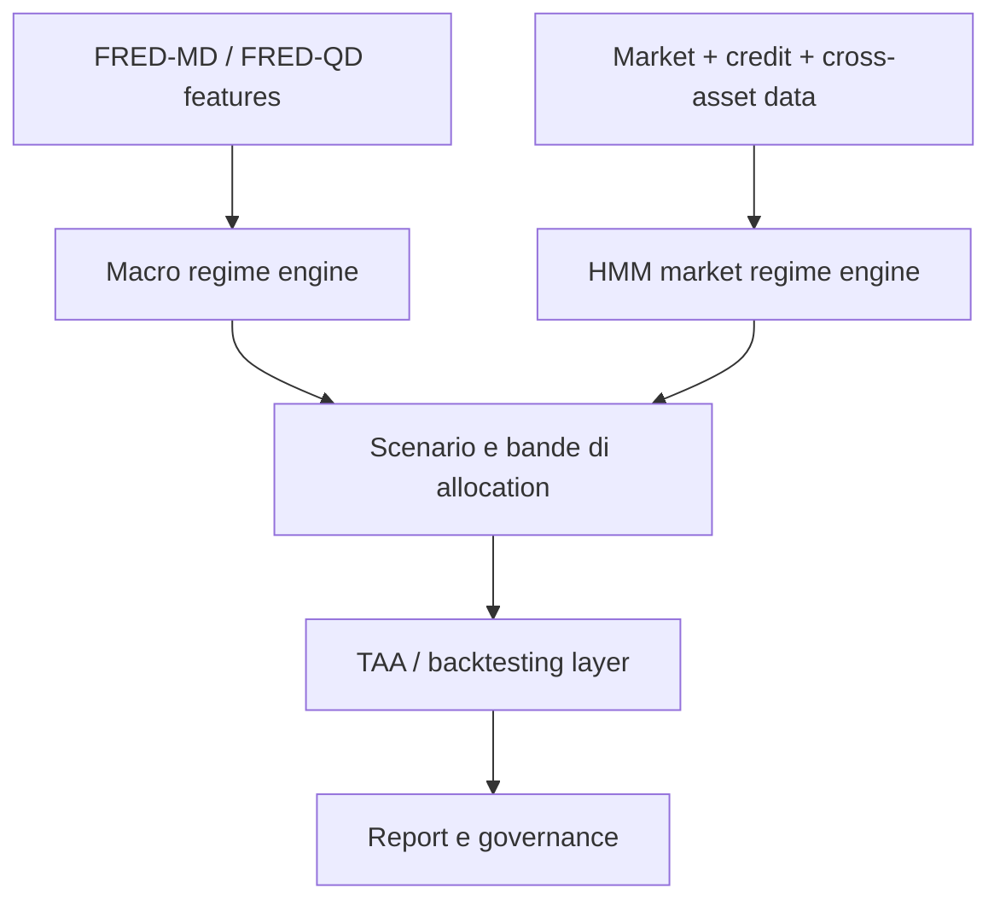

# Analisi di progetti GitHub per determinazione di regimi macro/market regime e asset allocation

Data analisi: 2026-06-29

Documento collegato: `macro_regime_asset_allocation_sota.md`

## Obiettivo

Questo documento analizza repository GitHub focalizzati, o fortemente collegati, alla determinazione di regimi macroeconomici e di mercato per supportare asset allocation strategica, tattica o risk management di portafogli personali.

L'analisi considera due dimensioni:

1. **Aderenza alla letteratura accademica**: coerenza con i paper gia' sintetizzati su Markov switching, HMM, FRED-MD/FRED-QD, asset allocation intertemporale, regimi macro e gestione del rischio di coda.
2. **Consenso della comunita' sviluppatori**: stelle, fork, issue/PR, commit, release, documentazione, packaging, test, riproducibilita' e segnali di manutenzione.

Le metriche GitHub sono state rilevate dalle pagine pubbliche dei repository il 2026-06-29; possono cambiare nel tempo.

## Executive Summary

Il panorama GitHub e' frammentato. Non emerge ancora un singolo progetto open-source dominante per la determinazione di regimi macroeconomici finalizzata alla Strategic Asset Allocation personale. I progetti migliori si dividono in quattro famiglie:

- **Macro regime research**: repository direttamente centrati su regimi macro-finanziari, spesso con FRED/FRED-MD, PCA, credit spread, yield curve e clustering.
- **Market regime/HMM framework**: progetti piu' operativi su HMM, regime detection, risk-on/risk-off, backtesting e trading.
- **Dataset e feature engineering macro**: repository essenziali per alimentare un sistema informativo, ma non sufficienti da soli per decidere l'allocation.
- **Tactical asset allocation/backtesting**: strumenti utili per tradurre segnali in portafogli, ma spesso meno rigorosi sulla classificazione macro.

La conclusione progettuale e' netta: per costruire un sistema informativo robusto conviene combinare piu' progetti, non adottarne uno solo.

La combinazione piu' coerente e':

- **Snow-Ouyang/Market-Regime-Clustering** come riferimento macro-regime interpretabile;
- **geoluna/FactorModels** o **cagdemir/fred-md-calculation** come layer FRED-MD/FRED-QD e feature engineering macro;
- **hidden-regime/hidden-regime** o **blackswan-quants/marketregime_hmm** come ispirazione per pipeline HMM, temporal isolation e reporting;
- **oronimbus/tactical-asset-allocation** come riferimento TAA/backtesting e collegamento alla letteratura su Dynamic Strategic Asset Allocation;
- **yvesdhondt/MarketMoodRing** e **gcosta151/RS-Portfolio-Opt** come riferimenti specifici per regime-dependent portfolio optimization;
- **braverock/PortfolioAnalytics** come motore maturo di ottimizzazione, risk budgeting e walk-forward da alimentare con regimi esterni;
- **KMueller-Lab/Global-Macro-Database** come dataset macro globale di supporto, non come motore di regime.

## Criteri di valutazione

### Aderenza accademica

| Punteggio | Significato |
|---:|---|
| 5 | Allineamento diretto con macro regime detection, FRED-MD/FRED-QD, HMM/Markov switching, asset allocation e validazione |
| 4 | Molto utile, ma focalizzato piu' su market regime o TAA che su macro regime |
| 3 | Collegato come componente di supporto, dataset o dimostrazione |
| 2 | Applicabile solo con adattamenti significativi |
| 1 | Tangenziale |

### Consenso e maturita' community

| Punteggio | Significato |
|---:|---|
| 5 | Ampio uso/consenso, molte stelle/fork, package, test, release, manutenzione visibile |
| 4 | Buon consenso relativo alla nicchia, struttura software convincente |
| 3 | Interesse moderato o progetto piccolo ma ben documentato |
| 2 | Poche metriche community, codice utile ma immaturo |
| 1 | Esperimento/notebook poco mantenuto |

## Progetti analizzati

### 1. Snow-Ouyang/Market-Regime-Clustering

URL: https://github.com/Snow-Ouyang/Market-Regime-Clustering

**Descrizione**

Repository di ricerca su macro regime clustering con feature macro-finanziarie mensili, Jump Models, analisi di stabilita', validazione esterna e mapping degli asset tra azioni, bond, petrolio e oro.

**Metriche GitHub osservate**

| Metrica | Valore |
|---|---:|
| Stelle | 8 |
| Fork | 0 |
| Issue aperte | 0 |
| Pull request aperte | 0 |
| Commit | 11 |
| Release | 1, `v1.0.0`, 2026-04-08 |
| Linguaggio | Python |
| Licenza | MIT |

**Metodologia**

Il progetto propone un modello finale a 4 stati basato su Jump Model. Le variabili principali sono:

- `growth_pc1`;
- `inflation_pc1`;
- rendimento Treasury 10 anni (`gs10`);
- term spread 10 anni - 1 anno;
- credit spread `BAA - AAA`.

Il modello preferito aggiunge il credit spread rispetto al baseline a 3 stati, per isolare uno stato di **Macro-Financial Stress**. I quattro regimi sono:

| Stato | Nome regime | Interpretazione |
|---|---|---|
| `state_0` | Late-Cycle / Inflationary Flat Curve | Crescita moderata, curva piatta, pressione inflazionistica |
| `state_1` | Low-Rate / Steep Curve | Tassi bassi, curva ripida, condizioni finanziarie piu' facili |
| `state_2` | High-Rate / Resilient Growth | Tassi restrittivi ma crescita resiliente |
| `state_3` | Macro-Financial Stress | Crescita debole, spread larghi, volatilita' elevata |

**Collegamento con i paper**

| Paper/tema | Collegamento |
|---|---|
| McCracken & Ng, FRED-MD/FRED-QD | Usa feature macro-finanziarie e logica di fattori/PCA coerente con la letteratura FRED-MD |
| Blitz & van Vliet, Dynamic Strategic Asset Allocation | La classificazione per stati macro-finanziari e il mapping asset sono coerenti con la SAA dinamica per regimi |
| Ang & Bekaert | Lo stato di stress con spread/volatilita' alti richiama bear regime e aumento correlazioni |
| Guidolin & Timmermann | Approccio multi-stato coerente con regimi crash/slow growth/bull/recovery, pur senza portfolio choice ottimale |
| Hamilton | Logica di stati persistenti e non lineari, anche se implementata con Jump Model invece di Markov switching classico |

**Punti di forza**

- Molto allineato al tema macro-regime.
- Feature compatte e interpretabili: crescita, inflazione, curva, credito.
- Il credit spread consente di distinguere crisi/stress da normali regimi di ciclo.
- Include asset mapping cross-asset: S&P 500, Treasury bond, petrolio, oro.
- Buona documentazione, risultati curati, dati e output inclusi.
- Release esplicita e licenza MIT.

**Limiti**

- Consenso community ancora basso: 8 stelle e 0 fork.
- Non e' un motore completo di asset allocation, ma un framework descrittivo di segmentazione.
- Non sembra pensato per produzione o aggiornamento automatico live.
- La validazione e' narrativa/storica; per uso operativo servirebbero walk-forward, costi, turnover, fiscalita' e out-of-sample rigido.

**Valutazione**

| Dimensione | Score |
|---|---:|
| Aderenza accademica | 5/5 |
| Consenso community | 2/5 |
| Maturita' software | 3/5 |
| Utilita' per sistema informativo | 5/5 |

**Uso consigliato**

Usarlo come riferimento primario per il design del **macro regime engine** interpretabile. Non usarlo da solo per generare ordini o pesi di portafoglio.

---

### 2. ARahimiQuant/forecasting-economic-and-market-regimes

URL: https://github.com/ARahimiQuant/forecasting-economic-and-market-regimes

**Descrizione**

Progetto di forecasting di regimi economici e di mercato usando machine learning e framework CRISP-DM. Usa FRED-MD per le feature, NBER Business Cycle Dating per etichette economiche e 1-trend-filtering per etichette di market regime.

**Metriche GitHub osservate**

| Metrica | Valore |
|---|---:|
| Stelle | 16 |
| Fork | 5 |
| Issue aperte | 0 |
| Pull request aperte | 0 |
| Commit | 2 |
| Licenza | MIT |

**Metodologia**

- Feature macro da FRED-MD.
- Label economiche da NBER expansion/recession chronology.
- Label di mercato tramite 1-trend-filtering.
- Modelli ML, con XGBoost indicato come miglior modello per prevedere il regime economico a un mese.

**Collegamento con i paper**

| Paper/tema | Collegamento |
|---|---|
| McCracken & Ng | Forte: FRED-MD e' esplicitamente usato come base macro |
| Hamilton | Indiretto: previsione di recessioni/regimi economici, ma non Markov switching |
| Campbell & Viceira | Indiretto: utile come variabile di stato per portafogli intertemporali |
| Cunha Oliveira et al. | Concettualmente vicino: ML su FRED-MD per regime detection |
| Ang & Bekaert / Guidolin & Timmermann | Meno diretto: non e' centrato su distribuzioni di asset per stato |

**Punti di forza**

- Molto coerente con un layer macro predittivo.
- Usa etichette NBER, utili come benchmark esterno.
- Introduce separazione fra regime economico e regime di mercato.
- Fork/stars leggermente superiori rispetto ai repo macro-regime piu' recenti.

**Limiti**

- Solo 2 commit: segnale di manutenzione debole.
- Probabile natura da progetto dimostrativo/portfolio piu' che libreria riusabile.
- Rischio di label leakage se non gestita bene la disponibilita' real-time dei dati NBER.
- Le etichette NBER sono ex-post e non disponibili in tempo reale; per un sistema operativo bisogna trattarle come ground truth storica, non come input live.

**Valutazione**

| Dimensione | Score |
|---|---:|
| Aderenza accademica | 4/5 |
| Consenso community | 2/5 |
| Maturita' software | 2/5 |
| Utilita' per sistema informativo | 4/5 |

**Uso consigliato**

Buon riferimento per costruire un **modulo supervised recession/regime probability**, ma da riscrivere con pipeline robusta, vintage data e walk-forward validation.

---

### 3. geoluna/FactorModels

URL: https://github.com/geoluna/FactorModels

**Descrizione**

Implementazione Python del codice Matlab di McCracken & Ng per stimare factor models e fare previsioni con FRED-MD e FRED-QD.

**Metriche GitHub osservate**

| Metrica | Valore |
|---|---:|
| Stelle | 19 |
| Fork | 8 |
| Issue aperte | 0 |
| Pull request aperte | 0 |
| Commit | 7 |
| Release | Nessuna |
| Linguaggio | Python |

**Metodologia**

Il repository:

- carica dati FRED-MD/FRED-QD;
- trasforma le serie in forma stazionaria;
- rimuove outlier;
- stima fattori con PCA;
- usa criteri informativi per scegliere il numero di fattori;
- gestisce missing values con algoritmo EM iterativo;
- calcola R-squared e marginal R-squared dei fattori.

**Collegamento con i paper**

| Paper/tema | Collegamento |
|---|---|
| McCracken & Ng | Diretto: implementa il codice per FRED-MD/FRED-QD |
| Cunha Oliveira et al. | Supporto: fornisce il feature layer per macro regime detection |
| Campbell & Viceira | Supporto: fattori macro possono diventare variabili di stato |
| Hamilton / HMM | Non diretto |
| Ang & Bekaert / Guidolin & Timmermann | Non diretto, ma utile come input macro |

**Punti di forza**

- Forte allineamento alla base dati accademica piu' rilevante.
- Include trasformazioni, outlier handling, PCA e EM.
- 19 stelle e 8 fork: buon segnale relativo alla nicchia.
- Utile come base di feature store macro.

**Limiti**

- Non identifica regimi direttamente.
- Poche commit e nessuna release.
- Non e' un sistema di asset allocation.
- Va integrato con regime engine, backtesting e data-vintage governance.

**Valutazione**

| Dimensione | Score |
|---|---:|
| Aderenza accademica | 4/5 |
| Consenso community | 3/5 |
| Maturita' software | 2/5 |
| Utilita' per sistema informativo | 4/5 |

**Uso consigliato**

Componente utile per il **feature store macro**. Da affiancare a un classificatore di regime e a un motore di allocazione.

---

### 4. cagdemir/fred-md-calculation

URL: https://github.com/cagdemir/fred-md-calculation

**Descrizione**

Script Python per calcolare e preprocessare FRED-MD. Il progetto converte una libreria Matlab in Python e aggiunge recupero dati via API della St. Louis Fed.

**Metriche GitHub osservate**

| Metrica | Valore |
|---|---:|
| Stelle | 8 |
| Fork | 2 |
| Issue aperte | 0 |
| Pull request aperte | 0 |
| Commit | 7 |
| Release | Nessuna |
| Licenza | MIT |
| Linguaggio | Python |

**Metodologia**

- Download dati FRED-MD via API St. Louis Fed.
- Preprocessamento di circa 150 variabili macro mensili.
- Trasformazione delle serie in variabili stazionarie.

**Collegamento con i paper**

| Paper/tema | Collegamento |
|---|---|
| McCracken & Ng | Diretto |
| Cunha Oliveira et al. | Supporto per feature macro |
| Hamilton/HMM/Markov switching | Non diretto |
| Asset allocation regime-based | Non diretto |

**Punti di forza**

- Utile per automatizzare data ingestion FRED-MD.
- Semplice, focalizzato, licenza MIT.
- Puo' ridurre lavoro manuale nella costruzione del dataset macro.

**Limiti**

- Non include regime detection.
- Poca attivita' community.
- Non include governance dei dati vintage.
- Non include test/packaging significativi.

**Valutazione**

| Dimensione | Score |
|---|---:|
| Aderenza accademica | 3/5 |
| Consenso community | 2/5 |
| Maturita' software | 2/5 |
| Utilita' per sistema informativo | 3/5 |

**Uso consigliato**

Utile come riferimento per data ingestion FRED-MD, soprattutto se si vuole replicare in Python la trasformazione delle serie. Meno completo di `geoluna/FactorModels` per estrazione fattori.

---

### 5. KMueller-Lab/Global-Macro-Database

URL: https://github.com/KMueller-Lab/Global-Macro-Database

**Descrizione**

Repository con codice di replica e dati grezzi per il Global Macro Database. Il dataset collegato al paper Müller, Xu, Lehbib e Chen (2025) include 73 variabili macroeconomiche per 240 paesi, da dati storici fino al 2024 e proiezioni fino al 2029.

**Metriche GitHub osservate**

| Metrica | Valore |
|---|---:|
| Stelle | 250 |
| Fork | 32 |
| Issue aperte | 0 |
| Pull request aperte | 0 |
| Commit | 52 |
| Release corrente | `2026_03`, 2026-04-01/03 |
| Licenza | CC BY-NC-SA 4.0 |

**Metodologia**

Non e' un progetto di regime detection, ma un dataset macro globale e storico. Copre variabili macro, finanza pubblica, prezzi, debito, trade, moneta, GDP e altre aree.

**Collegamento con i paper**

| Paper/tema | Collegamento |
|---|---|
| McCracken & Ng | Complementare: dataset macro ampio, ma non FRED-MD/FRED-QD |
| Campbell & Viceira | Utile come fonte di variabili di stato di lungo periodo |
| Regimi macro globali | Molto utile per estendere analisi oltre USA |
| Asset allocation personale | Supporto, non motore decisionale |

**Punti di forza**

- Il piu' forte consenso GitHub tra i progetti analizzati: 250 stelle e 32 fork.
- Dataset ampio, globale, storico e collegato a paper.
- Release recente e repository strutturato.
- Utile per backtest macro storici e cross-country.

**Limiti**

- Non e' un motore di regime.
- Licenza non commerciale; attenzione se il sistema informativo ha uso commerciale.
- Frequenza e granularita' possono non essere ideali per decisioni mensili di portafoglio personale.
- Proiezioni future vanno trattate separatamente dai dati osservati.

**Valutazione**

| Dimensione | Score |
|---|---:|
| Aderenza accademica | 4/5 |
| Consenso community | 5/5 |
| Maturita' software/dati | 4/5 |
| Utilita' per sistema informativo | 3/5 |

**Uso consigliato**

Usarlo come **fonte macro globale di supporto** per analisi storiche, stress test e contesto internazionale. Non usarlo come motore principale per segnali mensili senza adattamento.

---

### 6. blackswan-quants/marketregime_hmm

URL: https://github.com/blackswan-quants/marketregime_hmm

**Descrizione**

Framework riproducibile per market regime detection usando Gaussian HMM e clustering DTW su dati multi-asset. Il sistema identifica stati latenti risk-on, neutral e risk-off da segnali macroeconomici e cross-asset.

**Metriche GitHub osservate**

| Metrica | Valore |
|---|---:|
| Stelle | 8 |
| Fork | 4 |
| Issue aperte | 0 |
| Pull request aperte | 0 |
| Commit | 39 |
| Licenza | MIT |
| Linguaggio | Python |

**Metodologia**

Pipeline dichiarata:

- dati da FRED + Yahoo Finance;
- feature engineering market/credit/cross-asset;
- test di stazionarieta' ADF e KPSS;
- filtro collinearita' VIF < 5;
- PCA per categoria;
- concatenazione feature;
- model selection con penalized BIC per `k=2..10`, ottimo `k=3`;
- Gaussian HMM e regime labels.

**Collegamento con i paper**

| Paper/tema | Collegamento |
|---|---|
| Hamilton | Diretto nella logica HMM/regime switching |
| Ang & Bekaert | Forte: risk-on/risk-off e bear/high-volatility regime |
| Guidolin & Timmermann | Forte: stati latenti e distribuzioni di asset differenti |
| McCracken & Ng | Indiretto/dati macro da FRED |
| Collin-Dufresne et al. | Parziale, se il credit/liquidity layer viene esteso |

**Punti di forza**

- Buona struttura rispetto alla maggior parte dei repo piccoli.
- 39 commit, pre-commit, linting e approccio "production-grade" dichiarato.
- Usa dati macro e cross-asset, non solo prezzi.
- Include report PDF e metodo di selezione numero stati.
- Buona coerenza con le regole operative: stazionarieta', PCA, VIF, BIC.

**Limiti**

- Community piccola.
- Non e' focalizzato su asset allocation strategica personale.
- Bisogna verificare nel codice l'assenza di look-ahead bias e la gestione di vintage/revisioni macro.
- HMM risk-on/risk-off puo' essere piu' market regime che macro regime.

**Valutazione**

| Dimensione | Score |
|---|---:|
| Aderenza accademica | 4/5 |
| Consenso community | 2/5 |
| Maturita' software | 4/5 |
| Utilita' per sistema informativo | 4/5 |

**Uso consigliato**

Ottimo riferimento per il **market regime engine probabilistico** e per la pipeline di preprocessamento/validazione.

---

### 7. hidden-regime/hidden-regime

URL: https://github.com/hidden-regime/hidden-regime

**Descrizione**

Pacchetto Python per market regime detection con HMM, architettura pipeline, temporal data isolation, backtesting, event studies, reporting Markdown, esempi e integrazione MCP.

**Metriche GitHub osservate**

| Metrica | Valore |
|---|---:|
| Stelle | 6 |
| Fork | 5 |
| Issue aperte | 0 |
| Pull request aperte | 0 |
| Commit | 19 |
| Release | 1, `v2.0.0`, 2025-11-24 |
| Licenza | MIT |
| Linguaggi | Python 89.5%, Jupyter 9.1%, Shell 1.3%, Dockerfile 0.1% |

**Metodologia**

Il progetto propone pipeline:

`Data -> Observation -> Model -> Analysis -> Report`

Caratteristiche dichiarate:

- HMM a 2-5 stati;
- Baum-Welch training e Viterbi inference;
- isolamento temporale per backtesting;
- analisi di regime: rendimenti, volatilita', win rate, drawdown, regime strength;
- event study per crash, bubble, sector rotation;
- trading simulation con risk management;
- report Markdown;
- esempi su SPY, QQQ, TLT e altri ticker.

**Collegamento con i paper**

| Paper/tema | Collegamento |
|---|---|
| Hamilton | Diretto: HMM/Markov switching |
| Ang & Bekaert | Diretto: market regimes e risk management |
| Guidolin & Timmermann | Diretto: stati latenti e caratterizzazione regime-dependent |
| Collin-Dufresne et al. | Parziale: risk management/trading, ma liquidita' non centrale |
| McCracken & Ng | Debole: non e' macro/FRED-MD oriented |

**Punti di forza**

- Tra i migliori dal punto di vista architetturale.
- Temporal isolation esplicitamente menzionata: molto importante per evitare look-ahead bias.
- Include test, docs, examples, Docker, changelog, contributing.
- Reporting Markdown integrabile con un sistema informativo.
- Pipeline chiara e riusabile.

**Limiti**

- Community piccola: 6 stelle.
- Market regime basato soprattutto su prezzi/yfinance, non macro regime.
- Non direttamente collegato a FRED-MD o regimi macro crescita/inflazione.
- Rischio che la documentazione sia piu' ambiziosa della validazione empirica effettiva; va ispezionato il codice prima del riuso.

**Valutazione**

| Dimensione | Score |
|---|---:|
| Aderenza accademica | 4/5 |
| Consenso community | 2/5 |
| Maturita' software | 4/5 |
| Utilita' per sistema informativo | 4/5 |

**Uso consigliato**

Ottimo riferimento per architettura software, temporal isolation, reportistica e API. Da estendere con feature macro vere.

---

### 8. LSEG-API-Samples/Article.RD.Python.MarketRegimeDetectionUsingStatisticalAndMLBasedApproaches

URL: https://github.com/LSEG-API-Samples/Article.RD.Python.MarketRegimeDetectionUsingStatisticalAndMLBasedApproaches

**Descrizione**

Notebook/articolo dimostrativo di LSEG/Refinitiv per market regime detection con HMM, k-means e Gaussian Mixture Models. Identifica stati normal/growth e crash sullo S&P 500 e confronta una strategia semplice con buy-and-hold.

**Metriche GitHub osservate**

| Metrica | Valore |
|---|---:|
| Stelle | 62 |
| Fork | 9 |
| Issue aperte | 0 |
| Pull request aperte | 0 |
| Commit | 7 |

**Metodologia**

- Regime detection non supervisionata.
- Modelli: Gaussian HMM, k-means, Gaussian Mixture Models.
- Focus su S&P 500.
- Confronto con buy-and-hold.
- Usa Refinitiv Data Library per Python.

**Collegamento con i paper**

| Paper/tema | Collegamento |
|---|---|
| Hamilton | Diretto per HMM |
| Ang & Bekaert | Parziale: normal/crash e bear/high-volatility |
| Guidolin & Timmermann | Parziale: stati latenti, ma singolo asset |
| McCracken & Ng | Assente |
| Asset allocation multi-asset | Debole |

**Punti di forza**

- Piu' consenso GitHub rispetto ai piccoli repo HMM: 62 stelle.
- Fonte istituzionale/practitioner riconoscibile.
- Buono per apprendere confronto fra HMM, k-means e GMM.
- Notebook semplice da seguire.

**Limiti**

- Esempio didattico, non framework.
- Dipendenza da Refinitiv/LSEG.
- Focus su S&P 500, non macro e non multi-asset SAA.
- Poco adatto direttamente a portafoglio personale.

**Valutazione**

| Dimensione | Score |
|---|---:|
| Aderenza accademica | 3/5 |
| Consenso community | 4/5 |
| Maturita' software | 2/5 |
| Utilita' per sistema informativo | 3/5 |

**Uso consigliato**

Buon materiale di confronto metodologico per HMM/k-means/GMM, ma non base architetturale principale.

---

### 9. oronimbus/tactical-asset-allocation

URL: https://github.com/oronimbus/tactical-asset-allocation

**Descrizione**

Pacchetto `pyTAA` per backtestare strategie sistematiche low-frequency e confrontare programmi di Tactical Asset Allocation. Include codice, notebook, test e distribuzione PyPI.

**Metriche GitHub osservate**

| Metrica | Valore |
|---|---:|
| Stelle | 50 |
| Fork | 12 |
| Issue aperte | 4 |
| Pull request aperte | 1 |
| Commit | 127 |
| Licenza | MIT |
| Package | PyPI `pytaa` |

**Metodologia**

Il progetto non e' centrato su macro regime detection, ma su TAA:

- backtesting sistematico low-frequency;
- confronto fra strategie;
- momentum signals e dual momentum;
- asset allocation tra stocks, bonds, cash, commodities;
- obiettivi di diversificazione, drawdown control e risk management.

La README cita esplicitamente tra i riferimenti:

- Antonacci, "Risk Premia Harvesting Through Dual Momentum";
- Blitz e van Vliet, "Dynamic Strategic Asset Allocation: Risk and Return Across Economic Regimes".

**Collegamento con i paper**

| Paper/tema | Collegamento |
|---|---|
| Blitz & van Vliet | Diretto: citato nelle references |
| Ang & Bekaert | Concettualmente vicino: scelta fra asset class e cash |
| Campbell & Viceira | Indiretto: asset allocation strategica/dinamica |
| McCracken & Ng | Non diretto |
| HMM/Markov switching | Non centrale |

**Punti di forza**

- Uno dei repo piu' maturi: 127 commit, test, packaging, PyPI.
- Consenso community relativamente alto: 50 stelle e 12 fork.
- Molto utile per implementare e confrontare regole di allocation low-frequency.
- Include riferimenti accademici/practitioner rilevanti.

**Limiti**

- Non determina regimi macro in modo nativo.
- Molte strategie TAA sono momentum/rule-based piu' che macro-probabilistiche.
- La README dichiara WIP.
- Serve integrare un regime engine separato.

**Valutazione**

| Dimensione | Score |
|---|---:|
| Aderenza accademica | 4/5 |
| Consenso community | 4/5 |
| Maturita' software | 4/5 |
| Utilita' per sistema informativo | 4/5 |

**Uso consigliato**

Usarlo come ispirazione per il **backtesting e allocation layer**, non per il regime engine.

---

### 10. I-am-Uchenna/regime-allocation-strategy

URL: https://github.com/I-am-Uchenna/regime-allocation-strategy

**Descrizione**

Strategia multi-asset che usa HMM su regimi di volatilita' derivati dal VIX e ruota tra TLT, GLD e SPY. Include notebook, script, setup, changelog e contributing.

**Metriche GitHub osservate**

| Metrica | Valore |
|---|---:|
| Stelle | 8 |
| Fork | 2 |
| Issue aperte | 0 |
| Pull request aperte | 0 |
| Commit | 11 |
| Licenza | MIT |

**Metodologia**

- HMM gaussiano per identificare stati di volatilita' da VIX.
- Rotazione rule-based tra:
  - SPY;
  - TLT;
  - GLD.
- Include execution lag per evitare look-ahead bias.
- Dati Yahoo Finance dal 2004 al 2026-01-16.
- Analytics e visualizzazioni.

**Collegamento con i paper**

| Paper/tema | Collegamento |
|---|---|
| Hamilton | Diretto: HMM |
| Ang & Bekaert | Forte: cash/bond/equity-like risk-off/risk-on, anche se qui il cash non e' centrale |
| Guidolin & Timmermann | Parziale: stati latenti e asset allocation condizionata |
| Regime-Based Portfolio Allocation HMM+RL 2026 | Molto vicino nell'universo SPY/TLT/GLD |
| McCracken & Ng | Assente |

**Punti di forza**

- Molto vicino all'idea operativa "regime -> asset allocation".
- Usa asset liquidi e comprensibili.
- Considera execution lag, una buona pratica importante.
- Reproducible research con notebook e script.

**Limiti**

- Regime basato quasi solo su volatilita' VIX: non e' macro regime.
- Strategia potenzialmente troppo tattica per SAA personale.
- Community piccola.
- Rischio di overfitting su un universo molto ristretto.

**Valutazione**

| Dimensione | Score |
|---|---:|
| Aderenza accademica | 4/5 |
| Consenso community | 2/5 |
| Maturita' software | 3/5 |
| Utilita' per sistema informativo | 3/5 |

**Uso consigliato**

Buon esempio di **traduzione HMM -> allocation rule**, utile come prototipo didattico. Da rendere piu' prudente, multi-indicatore e vincolato per uso personale.

---

### 11. Sakeeb91/market-regime-detection

URL: https://github.com/Sakeeb91/market-regime-detection

**Descrizione**

Sistema educativo di market regime detection con HMM, GMM, change point detection, regime-conditioned trading e walk-forward validation.

**Metriche GitHub osservate**

| Metrica | Valore |
|---|---:|
| Stelle | 12 |
| Fork | 3 |
| Issue aperte | 7 |
| Pull request aperte | 0 |
| Commit | 1 |

**Metodologia**

- HMM con emissioni gaussiane;
- GMM come alternativa;
- change point detection;
- regimi bull/calm, bear/crisis, transition;
- dati Yahoo Finance;
- feature di rendimento, volatilita' e indicatori tecnici;
- walk-forward validation dichiarata.

**Collegamento con i paper**

| Paper/tema | Collegamento |
|---|---|
| Hamilton | Diretto |
| Ang & Bekaert | Parziale: bear/high-volatility |
| Guidolin & Timmermann | Parziale: regimi latenti |
| McCracken & Ng | Assente |
| Asset allocation personale | Debole/moderato |

**Punti di forza**

- README chiara e didattica.
- Copre HMM, GMM e change point detection.
- Menziona walk-forward validation e no look-ahead.
- Buono come materiale introduttivo.

**Limiti**

- Solo 1 commit: maturita' bassa.
- 7 issue aperte con nessuna PR aperta: segnale da verificare.
- Non focalizzato su macro.
- Probabilmente non pronto come dipendenza di sistema.

**Valutazione**

| Dimensione | Score |
|---|---:|
| Aderenza accademica | 3/5 |
| Consenso community | 2/5 |
| Maturita' software | 1/5 |
| Utilita' per sistema informativo | 2/5 |

**Uso consigliato**

Usarlo solo come riferimento didattico per struttura concettuale e confronto HMM/GMM/change point.

---

### 12. 0x596173736972/MarketRegimeTrader

URL: https://github.com/0x596173736972/MarketRegimeTrader

**Descrizione**

Applicazione quantitativa che usa HMM per rilevare regimi e implementare strategie adattive. Include backtesting, risk management, walk-forward analysis, TDA e generazione automatica di strategie.

**Metriche GitHub osservate**

| Metrica | Valore |
|---|---:|
| Stelle | 13 |
| Fork | 4 |
| Issue aperte | 0 |
| Pull request aperte | 0 |
| Commit | 3 |
| Licenza | MIT |

**Metodologia**

- HMM a 2-4 regimi;
- feature tecniche: returns, volatility, momentum, RSI, volume;
- transition matrix, emission matrix, EM/Baum-Welch;
- backtesting con costi e slippage;
- walk-forward analysis;
- topological data analysis;
- risk analysis.

**Collegamento con i paper**

| Paper/tema | Collegamento |
|---|---|
| Hamilton | Diretto |
| Ang & Bekaert | Parziale |
| Guidolin & Timmermann | Parziale |
| Collin-Dufresne et al. | Parziale: costi/slippage/risk management |
| McCracken & Ng | Assente |

**Punti di forza**

- Ampio scope funzionale: HMM, backtesting, risk, TDA.
- Include costi/slippage e walk-forward.
- Buona ispirazione per architettura di trading/risk layer.

**Limiti**

- Solo 3 commit.
- Ambizione alta rispetto alla maturita' osservabile.
- Non macro regime.
- Generazione automatica di strategie e TDA possono aggiungere complessita' senza beneficio chiaro per SAA personale.

**Valutazione**

| Dimensione | Score |
|---|---:|
| Aderenza accademica | 3/5 |
| Consenso community | 2/5 |
| Maturita' software | 2/5 |
| Utilita' per sistema informativo | 2/5 |

**Uso consigliato**

Da usare come ispirazione per moduli di backtesting/risk, non come nucleo del sistema.

---

### 13. kangchengX/market-regime

URL: https://github.com/kangchengX/market-regime

**Descrizione**

Studio esteso di regime identification su serie finanziarie multivariate, con CNN, AutoEncoder, Siamese Model, matrici di correlazione, k-means++ e hierarchical clustering. Progetto collegato a Insight Investment e a un MSc in Data Science and Machine Learning presso UCL.

**Metriche GitHub osservate**

| Metrica | Valore |
|---|---:|
| Stelle | 2 |
| Fork | 3 |
| Issue aperte | 0 |
| Pull request aperte | 0 |
| Commit | 15 |

**Metodologia**

Modelli principali:

- CFM: Correlation Feature-Based Model con k-means++ e hierarchical clustering;
- DFM: CNN AutoEncoder;
- DCFM: CNN AutoEncoder con connessioni aggiuntive;
- EEM: Siamese CNN end-to-end.

Il progetto usa correlazioni rolling tra indici finanziari e rappresentazioni image-like/matriciali per identificare regimi, con esempi su 2008 GFC e 2019/2020 COVID.

**Collegamento con i paper**

| Paper/tema | Collegamento |
|---|---|
| Ang & Bekaert | Forte sul tema correlazioni che cambiano nei bear market |
| Guidolin & Timmermann | Parziale: stati di mercato multivariati |
| Hamilton/HMM | Debole: non HMM centrale |
| McCracken & Ng | Assente |
| Deep/ML regime detection | Forte come esplorazione ML |

**Punti di forza**

- Interessante per rappresentazione multivariata e correlazioni regime-dependent.
- Affronta un punto chiave della letteratura: correlazioni instabili.
- Include piu' modelli e ablation studies.

**Limiti**

- Community minima.
- Non macro regime.
- Deep learning potenzialmente eccessivo per portafoglio personale.
- Meno interpretabile rispetto a feature macro/credit/yield curve.

**Valutazione**

| Dimensione | Score |
|---|---:|
| Aderenza accademica | 3/5 |
| Consenso community | 1/5 |
| Maturita' software | 2/5 |
| Utilita' per sistema informativo | 2/5 |

**Uso consigliato**

Utile come riferimento sperimentale per **correlation-regime analysis**, non come motore primario.

---

### 14. kieranjwood/deepm

URL: https://github.com/kieranjwood/deepm

**Descrizione**

Codice di replica per il paper "DeePM: Regime-Robust Deep Learning for Systematic Macro Portfolio Management" di Kieran Wood, Stephen J. Roberts e Stefan Zohren.

**Metriche GitHub osservate**

| Metrica | Valore |
|---|---:|
| Stelle | 16 |
| Fork | 9 |
| Issue aperte | 0 |
| Pull request aperte | 0 |
| Commit | 3 |
| Licenza | MIT |

**Metodologia**

Il modello e' un macro portfolio manager deep-learning end-to-end. Elementi dichiarati:

- Directed Delay / Causal Sieve per gestire ragged filtration e asincronia informativa;
- Macroeconomic Graph Prior;
- obiettivo robusto con penalita' smooth worst-window come proxy differenziabile di EVaR;
- backtest 2010-2025 su 50 futures con costi realistici;
- robustezza su CTA Winter, pandemia, inflation shock e higher-for-longer.

**Collegamento con i paper**

| Paper/tema | Collegamento |
|---|---|
| Campbell & Viceira | Indiretto: portfolio management condizionato a stato macro |
| Collin-Dufresne et al. | Forte sul tema costi e robustezza, ma con deep learning |
| Peng/Kim/Mittnik e tail risk | Collegamento concettuale tramite EVaR/worst-window |
| Regime detection classica | Indiretto: "regime-robust" piu' che regime classifier |
| McCracken & Ng | Potenzialmente collegato al macro prior, ma non FRED-MD come centro |

**Punti di forza**

- Forte collegamento a paper recente.
- Affronta problemi importanti: costi, robustezza, regime shift, ragged filtration.
- Interessante per visione avanzata su macro portfolio management.

**Limiti**

- Non e' focalizzato sulla classificazione esplicita di regimi interpretabili.
- Deep learning end-to-end: meno trasparente per un sistema informativo personale.
- Solo 3 commit.
- Potenzialmente troppo complesso e data hungry.

**Valutazione**

| Dimensione | Score |
|---|---:|
| Aderenza accademica | 4/5 |
| Consenso community | 2/5 |
| Maturita' software | 2/5 |
| Utilita' per sistema informativo | 2/5 |

**Uso consigliato**

Da considerare come riferimento di ricerca avanzata, soprattutto per robust optimization e costi. Non consigliato come base per un sistema informativo personale interpretabile.

---

### 15. QuhiQuhihi/regime_model

URL: https://github.com/QuhiQuhihi/regime_model

**Descrizione**

Repository didattico/quantitativo per la rilevazione di regimi di mercato. Usa notebook su Gaussian Mixture Model, Hidden Markov Model e Greedy Gaussian Segmentation. L'obiettivo dichiarato e' automatizzare l'identificazione dei regimi finanziari, evitando etichette manuali costose e soggettive.

**Metriche GitHub osservate**

| Metrica | Valore |
|---|---:|
| Stelle | 121 |
| Fork | 25 |
| Issue aperte | 0 |
| Pull request aperte | 0 |
| Commit | 6 |
| Release | Nessuna |
| Linguaggio | Jupyter Notebook 90.3%, Python 9.7% |

**Metodologia**

Il progetto contiene due filoni:

- **Gaussian Mixture Model / Hidden Markov Model**: usa asset class multiple, incluse azioni, bond, real estate e commodity, per rilevare cambi di regime.
- **Greedy Gaussian Segmentation**: usa una singola asset class, US equity, per catturare shift di regime.

Il README richiama esplicitamente l'articolo Two Sigma su machine learning per regime modeling e il paper di Hallac, Nystrup e Boyd sulla Greedy Gaussian Segmentation.

**Collegamento con i paper**

| Paper/tema | Collegamento |
|---|---|
| Hamilton, Markov switching | HMM come implementazione pratica di stati latenti persistenti |
| Ang & Bekaert | Regimi di mercato come driver di rischio/rendimento e allocation |
| Hallac, Nystrup, Boyd | Collegamento diretto tramite Greedy Gaussian Segmentation |
| Regime come classificazione probabilistica | Coerente con HMM/GMM, ma poco sviluppato come pipeline di allocazione |

**Punti di forza**

- Consenso community relativamente alto per la nicchia: 121 stelle e 25 fork.
- Buon valore didattico per GMM/HMM/GGS.
- Copre piu' asset class nel filone GMM/HMM.
- Chiarisce bene il problema delle etichette manuali nei mercati finanziari.

**Limiti**

- Solo 6 commit e nessuna release.
- Prevalentemente notebook, non package o pipeline produttiva.
- Non e' un sistema macro-regime completo: il focus e' market regime detection.
- Non include governance, walk-forward robusto, asset allocation personale o vincoli di portafoglio.

**Valutazione**

| Dimensione | Score |
|---|---:|
| Aderenza accademica | 3/5 |
| Consenso community | 4/5 |
| Maturita' software | 1/5 |
| Utilita' per sistema informativo | 2/5 |

**Uso consigliato**

Da usare come materiale didattico e come benchmark semplice per GMM/HMM/GGS. Non usarlo come core engine.

---

### 16. braverock/PortfolioAnalytics

URL: https://github.com/braverock/PortfolioAnalytics

**Descrizione**

Package R maturo per ottimizzazione e analisi di portafoglio. Non e' un regime detection engine puro, ma e' molto rilevante come **allocation/optimization layer** da collegare a un motore esterno di regimi macro o di mercato.

**Metriche GitHub osservate**

| Metrica | Valore |
|---|---:|
| Stelle | 104 |
| Fork | 50 |
| Issue aperte | 6 |
| Pull request aperte | 1 |
| Commit | 1,496 |
| Tag | 1 |
| Linguaggi | PostScript 79.9%, R 11.6%, HTML 4.5%, JavaScript 2.9%, TeX 0.7%, CSS 0.3% |

**Metodologia**

Il progetto fornisce:

- ottimizzazione vincolata con box, group, turnover, diversification, leverage e factor exposure constraints;
- obiettivi custom su mean return, variance, expected shortfall/CVaR, risk budgets e coherent second moments;
- backtesting con rebalancing e walk-forward analysis;
- visualizzazione di efficient frontier, risk/reward e distribuzione pesi;
- integrazione con CVXR e solver LP/QP/SOCP/SDP/MIP;
- robust covariance estimators;
- multi-layer optimization;
- supporto dichiarato a regime switching portfolio optimization;
- esempi, demo, vignettes e test suite.

**Collegamento con i paper**

| Paper/tema | Collegamento |
|---|---|
| Campbell & Viceira | Utile come motore di ottimizzazione vincolata per policy strategiche |
| Guidolin & Timmermann | Puo' ricevere input regime-dependent su expected returns/covariance |
| Ang & Bekaert | Utile per tradurre regimi in portafogli con vincoli e risk budget |
| Collin-Dufresne et al. | Supporta CVaR/risk budgeting e puo' integrare regimi di liquidita' |
| Blitz & van Vliet | Utile per backtesting e ribilanciamento walk-forward di SAA dinamica |

**Punti di forza**

- Consenso e maturita' software superiori alla maggior parte dei repository specialistici.
- Molto utile per ottimizzazione vincolata, robust covariance, CVaR e risk budgeting.
- Supporta rebalancing e walk-forward analysis.
- Ampia documentazione, esempi e test.
- E' un buon candidato per il modulo "allocation engine" del sistema informativo.

**Limiti**

- Non determina direttamente regimi macro.
- Richiede un motore esterno per classificare lo stato macro/mercato.
- Ecosistema R: va integrato con pipeline Python o database se il resto del sistema e' Python.

**Valutazione**

| Dimensione | Score |
|---|---:|
| Aderenza accademica | 4/5 |
| Consenso community | 5/5 |
| Maturita' software | 5/5 |
| Utilita' per sistema informativo | 4/5 |

**Uso consigliato**

Usarlo come motore maturo per allocation, risk budgeting, vincoli e walk-forward. Non sostituisce il macro regime engine, ma puo' essere il miglior layer per trasformare segnali di regime in pesi di portafoglio.

---

### 17. yvesdhondt/MarketMoodRing

URL: https://github.com/yvesdhondt/MarketMoodRing

**Descrizione**

Package Python per testare modelli di regime detection e ottimizzatori di portafoglio regime-dependent. Nasce da un progetto di ricerca UC Berkeley Haas MFE 2023. E' uno dei repository piu' pertinenti fra quelli aggiunti perche' collega direttamente regime detection e portfolio optimization.

**Metriche GitHub osservate**

| Metrica | Valore |
|---|---:|
| Stelle | 16 |
| Fork | 5 |
| Issue aperte | 0 |
| Pull request aperte | 0 |
| Commit | 46 |
| Release | Nessuna |
| Linguaggio | Python 100% |
| Licenza | MIT |

**Metodologia**

Il progetto include:

- Hidden Markov Models;
- Wasserstein K-Means clustering;
- portfolio optimization con stochastic programming;
- factor-based optimization;
- uso di stati stimati e matrice di transizione come input dell'ottimizzatore.

L'esempio del README mostra una pipeline esplicita:

1. lettura dati indice;
2. fitting HMM;
3. stima di stati e probabilita';
4. uso della transition matrix;
5. calcolo dei pesi con ottimizzatore regime-dependent.

**Collegamento con i paper**

| Paper/tema | Collegamento |
|---|---|
| Hamilton | HMM e matrice di transizione |
| Ang & Bekaert | Regime-dependent portfolio choice |
| Guidolin & Timmermann | Collegamento diretto tra stati e pesi di portafoglio |
| Blitz & van Vliet | Traduzione operativa dei regimi in allocation |
| Regime probability | Uso esplicito di probabilita' di stato e transizioni |

**Punti di forza**

- Collegamento chiaro tra regime detection e ottimizzazione di portafoglio.
- Include sia HMM sia Wasserstein K-Means.
- Include stochastic programming e factor-based optimization.
- Buona struttura package rispetto a notebook isolati.
- Ha CITATION e riferimento a paper di progetto.

**Limiti**

- Non pubblicato su PyPI.
- Nessuna release.
- Community ancora bassa.
- Va verificata la robustezza di backtest, costi e walk-forward.
- Non sembra focalizzato su macro variabili FRED/FRED-MD, ma su regime di mercato/indice.

**Valutazione**

| Dimensione | Score |
|---|---:|
| Aderenza accademica | 5/5 |
| Consenso community | 2/5 |
| Maturita' software | 3/5 |
| Utilita' per sistema informativo | 4/5 |

**Uso consigliato**

Da studiare come riferimento diretto per il modulo regime -> optimizer. Potrebbe diventare un componente sperimentale, ma richiede audit e test prima di uso operativo.

---

### 18. gcosta151/RS-Portfolio-Opt

URL: https://github.com/gcosta151/RS-Portfolio-Opt

**Descrizione**

Repository Julia per portfolio optimization sotto framework Markov regime-switching. E' collegato direttamente a due paper accademici di Costa e Kwon su risk parity e mean-variance optimization in presenza di regimi.

**Metriche GitHub osservate**

| Metrica | Valore |
|---|---:|
| Stelle | 6 |
| Fork | 3 |
| Issue aperte | 0 |
| Pull request aperte | 0 |
| Commit | 14 |
| Release | Nessuna |
| Linguaggio | Julia 100% |
| Licenza | Apache-2.0 |

**Metodologia**

Il repository implementa esperimenti numerici per:

- Markov regime-switching factor model;
- stima di expected returns e covariance matrix per regime;
- portafogli adattati all'ambiente corrente;
- grandi portafogli computazionalmente trattabili;
- dati da Kenneth French Data Library;
- Fama-French three-factor returns;
- Industry Portfolios.

I modelli disponibili includono:

- nominal mean-variance optimization;
- regime-switching mean-variance optimization;
- nominal minimum variance optimization;
- regime-switching minimum variance optimization;
- risk parity portfolio optimization;
- regime-switching risk parity portfolio optimization.

Il codice include anche un'implementazione Baum-Welch per stimare HMM sui factor returns.

**Collegamento con i paper**

| Paper/tema | Collegamento |
|---|---|
| Costa & Kwon 2019 | Collegamento diretto: risk parity sotto Markov regime switching |
| Costa & Kwon 2020 | Collegamento diretto: regime-switching factor model per mean-variance |
| Hamilton | HMM/Baum-Welch e regimi Markov |
| Guidolin & Timmermann | Portfolio choice con momenti dipendenti dallo stato |
| Ang & Bekaert | Asset allocation adattata ai regimi |

**Punti di forza**

- Collegamento accademico molto forte.
- Implementa sia MVO sia risk parity in versione nominale e regime-switching.
- Usa factor model e momenti regime-dependent, esattamente il ponte richiesto tra regime e allocation.
- Codice in Julia con JuMP/Ipopt, adatto a ottimizzazione.

**Limiti**

- Community molto piccola.
- Nessuna release.
- Repository da esperimenti numerici, non prodotto.
- Focus su fattori e industry portfolios, non macro-regime personale.
- Richiede competenza Julia/JuMP.

**Valutazione**

| Dimensione | Score |
|---|---:|
| Aderenza accademica | 5/5 |
| Consenso community | 1/5 |
| Maturita' software | 2/5 |
| Utilita' per sistema informativo | 4/5 |

**Uso consigliato**

Da usare come riferimento teorico-operativo per implementare ottimizzazione regime-dependent. Non e' la base applicativa, ma e' tra i migliori esempi accademicamente fondati per il legame regime -> momenti -> pesi.

---

### 19. YuvrajChauhan-Fin/macro-liquidity-regime-strategy-v4

URL: https://github.com/YuvrajChauhan-Fin/macro-liquidity-regime-strategy-v4

**Descrizione**

Strategia multi-asset macro-liquidity regime-driven con walk-forward validation, risk budgeting e volatility targeting. Il progetto classifica condizioni di liquidita' globale e alloca tra NIFTY, SPY e GLD.

**Metriche GitHub osservate**

| Metrica | Valore |
|---|---:|
| Stelle | 3 |
| Fork | 0 |
| Issue aperte | 0 |
| Pull request aperte | 0 |
| Commit | 5 |
| Release | Nessuna |
| Linguaggi | Jupyter Notebook 98.7%, Python 1.3% |

**Metodologia**

Il progetto dichiara:

- liquidity composite costruito da US M2 growth ed ECB balance sheet growth;
- percent change;
- smoothing rolling;
- z-score normalization addestrata solo in-sample;
- classificazione in Risk-On, Neutral, Risk-Off;
- nessun look-ahead bias;
- monthly 12-month momentum ranking;
- allocation Risk-On su top 2 equity assets con 60/40;
- allocation Risk-Off 100% gold;
- rebalancing mensile;
- inverse-volatility weighting;
- volatility targeting al 10%;
- 10-year expanding warmup window;
- monthly retraining;
- valutazione out-of-sample;
- costi di transazione inclusi.

I risultati riportati dal README indicano CAGR intorno al 17%, volatilita' circa 12%, Sharpe circa 1.4 e max drawdown -13.25%, su 101 mesi out-of-sample. Questi risultati sono dichiarazioni del repository e vanno verificati indipendentemente.

**Collegamento con i paper**

| Paper/tema | Collegamento |
|---|---|
| Collin-Dufresne et al. | Forte collegamento concettuale con regimi di liquidita' |
| Blitz & van Vliet | Dynamic allocation basata su stato macro/liquidita' |
| Ang & Bekaert | Allocazione risk-on/risk-off condizionata al regime |
| Walk-forward validation | Buona coerenza con requisito di temporal isolation |
| Regimi macro-finanziari | Usa M2 e bilancio BCE come proxy di liquidita' |

**Punti di forza**

- Tema molto pertinente: macro liquidity regime.
- Pipeline modulare: regime engine, portfolio engine, risk engine, volatility targeting, walk-forward.
- Enfasi esplicita su no look-ahead bias e out-of-sample.
- Include risk budgeting, volatility targeting e costi.

**Limiti**

- Solo 3 stelle, 0 fork, 5 commit.
- Universo asset molto ristretto: NIFTY, SPY, GLD.
- Proxy di liquidita' limitati a US M2 ed ECB balance sheet.
- Prevalentemente notebook.
- Risultati dichiarati da verificare con riproduzione indipendente.

**Valutazione**

| Dimensione | Score |
|---|---:|
| Aderenza accademica | 4/5 |
| Consenso community | 1/5 |
| Maturita' software | 2/5 |
| Utilita' per sistema informativo | 3/5 |

**Uso consigliato**

Da usare come esempio di design per un modulo macro-liquidity e per la disciplina walk-forward. Non e' un candidato maturo come base software.

---

### 20. prasants/QuantLite

URL: https://github.com/prasants/QuantLite

**Descrizione**

Toolkit Python quantitativo "fat-tail-native" con regime detection, portfolio construction, risk metrics, backtesting, stress testing, overfitting controls e reportistica. Non e' focalizzato solo su macro-regime, ma contiene molti moduli utili per un sistema informativo robusto.

**Metriche GitHub osservate**

| Metrica | Valore |
|---|---:|
| Stelle | 2 |
| Fork | 0 |
| Issue aperte | 0 |
| Pull request aperte | 0 |
| Commit | 1 |
| Tag | 12 |
| Linguaggio | Python 100% |
| Licenza | MIT |

**Metodologia e moduli rilevanti**

Il README dichiara:

- API per fetch dati, detect regimes, construct portfolio, backtest e tearsheet;
- HMM per regime detection;
- optional `hmmlearn`;
- portfolio optimization con mean-variance, CVaR, risk parity, HRP, Black-Litterman, Kelly;
- rebalancing calendar, threshold e tactical;
- regime attribution;
- FRED come data connector opzionale;
- fat-tail distributions: Student-t, Levy stable, GPD, GEV;
- EVT, VaR, CVaR, Sortino, Calmar, Omega, drawdown;
- copule e tail dependence;
- scenario stress testing;
- Deflated Sharpe Ratio, CSCV/PBO e walk-forward validation;
- regime-switching simulation;
- defensive tilting e regime tearsheets.

**Collegamento con i paper**

| Paper/tema | Collegamento |
|---|---|
| Ang & Bekaert | Regime-aware portfolio construction |
| Hamilton | HMM regime detection |
| Collin-Dufresne et al. | Tail risk, stress e liquidita' possono essere integrati |
| Lopez de Prado / overfitting controls | Collegamento metodologico a backtest forensics |
| Risk management di coda | Forte utilita' per CVaR/EVT/stress |

**Punti di forza**

- Copertura concettuale ampia: regimi, portafoglio, backtest, rischio di coda, forensics.
- Include controlli anti-overfitting spesso assenti nei repo macro-regime.
- API dichiarata molto compatta.
- Supporto FRED e regime attribution.
- Licenza MIT e PyPI indicato nel README.

**Limiti**

- Solo 1 commit e 2 stelle.
- Community praticamente assente.
- Ampiezza funzionale molto elevata rispetto alla storia pubblica del repository: richiede verifica concreta del codice.
- Non e' specificamente macro-regime; e' un toolkit quantitativo generale.

**Valutazione**

| Dimensione | Score |
|---|---:|
| Aderenza accademica | 3/5 |
| Consenso community | 1/5 |
| Maturita' software | 2/5 |
| Utilita' per sistema informativo | 3/5 |

**Uso consigliato**

Da monitorare e usare come check-list funzionale per risk engine, backtest forensics e regime-aware pipeline. Non usarlo come dipendenza critica senza audit.

---

### 21. JackDamato/macro-regime-allocation

URL: https://github.com/JackDamato/macro-regime-allocation

**Descrizione**

Notebook/project per forecasting di regimi inflazionistici e sector allocation. Usa dati macro e market data per costruire un HMM a 3 stati e analizzare la performance dei settori S&P 500 per regime.

**Metriche GitHub osservate**

| Metrica | Valore |
|---|---:|
| Stelle | 3 |
| Fork | 0 |
| Issue aperte | 0 |
| Pull request aperte | 0 |
| Commit | 9 |
| Release | Nessuna |
| Linguaggio | Jupyter Notebook 100% |

**Metodologia**

Il progetto dichiara:

- dati macro da FRED: CPI, Fed Funds, GDP e altri indicatori;
- market data da Yahoo Finance: SPY e sector ETF;
- input standardizzati con z-score;
- Gaussian HMM a 3 stati;
- segmentazione dei ritorni settoriali per regime;
- identificazione di pattern in condizioni di stabilita', tightening e shock;
- dynamic allocation con pesi basati su regime-specific Sharpe-like scores;
- confronto con benchmark equal-weight.

**Collegamento con i paper**

| Paper/tema | Collegamento |
|---|---|
| Hamilton | HMM a 3 stati su dati macro/mercato |
| Blitz & van Vliet | Allocation dinamica per regime macro |
| Ang & Bekaert | Settori e pesi condizionati allo stato |
| McCracken & Ng | Usa indicatori macro FRED, ma non FRED-MD completo |
| Inflation regime | Collegamento diretto a regime inflazionistico e settori |

**Punti di forza**

- Molto allineato al caso "macro regime -> allocation".
- Usa variabili macro interpretabili: CPI, Fed Funds, GDP, term spreads.
- Collega regimi inflazionistici e performance settoriale.
- Output chiari: classificazione regime, sector performance, backtest.

**Limiti**

- Community minima.
- Notebook 100%, nessuna release.
- Non e' una pipeline generalizzabile senza refactoring.
- La metrica "Sharpe-like" va definita e validata con rigore.
- Non tratta fiscalita', costi, turnover o portafoglio personale.

**Valutazione**

| Dimensione | Score |
|---|---:|
| Aderenza accademica | 4/5 |
| Consenso community | 1/5 |
| Maturita' software | 1/5 |
| Utilita' per sistema informativo | 3/5 |

**Uso consigliato**

Da usare come prototipo chiaro per inflation regime e sector allocation. Utile per progettare report settoriali per regime, non come motore produttivo.

## Confronto sintetico

| Repository | Tipo | Stelle | Fork | Aderenza accademica | Consenso community | Maturita' software | Utilita' sistema |
|---|---|---:|---:|---:|---:|---:|---:|
| KMueller-Lab/Global-Macro-Database | Dataset macro globale | 250 | 32 | 4 | 5 | 4 | 3 |
| QuhiQuhihi/regime_model | GMM/HMM/GGS market regimes | 121 | 25 | 3 | 4 | 1 | 2 |
| braverock/PortfolioAnalytics | Portfolio optimization/backtesting | 104 | 50 | 4 | 5 | 5 | 4 |
| LSEG-API-Samples/MarketRegimeDetection | Notebook practitioner | 62 | 9 | 3 | 4 | 2 | 3 |
| oronimbus/tactical-asset-allocation | TAA/backtesting | 50 | 12 | 4 | 4 | 4 | 4 |
| geoluna/FactorModels | FRED-MD/FRED-QD factors | 19 | 8 | 4 | 3 | 2 | 4 |
| ARahimiQuant/forecasting-economic-and-market-regimes | Macro regime forecasting | 16 | 5 | 4 | 2 | 2 | 4 |
| yvesdhondt/MarketMoodRing | Regime detection + optimizer | 16 | 5 | 5 | 2 | 3 | 4 |
| kieranjwood/deepm | Deep macro portfolio | 16 | 9 | 4 | 2 | 2 | 2 |
| 0x596173736972/MarketRegimeTrader | HMM trading app | 13 | 4 | 3 | 2 | 2 | 2 |
| Sakeeb91/market-regime-detection | HMM/GMM demo | 12 | 3 | 3 | 2 | 1 | 2 |
| Snow-Ouyang/Market-Regime-Clustering | Macro regime clustering | 8 | 0 | 5 | 2 | 3 | 5 |
| blackswan-quants/marketregime_hmm | HMM pipeline | 8 | 4 | 4 | 2 | 4 | 4 |
| I-am-Uchenna/regime-allocation-strategy | HMM allocation SPY/TLT/GLD | 8 | 2 | 4 | 2 | 3 | 3 |
| cagdemir/fred-md-calculation | FRED-MD preprocessing | 8 | 2 | 3 | 2 | 2 | 3 |
| gcosta151/RS-Portfolio-Opt | Regime-switching portfolio optimization | 6 | 3 | 5 | 1 | 2 | 4 |
| hidden-regime/hidden-regime | HMM package/pipeline | 6 | 5 | 4 | 2 | 4 | 4 |
| YuvrajChauhan-Fin/macro-liquidity-regime-strategy-v4 | Macro liquidity allocation | 3 | 0 | 4 | 1 | 2 | 3 |
| JackDamato/macro-regime-allocation | Inflation regime sector allocation | 3 | 0 | 4 | 1 | 1 | 3 |
| kangchengX/market-regime | ML/deep market regimes | 2 | 3 | 3 | 1 | 2 | 2 |
| prasants/QuantLite | Fat-tail quant toolkit/regime-aware pipeline | 2 | 0 | 3 | 1 | 2 | 3 |

## Ranking per uso pratico nel sistema informativo

### Tier 1: da studiare e riusare come riferimento diretto

| Repository | Perche' |
|---|---|
| Snow-Ouyang/Market-Regime-Clustering | Migliore allineamento con macro regime interpretabile e asset mapping |
| yvesdhondt/MarketMoodRing | Miglior ponte Python tra regime detection e regime-dependent portfolio optimization |
| gcosta151/RS-Portfolio-Opt | Miglior riferimento accademico-operativo per ottimizzazione Markov regime-switching |
| blackswan-quants/marketregime_hmm | Buona pipeline HMM con feature macro/credit/cross-asset e validazione preliminare |
| hidden-regime/hidden-regime | Migliore architettura software fra i piccoli progetti HMM |
| oronimbus/tactical-asset-allocation | Migliore componente TAA/backtesting e collegamento a Blitz & van Vliet |
| braverock/PortfolioAnalytics | Miglior motore maturo per vincoli, risk budgeting, CVaR, rebalancing e walk-forward |
| geoluna/FactorModels | Componente FRED-MD/FRED-QD per feature macro |

### Tier 2: utili come supporto o confronto

| Repository | Perche' |
|---|---|
| KMueller-Lab/Global-Macro-Database | Ottimo dataset globale, ma non regime engine |
| ARahimiQuant/forecasting-economic-and-market-regimes | Buon esempio FRED-MD + NBER labels + ML |
| JackDamato/macro-regime-allocation | Buon prototipo inflation regime -> sector allocation |
| YuvrajChauhan-Fin/macro-liquidity-regime-strategy-v4 | Buon esempio macro-liquidity + walk-forward + vol targeting, ma community minima |
| LSEG-API-Samples/MarketRegimeDetection | Buon notebook didattico HMM/k-means/GMM |
| I-am-Uchenna/regime-allocation-strategy | Buon prototipo regime -> ETF allocation |
| QuhiQuhihi/regime_model | Buon materiale didattico su GMM/HMM/GGS con consenso superiore alla media della nicchia |

### Tier 3: solo ispirazione o ricerca avanzata

| Repository | Perche' |
|---|---|
| prasants/QuantLite | Checklist ampia per fat-tail risk, forensics e regime-aware pipeline; troppo nuovo per affidamento operativo |
| kieranjwood/deepm | Ricerca avanzata deep macro portfolio, poca interpretabilita' |
| kangchengX/market-regime | Interessante per correlation regimes, ma poco maturo |
| 0x596173736972/MarketRegimeTrader | Ambizioso ma troppo immaturo |
| Sakeeb91/market-regime-detection | Didattico, ma solo 1 commit |

## Consenso della comunita': interpretazione critica

Il consenso GitHub va letto con prudenza. Nel campo macro-regime/asset allocation, le metriche sono basse per quasi tutti i repository specialistici. Le stelle alte spesso premiano:

- repository istituzionali o dataset;
- notebook didattici;
- strumenti generici di TAA;
- progetti facili da capire.

Non premiano necessariamente la qualita' econometrica.

Per esempio:

- **KMueller-Lab/Global-Macro-Database** ha il consenso piu' alto, ma non determina regimi.
- **QuhiQuhihi/regime_model** ha consenso relativamente alto per la nicchia, ma e' soprattutto didattico/notebook.
- **braverock/PortfolioAnalytics** ha maturita' software elevata, ma non e' un regime engine: e' un allocation engine.
- **LSEG-API-Samples** ha 62 stelle, ma e' un notebook dimostrativo su S&P 500.
- **Snow-Ouyang/Market-Regime-Clustering** ha solo 8 stelle, ma e' tra i piu' allineati al problema specifico.
- **hidden-regime/hidden-regime** ha solo 6 stelle, ma ha una struttura software piu' interessante di molti repo piu' stellati.

Quindi per questo dominio conviene usare una metrica composita:

`valore progettuale = aderenza accademica + riproducibilita' + qualita' architetturale + consenso community`

Le stelle da sole sono un indicatore debole.

## Collegamento con il documento accademico precedente

| Principio dal documento SOTA | Repository piu' coerenti |
|---|---|
| Regime come stato probabilistico, non diagnosi certa | blackswan-quants/marketregime_hmm, hidden-regime/hidden-regime, I-am-Uchenna/regime-allocation-strategy |
| Separare regime macro, regime di mercato, regime di portafoglio | Snow-Ouyang/Market-Regime-Clustering, ARahimiQuant/forecasting-economic-and-market-regimes, QuhiQuhihi/regime_model |
| Usare crescita, inflazione, curva, credito | Snow-Ouyang/Market-Regime-Clustering |
| Usare FRED-MD/FRED-QD e fattori macro | geoluna/FactorModels, cagdemir/fred-md-calculation, ARahimiQuant |
| Considerare stress, spread e liquidita' | Snow-Ouyang, blackswan-quants, YuvrajChauhan-Fin/macro-liquidity-regime-strategy-v4; da estendere con Collin-Dufresne et al. |
| Evitare look-ahead bias | hidden-regime, I-am-Uchenna, oronimbus, blackswan-quants, YuvrajChauhan-Fin/macro-liquidity-regime-strategy-v4 |
| Tradurre regime in bande di allocazione, non all-in/out | oronimbus, MarketMoodRing, RS-Portfolio-Opt, I-am-Uchenna come prototipi; da progettare con vincoli personali |
| Misurare drawdown e rischio di coda | oronimbus, hidden-regime, MarketRegimeTrader, deepm, PortfolioAnalytics, QuantLite |
| Preferire interpretabilita' per portafoglio personale | Snow-Ouyang, ARahimiQuant, geoluna, JackDamato/macro-regime-allocation |
| Ottimizzare con momenti dipendenti dal regime | RS-Portfolio-Opt, MarketMoodRing, PortfolioAnalytics |

## Architettura consigliata usando i progetti analizzati

### Componenti suggeriti

| Modulo sistema | Repository di riferimento | Ruolo |
|---|---|---|
| Data ingestion macro USA | geoluna/FactorModels, cagdemir/fred-md-calculation | FRED-MD/FRED-QD, trasformazioni, PCA |
| Dataset macro globale | KMueller-Lab/Global-Macro-Database | Stress test e contesto cross-country |
| Macro regime clustering | Snow-Ouyang/Market-Regime-Clustering | Regimi crescita/inflazione/curva/credito |
| Market regime HMM | blackswan-quants/marketregime_hmm, hidden-regime/hidden-regime | Stati risk-on/risk-off, HMM, temporal isolation |
| Regime-dependent optimization | yvesdhondt/MarketMoodRing, gcosta151/RS-Portfolio-Opt | HMM/WKM, momenti per regime, stochastic programming, risk parity/MVO |
| Allocation/backtest | oronimbus/tactical-asset-allocation, braverock/PortfolioAnalytics | Confronto strategie low-frequency, vincoli, rebalancing, walk-forward |
| Prototype ETF rotation | I-am-Uchenna/regime-allocation-strategy | Esempio semplice regime -> allocation |
| Inflation/sector regime | JackDamato/macro-regime-allocation | Settori S&P 500 condizionati a regime inflazionistico |
| Macro liquidity overlay | YuvrajChauhan-Fin/macro-liquidity-regime-strategy-v4 | Proxy M2/BCE, risk-on/off, volatility targeting |
| Tail risk e backtest forensics | prasants/QuantLite | EVT, CVaR, Deflated Sharpe, CSCV/PBO, regime attribution |
| Reportistica | hidden-regime/hidden-regime | Markdown reports, event studies |

## Regole operative emerse dall'analisi GitHub

1. **Non scegliere solo il repo piu' stellato**: il consenso community e' utile ma non sufficiente.
2. **Separare dataset, modello e allocation**: nessun repo copre bene tutte le parti.
3. **Favorire interpretabilita' macro** per portafogli personali: Snow-Ouyang e ARahimiQuant sono piu' utili di modelli deep end-to-end.
4. **Usare HMM come layer probabilistico di mercato**, non come unica verita' macro.
5. **Integrare FRED-MD/FRED-QD** con pipeline robuste: geoluna e cagdemir sono utili, ma vanno completati con data-vintage controls.
6. **Pretendere temporal isolation**: hidden-regime e I-am-Uchenna evidenziano questo punto; va reso requisito non negoziabile.
7. **Misurare stabilita' dei regimi**: Snow-Ouyang include stability analysis, utile come standard minimo.
8. **Includere credit spread e curva tassi**: sono ricorrenti nei progetti piu' coerenti e nella letteratura.
9. **Aggiungere costi, turnover e fiscalita'**: quasi nessun repo copre bene la parte personale/fiscale.
10. **Usare report mensili spiegabili**: la decisione deve essere leggibile da un investitore, non solo da un modello.
11. **Separare regime detection e ottimizzazione**: `MarketMoodRing`, `RS-Portfolio-Opt` e `PortfolioAnalytics` mostrano che il ponte tecnico corretto e' passare da stato/probabilita' a momenti, vincoli e pesi.
12. **Non confondere market regime e macro regime**: `QuhiQuhihi/regime_model` e molti HMM su prezzi sono utili, ma non sostituiscono variabili macro, credito, curva, inflazione e liquidita'.
13. **Integrare liquidity regime come overlay, non come unica verita'**: `macro-liquidity-regime-strategy-v4` e' interessante, ma M2/BCE sono proxy troppo stretti per guidare l'intera SAA.
14. **Aggiungere controlli anti-overfitting**: `QuantLite` e' immaturo, ma la presenza di Deflated Sharpe, CSCV/PBO e walk-forward e' un requisito metodologico da importare nel sistema.

## Gap rispetto allo stato dell'arte accademico

I repository esaminati coprono bene alcune parti, ma lasciano scoperti aspetti importanti:

| Gap | Implicazione | Azione consigliata |
|---|---|---|
| Poca gestione di dati vintage | Rischio look-ahead sui dati macro revisionati | Integrare ALFRED/FRED vintages o snapshot storici |
| Poca modellazione fiscale | Forte limite per portafoglio personale | Aggiungere tax-aware rebalancing |
| Poca liquidita'/transaction-cost modeling | Rischio di backtest irrealistico | Integrare cost model e turnover budget |
| Poca asset allocation strategica personalizzata | Molti repo fanno trading/TAA generico | Costruire policy a bande per profilo investitore |
| Poca validazione out-of-sample seria | Rischio overfitting | Walk-forward, nested CV, stress su transizioni |
| Pochi riferimenti diretti a Campbell & Viceira | Orizzonte personale poco modellato | Integrare horizon/risk tolerance nel motore |
| Pochi modelli con cash esplicito | Cash spesso ignorato | Modellare cash/monetario come asset class |
| Correlazioni regime-dependent poco usate nell'allocation | Rischio sottostima crisi | Stimare covariance per regime e stress correlation |

## Raccomandazione finale

Per costruire un sistema informativo serio per asset allocation personale, non conviene clonare un singolo repository e adattarlo. Conviene progettare un sistema modulare:

1. **Feature store macro**
   - Base: `geoluna/FactorModels`.
   - Supporto: `cagdemir/fred-md-calculation`.
   - Estensione globale: `KMueller-Lab/Global-Macro-Database`.

2. **Macro regime engine**
   - Base concettuale: `Snow-Ouyang/Market-Regime-Clustering`.
   - Estensione supervisionata: `ARahimiQuant/forecasting-economic-and-market-regimes`.

3. **Market regime engine**
   - Base HMM/credit/cross-asset: `blackswan-quants/marketregime_hmm`.
   - Base architetturale/API/report: `hidden-regime/hidden-regime`.

4. **Allocation e backtesting**
   - Base TAA: `oronimbus/tactical-asset-allocation`.
   - Prototipo regime-allocation: `I-am-Uchenna/regime-allocation-strategy`.
   - Ottimizzazione vincolata matura: `braverock/PortfolioAnalytics`.
   - Ottimizzazione regime-switching accademica: `gcosta151/RS-Portfolio-Opt`.
   - Pipeline regime -> optimizer: `yvesdhondt/MarketMoodRing`.

5. **Governance**
   - Da implementare internamente: versionamento dati, data availability calendar, audit trail, costi, fiscalita', vincoli personali e report mensile.

La soluzione piu' robusta e' quindi un **ensemble informativo**:

- macro regime lento e interpretabile;
- market regime probabilistico e piu' tempestivo;
- modulo opzionale macro-liquidity;
- allocation vincolata a bande strategiche;
- ottimizzazione regime-dependent con risk budget e vincoli personali;
- risk engine con drawdown, CVaR, costi e fiscalita';
- reportistica spiegabile.

## Fonti GitHub analizzate

- https://github.com/Snow-Ouyang/Market-Regime-Clustering
- https://github.com/ARahimiQuant/forecasting-economic-and-market-regimes
- https://github.com/geoluna/FactorModels
- https://github.com/cagdemir/fred-md-calculation
- https://github.com/KMueller-Lab/Global-Macro-Database
- https://github.com/blackswan-quants/marketregime_hmm
- https://github.com/hidden-regime/hidden-regime
- https://github.com/LSEG-API-Samples/Article.RD.Python.MarketRegimeDetectionUsingStatisticalAndMLBasedApproaches
- https://github.com/oronimbus/tactical-asset-allocation
- https://github.com/I-am-Uchenna/regime-allocation-strategy
- https://github.com/Sakeeb91/market-regime-detection
- https://github.com/0x596173736972/MarketRegimeTrader
- https://github.com/kangchengX/market-regime
- https://github.com/kieranjwood/deepm
- https://github.com/QuhiQuhihi/regime_model
- https://github.com/braverock/PortfolioAnalytics
- https://github.com/yvesdhondt/MarketMoodRing
- https://github.com/gcosta151/RS-Portfolio-Opt
- https://github.com/YuvrajChauhan-Fin/macro-liquidity-regime-strategy-v4
- https://github.com/prasants/QuantLite
- https://github.com/JackDamato/macro-regime-allocation

## Riferimenti accademici richiamati

- Ang, A., Bekaert, G., "How Do Regimes Affect Asset Allocation?", NBER Working Paper 10080. https://www.nber.org/papers/w10080
- Guidolin, M., Timmermann, A., "Asset Allocation Under Multivariate Regime Switching", Journal of Economic Dynamics and Control. https://www.sciencedirect.com/science/article/pii/S0165188906002272
- Blitz, D., van Vliet, P., "Dynamic Strategic Asset Allocation: Risk and Return Across Economic Regimes". https://papers.ssrn.com/sol3/papers.cfm?abstract_id=1941777
- McCracken, M. W., Ng, S., "FRED-MD: A Monthly Database for Macroeconomic Research". https://www.tandfonline.com/doi/abs/10.1080/07350015.2015.1086655
- McCracken, M. W., Ng, S., "FRED-QD: A Quarterly Database for Macroeconomic Research". https://www.nber.org/papers/w26872
- Campbell, J. Y., Chan, Y. L., Viceira, L. M., "A Multivariate Model of Strategic Asset Allocation". https://www.nber.org/papers/w8566
- Campbell, J. Y., Chacko, G., Rodriguez, J., Viceira, L. M., "Strategic Asset Allocation in a Continuous-Time VAR Model". https://www.nber.org/papers/w9547
- Collin-Dufresne, P., Daniel, K., Sağlam, M., "Liquidity Regimes and Optimal Dynamic Asset Allocation". https://www.nber.org/papers/w24222
- Hamilton, J. D., "A New Approach to the Economic Analysis of Nonstationary Time Series and the Business Cycle". https://doi.org/10.2307/1912559
- Cunha Oliveira, D., Sandfelder, D., Fujita, A., Dong, X., Cucuringu, M., "Tactical Asset Allocation with Macroeconomic Regime Detection". https://arxiv.org/abs/2503.11499
