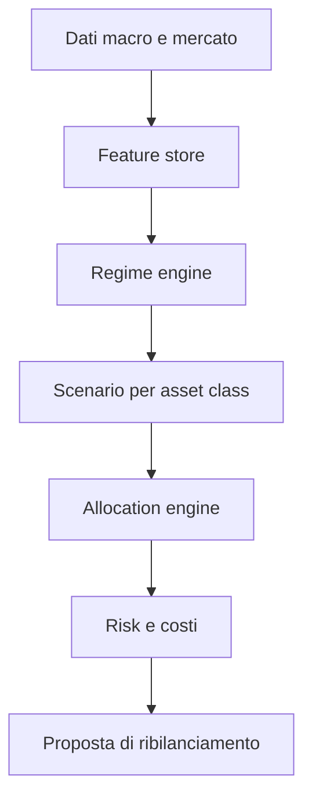

# Stato dell'arte sulla determinazione del regime macroeconomico per l'asset allocation strategica di un portafoglio personale

Data: 2026-06-29

## Scopo del documento

Questo documento sintetizza la letteratura accademica e tecnico-quantitativa sulla determinazione dei regimi macroeconomici e di mercato a supporto dell'asset allocation strategica di un portafoglio finanziario personale.

L'obiettivo non è costruire un modello predittivo "perfetto", ma definire le regole concettuali e operative per progettare un sistema informativo capace di:

- classificare il contesto macro-finanziario corrente;
- stimare probabilisticamente la transizione fra regimi;
- tradurre il regime in vincoli e preferenze di asset allocation;
- evitare overfitting, market timing ingenuo e turnover eccessivo;
- mantenere coerenza con obiettivi, orizzonte, fiscalità, costi e tolleranza al rischio dell'investitore personale.

Nota: il contenuto ha finalità di ricerca e progettazione. Non costituisce consulenza finanziaria personalizzata.

## Sintesi esecutiva

La letteratura converge su un punto forte: rendimenti, volatilità, correlazioni e liquidità degli asset non sono stabili nel tempo. Cambiano in modo non lineare fra fasi di espansione, rallentamento, recessione, ripresa, crisi di liquidità, inflazione elevata e contesti di risk-on/risk-off. Per questo una asset allocation statica può essere razionale come ancora strategica, ma un sistema informativo moderno dovrebbe almeno misurare il regime e il rischio di transizione.

I paper più rilevanti mostrano tre approcci complementari:

1. **Regimi latenti sui rendimenti finanziari**: modelli Markov switching, Hidden Markov Model, regime-switching GARCH. Sono utili perché catturano stati non osservabili come bear market, alta volatilità, crisi e recupero.
2. **Regimi macroeconomici osservabili o dedotti da grandi dataset macro**: classificazioni su crescita, inflazione, politica monetaria, occupazione, credito e condizioni finanziarie, spesso usando FRED-MD/FRED-QD e tecniche di clustering o fattori.
3. **Regimi come input di portfolio construction**: il regime non deve produrre direttamente un "all-in/all-out", ma modificare aspettative di rendimento, rischio, correlazione, liquidità, budget di rischio e limiti di esposizione.

La regola progettuale più importante è separare tre livelli:

- **classificazione del regime**: che stato macro/finanziario sembra prevalere;
- **decisione di asset allocation**: quali pesi sono coerenti con obiettivi, vincoli e costi;
- **controllo del rischio e implementazione**: come limitare turnover, errori di modello, drawdown, fiscalità e slippage.

Per un portafoglio personale, il sistema dovrebbe essere più prudente rispetto a un modello istituzionale: frequenza mensile o trimestrale, asset liquidi e diversificati, pesi vincolati, ribilanciamento controllato, soglie di conferma, stress test e revisione umana.

## Documenti accademici e tecnici selezionati

| Area | Documento | Contributo principale | Implicazione operativa |
|---|---|---|---|
| Regime switching e asset allocation | Andrew Ang, Geert Bekaert, "How Do Regimes Affect Asset Allocation?", NBER Working Paper 10080, 2003/2004. Fonte: [NBER](https://www.nber.org/papers/w10080) | I bear market presentano alta volatilità e correlazioni elevate. I regimi sono più utili quando l'investitore può scegliere fra azioni, bond e cash, non solo fra mercati azionari internazionali. | Prevedere una componente cash/monetaria come asset class attiva nei regimi difensivi. |
| Regime switching multivariato | Massimo Guidolin, Allan Timmermann, "Asset Allocation Under Multivariate Regime Switching", Journal of Economic Dynamics and Control, 2007. Fonte: [ScienceDirect](https://www.sciencedirect.com/science/article/pii/S0165188906002272), [SSRN](https://papers.ssrn.com/sol3/papers.cfm?abstract_id=940652) | Identifica quattro stati: crash, slow growth, bull e recovery. I pesi ottimali cambiano in modo rilevante con probabilità di stato e orizzonte temporale. | Usare probabilità di regime, non etichette discrete rigide. L'orizzonte dell'investitore modifica la risposta ottimale. |
| Ciclo economico e asset allocation strategica dinamica | David Blitz, Pim van Vliet, "Dynamic Strategic Asset Allocation: Risk and Return Across Economic Regimes", Journal of Asset Management, 2011. Fonte: [SSRN](https://papers.ssrn.com/sol3/papers.cfm?abstract_id=1941777) | Propone una cornice pratica su quattro fasi del ciclo economico e mostra variazione marcata di rischio/rendimento per asset class. | La SAA può essere "dinamica" se cerca di stabilizzare il rischio lungo il ciclo, non solo massimizzare rendimento atteso. |
| Regime detection macro con machine learning | Daniel Cunha Oliveira, Dylan Sandfelder, André Fujita, Xiaowen Dong, Mihai Cucuringu, "Tactical Asset Allocation with Macroeconomic Regime Detection", 2025/2026. Fonte: [arXiv](https://arxiv.org/abs/2503.11499), [Taylor & Francis](https://doi.org/10.1080/14697688.2026.2659195) | Usa FRED-MD e un k-means modificato per classificare regimi, prevedere distribuzioni future di regime e trasformarle in allocazioni. | Integrare grandi dataset macro, ma con robusti controlli out-of-sample e gestione dell'incertezza di classificazione. |
| Database macro per regime detection | Michael W. McCracken, Serena Ng, "FRED-MD: A Monthly Database for Macroeconomic Research", Journal of Business & Economic Statistics, 2016. Fonte: [Taylor & Francis](https://www.tandfonline.com/doi/abs/10.1080/07350015.2015.1086655), [SSRN](https://papers.ssrn.com/sol3/papers.cfm?abstract_id=2646151) | Dataset macro mensile ampio, aggiornabile e replicabile, progettato come base per ricerca empirica macro. | Usare dataset standardizzati e replicabili, evitando selezione arbitraria di indicatori scelti ex post. |
| Database macro trimestrale | Michael W. McCracken, Serena Ng, "FRED-QD: A Quarterly Database for Macroeconomic Research", NBER Working Paper 26872, 2020. Fonte: [NBER](https://www.nber.org/papers/w26872) | Estende la logica FRED-MD alla frequenza trimestrale. | Frequenza trimestrale utile per segnali più lenti e meno rumorosi nella SAA personale. |
| Strategic asset allocation intertemporale | John Y. Campbell, Yeung Lewis Chan, Luis M. Viceira, "A Multivariate Model of Strategic Asset Allocation", Journal of Financial Economics, 2003. Fonte: [NBER](https://www.nber.org/papers/w8566) | Modello VAR con variabili di stato prevedibili. La prevedibilità dei rendimenti influenza la domanda ottimale di azioni e bond per investitori di lungo periodo. | Distinguere fra domanda speculativa di breve periodo e domanda di copertura intertemporale di lungo periodo. |
| VAR continuo e investitore lungo periodo | John Y. Campbell, George Chacko, Jorge Rodriguez, Luis M. Viceira, "Strategic Asset Allocation in a Continuous-Time VAR Model", JEDC, 2004. Fonte: [NBER](https://www.nber.org/papers/w9547) | Formalizza la SAA in un contesto intertemporale con stato economico persistente. | La componente strategica non deve essere ribaltata troppo spesso da segnali tattici rumorosi. |
| Liquidità e costi di trading | Pierre Collin-Dufresne, Kent Daniel, Mehmet Sağlam, "Liquidity Regimes and Optimal Dynamic Asset Allocation", JFE, 2019. Fonte: [NBER](https://www.nber.org/papers/w24222) | Rendimento atteso, volatilità e costi di transazione possono cambiare per regime. Bond governativi possono essere sovrappesati perché restano liquidi in crisi. | Il sistema deve modellare liquidità e costi, non solo media e varianza. |
| Regimi asset-specific | Yizhan Shu, Chenyu Yu, John M. Mulvey, "Dynamic Asset Allocation with Asset-Specific Regime Forecasts", 2024. Fonte: [arXiv](https://arxiv.org/abs/2406.09578) | Combina identificazione non supervisionata e classificatori supervisionati per prevedere regimi specifici di ciascun asset. | Non assumere che un solo regime macro globale spieghi tutte le asset class allo stesso modo. |
| Regime switching, fat tails e tail risk | Cheng Peng, Young Shin Kim, Stefan Mittnik, "Portfolio Optimization on Multivariate Regime Switching GARCH Model with Normal Tempered Stable Innovation", 2020. Fonte: [arXiv](https://arxiv.org/abs/2009.11367) | Combina regime switching, GARCH, code pesanti e ottimizzazione su CVaR/CDaR. | Per portafogli reali, ottimizzare anche drawdown e rischio di coda, non solo volatilità. |
| Origine econometrica dei Markov switching | James D. Hamilton, "A New Approach to the Economic Analysis of Nonstationary Time Series and the Business Cycle", Econometrica, 1989. Fonte: [DOI](https://doi.org/10.2307/1912559) | Introduce un approccio Markov switching per serie macro non stazionarie e ciclo economico. | Fondamento teorico dei modelli a stati latenti applicati a ciclo e mercati. |

## Concetti chiave emersi dalla letteratura

### 1. Il regime è uno stato probabilistico, non una diagnosi certa

Il regime macroeconomico non è osservabile direttamente. Si può inferire da dati macro, prezzi di mercato, volatilità, credito, tassi, inflazione, spread e liquidità. I modelli più rigorosi restituiscono probabilità: ad esempio 65% espansione, 25% rallentamento, 10% stress. Convertire questa distribuzione in una singola etichetta può essere utile per comunicare, ma è pericoloso per decidere.

Regola: il sistema informativo deve salvare e usare le probabilità di regime, non solo la classe più probabile.

### 2. Rendimenti, volatilità e correlazioni sono regime-dependent

Ang e Bekaert mostrano che nei bear market aumentano volatilità e correlazioni, riducendo il beneficio della diversificazione azionaria internazionale. Guidolin e Timmermann mostrano che la struttura con più stati cambia la domanda ottimale di azioni e bond. Questo implica che una matrice di covarianza stimata su tutto il campione storico può sottostimare il rischio quando il regime cambia.

Regola: per ogni regime stimare almeno:

- rendimento atteso per asset class;
- volatilità;
- correlazioni;
- drawdown storico;
- liquidità e costo di ribilanciamento;
- persistenza media del regime;
- probabilità di transizione.

### 3. I regimi macro e i regimi di mercato non coincidono sempre

Una recessione macro può essere anticipata dai mercati; una fase di ripresa dei prezzi può iniziare prima dei dati economici ufficiali; l'inflazione può danneggiare simultaneamente azioni e bond nominali; uno shock di liquidità può dominare temporaneamente le variabili macro.

Regola: separare:

- **regime macro**: crescita, inflazione, lavoro, credito, politica monetaria;
- **regime di mercato**: trend, volatilità, correlazioni, spread, momentum, liquidità;
- **regime di portafoglio**: livello di rischio effettivo, drawdown, concentrazione, tracking error rispetto alla policy.

### 4. Il cash è una vera asset class nei modelli di regime

Nei lavori di Ang e Bekaert il valore dell'approccio regime-based aumenta quando l'investitore può spostarsi fra azioni, bond e cash. Il cash non è solo "assenza di investimento": è opzionalità, riduzione della volatilità, protezione da liquidità scarsa e riserva per ribilanciamenti futuri.

Regola: nel sistema informativo il cash o monetario breve termine deve essere modellato esplicitamente, con rendimento atteso, rischio, inflazione attesa e vincoli fiscali.

### 5. L'orizzonte personale modifica la risposta ottimale

La letteratura intertemporale di Campbell e Viceira evidenzia che l'investitore di lungo periodo non ragiona come un trader a un mese. Alcuni rischi sono più tollerabili su orizzonti lunghi, altri no; bond indicizzati all'inflazione e asset reali possono avere funzione di copertura del consumo reale.

Regola: il regime non deve sovrascrivere la policy strategica personale. Deve modificare bande, budget di rischio e velocità di ribilanciamento in base a orizzonte e obiettivi.

### 6. La stima del rendimento atteso è fragile

Molti miglioramenti apparenti dei modelli vengono da stime instabili dei rendimenti attesi. È spesso più robusto usare il regime per stimare rischio, correlazioni, drawdown e vincoli di esposizione, lasciando la stima dei rendimenti attesi più prudente e shrinkata verso medie di lungo periodo.

Regola: applicare shrinkage, prior bayesiani o limiti discrezionali ai rendimenti attesi per evitare allocazioni estreme.

### 7. La liquidità cambia nei regimi peggiori

Collin-Dufresne, Daniel e Sağlam mostrano che costi di trading e liquidità sono parte del problema di asset allocation. Un sistema che ignora spread, turnover e profondità di mercato può generare decisioni non eseguibili proprio quando servono di più.

Regola: ogni segnale di cambio regime deve passare da un filtro di costo, liquidità e beneficio atteso.

## Tassonomia dei regimi utili per un portafoglio personale

Una classificazione efficace deve essere abbastanza semplice da essere governabile, ma abbastanza ricca da distinguere i rischi principali. Per un investitore personale multi-asset, una tassonomia consigliata è a due livelli.

### Livello 1: regime macro fondamentale

| Regime | Crescita | Inflazione | Politica monetaria | Asset tipicamente favoriti | Rischi principali |
|---|---:|---:|---|---|---|
| Espansione disinflazionistica | Positiva/in aumento | Stabile/in calo | Neutrale o accomodante | Azioni, credito, duration moderata | Valutazioni eccessive |
| Espansione inflazionistica | Positiva | In aumento | Restrittiva o in ritardo | Azioni value/real asset/commodity, duration breve | Compressione multipli, shock tassi |
| Rallentamento | In calo | Variabile | Verso accomodamento | Qualità, bond governativi se inflazione sotto controllo, cash | Earnings recession |
| Recessione/stress | Negativa | Spesso in calo, ma non sempre | Accomodante o vincolata | Cash, governativi di qualità, strategie difensive | Correlazioni in aumento, liquidità |
| Stagflazione | Debole/negativa | Alta | Difficile/restrittiva | Cash reale, inflation-linked, commodity selettive, duration corta | Azioni e bond nominali entrambi deboli |

### Livello 2: regime di mercato

| Regime | Indicatori | Lettura operativa |
|---|---|---|
| Risk-on trend | Trend positivo, volatilità bassa, spread stretti | Consentire esposizione equity entro banda alta |
| Risk-off/liquidity stress | Volatilità alta, spread larghi, correlazioni elevate | Ridurre asset rischiosi, aumentare qualità e liquidità |
| Mean-reversion/chop | Trend deboli, volatilità intermittente, segnali contraddittori | Evitare turnover; mantenere policy o bande strette |
| Inflation shock | Tassi reali/nominali in salita, commodity forti, bond deboli | Ridurre duration nominale; valutare inflation hedge |
| Recovery | Momentum migliora dopo stress, spread si comprimono | Rientro graduale, non all-in immediato |

## Dati e indicatori per il sistema informativo

Il sistema dovrebbe combinare dati macro lenti e dati di mercato più tempestivi. La frequenza consigliata per un portafoglio personale è mensile, con monitoraggio settimanale solo per risk control.

### Dati macro

| Dimensione | Indicatori possibili | Fonte tipica | Frequenza |
|---|---|---|---|
| Crescita | PMI/ISM, produzione industriale, occupazione, vendite retail, GDP nowcast | FRED, OECD, Eurostat, ISTAT, BCE, Fed | Mensile/trimestrale |
| Inflazione | CPI, core CPI, PCE, aspettative inflazione, breakeven inflation | FRED, BCE, Eurostat | Mensile |
| Politica monetaria | Fed funds/ECB deposit rate, curve OIS, slope curva, real rates | Banche centrali, FRED, market data | Giornaliera/mensile |
| Credito | Corporate spread, high yield spread, lending standards | FRED, ICE/BofA, BCE | Giornaliera/trimestrale |
| Liquidità | TED/OIS-like spread, bid-ask proxy, funding stress, financial conditions index | Fed, BCE, broker/data provider | Giornaliera/mensile |
| Sentiment | Equity momentum, VIX/VSTOXX, drawdown, breadth | Market data | Giornaliera/settimanale |

### Feature engineering

Regole operative:

- usare variazioni e z-score rolling, non livelli grezzi quando le serie non sono stazionarie;
- distinguere indicatori coincidenti, anticipatori e ritardati;
- salvare sempre timestamp di pubblicazione, periodo di riferimento e data di revisione;
- evitare look-ahead bias usando solo dati disponibili alla data decisionale;
- normalizzare le frequenze in modo trasparente;
- gestire revisioni macro con dataset vintage quando possibile.

## Metodi di determinazione del regime

### 1. Regole economiche trasparenti

Esempio: classificare crescita e inflazione in accelerazione/decelerazione rispetto a trend rolling.

Vantaggi:

- interpretabili;
- facili da governare;
- adatte a investitori personali;
- meno soggette a instabilità numerica.

Limiti:

- soglie arbitrarie;
- bassa capacità di cogliere stati latenti;
- possibile lentezza nei turning point.

Uso consigliato: baseline e layer di spiegabilità.

### 2. Markov switching e Hidden Markov Model

Questi modelli inferiscono stati latenti con probabilità di transizione. Sono coerenti con Hamilton, Ang-Bekaert e Guidolin-Timmermann.

Vantaggi:

- modellano persistenza e transizioni;
- producono probabilità di stato;
- catturano volatilità e correlazioni diverse per regime.

Limiti:

- instabilità nella scelta del numero di stati;
- rischio di overfitting;
- latenza nei cambiamenti rapidi;
- interpretazione economica non sempre chiara.

Uso consigliato: motore probabilistico, non decisore unico.

### 3. Clustering macro su dataset ampi

Approcci come k-means modificato, clustering gerarchico, Gaussian mixture, dynamic clustering e fattori su FRED-MD cercano di raggruppare osservazioni macro simili.

Vantaggi:

- sfruttano molte variabili macro;
- possono scoprire stati non ovvi;
- utili per analisi storica dei regimi.

Limiti:

- dipendono da scaling e scelta delle feature;
- cluster labels possono cambiare nel tempo;
- rischio di instabilità out-of-sample.

Uso consigliato: modulo di classificazione macro, con versionamento rigoroso.

### 4. Modelli supervisionati

Si addestra un classificatore a prevedere regimi etichettati da un modello precedente o da una cronologia esterna.

Vantaggi:

- può usare molte feature;
- produce probabilità predittive;
- permette explainability con feature importance o SHAP.

Limiti:

- l'etichetta iniziale può essere discutibile;
- rischio di data snooping;
- necessità di walk-forward validation.

Uso consigliato: previsione di regime a 1-3 mesi, non classificazione storica definitiva.

### 5. Ensemble e state machine

Un sistema robusto può combinare:

- regime macro lento;
- regime di mercato veloce;
- probabilità HMM;
- indicatori di stress;
- regole di conferma e isteresi.

Uso consigliato: architettura finale per portafogli personali, perché riduce la dipendenza da un solo modello.

## Traduzione del regime in asset allocation

La letteratura suggerisce di non passare direttamente da "regime = X" a "peso = Y" senza ottimizzazione vincolata. Il processo consigliato è:

1. Stimare distribuzioni condizionate per asset class.
2. Applicare shrinkage e limiti di plausibilità.
3. Definire un portafoglio strategico base.
4. Calcolare deviazioni per regime entro bande massime.
5. Applicare vincoli personali, fiscali, costi e liquidità.
6. Eseguire ribilanciamento solo se il beneficio atteso supera una soglia.

### Esempio di policy a bande

| Asset class | Peso strategico | Banda normale | Banda difensiva | Banda risk-on | Note |
|---|---:|---:|---:|---:|---|
| Azioni globali | 55% | 45-65% | 30-50% | 55-70% | Ridurre in stress, aumentare in espansione/ripresa |
| Bond governativi qualità | 25% | 15-35% | 25-45% | 10-25% | Attenzione alla duration in inflazione alta |
| Inflation-linked/real asset | 10% | 0-20% | 5-20% | 5-15% | Utile in shock inflazionistici |
| Cash/monetario | 5% | 0-15% | 10-30% | 0-10% | Opzionalità e riduzione drawdown |
| Alternative liquide | 5% | 0-15% | 0-10% | 0-10% | Solo se trasparenti e liquide |

Questa tabella è un esempio metodologico, non una raccomandazione. Il punto progettuale è che il regime modifica le bande, non sostituisce il profilo dell'investitore.

## Regole operative per costruire il sistema informativo

### A. Architettura funzionale

Il sistema dovrebbe essere composto da moduli separati:

1. **Data ingestion**: acquisizione dati macro, mercato, portafoglio e benchmark.
2. **Data quality**: controlli su missing data, revisioni, outlier, frequenza, calendario.
3. **Feature store**: serie trasformate, z-score, momentum, spread, slope, volatilità.
4. **Regime engine**: modelli rule-based, HMM, clustering, ensemble.
5. **Scenario engine**: stime condizionate di rischio/rendimento/correlazione per regime.
6. **Allocation engine**: ottimizzazione vincolata e policy a bande.
7. **Risk engine**: VaR/CVaR, drawdown, stress test, concentrazione, liquidità.
8. **Execution/rebalance engine**: soglie, costi, fiscalità, ordini ipotetici.
9. **Reporting**: dashboard, spiegazione del regime, motivazione delle variazioni.
10. **Governance**: versionamento dati/modelli, audit trail, approvazione umana.

### B. Regole di classificazione del regime

- Non usare un singolo indicatore per dichiarare il regime.
- Richiedere conferma multi-dimensionale: crescita, inflazione, credito, trend, volatilità.
- Usare probabilità e soglie: ad esempio cambiare regime operativo solo se probabilità > 60% per due osservazioni consecutive.
- Introdurre isteresi: soglia di ingresso diversa dalla soglia di uscita.
- Mantenere uno stato "incerto" o "transizione" quando i segnali sono misti.
- Salvare sempre il motivo della classificazione: top feature, segnali dominanti, cambiamenti rispetto al mese precedente.

### C. Regole di allocazione

- Il portafoglio strategico personale è l'ancora.
- Il regime può modificare solo bande e budget di rischio predefiniti.
- Vietare allocazioni estreme salvo esplicita policy.
- Usare ottimizzazione long-only per la maggior parte dei portafogli personali.
- Limitare turnover mensile/trimestrale.
- Applicare un costo minimo di intervento: ribilanciare solo se il miglioramento stimato supera costi, imposte e slippage.
- Preferire strumenti liquidi, diversificati e trasparenti.
- Separare decisioni di rischio da decisioni fiscali: non vendere automaticamente posizioni con plusvalenze se il beneficio netto è debole.

### D. Regole di rischio

- Misurare volatilità e correlazione condizionate al regime.
- Includere CVaR e drawdown-at-risk, non solo deviazione standard.
- Eseguire stress test su:
  - stagflazione;
  - crisi di liquidità;
  - rialzo improvviso dei tassi reali;
  - equity crash;
  - correlazione azioni-bond positiva;
  - cambio valuta sfavorevole;
  - inflazione persistente.
- Simulare persistenza dei regimi peggiori oltre la media storica.
- Valutare drawdown in euro reali, non solo nominali.

### E. Regole di validazione

- Usare walk-forward analysis.
- Separare chiaramente training, validation e out-of-sample.
- Testare stabilità del numero di regimi.
- Confrontare contro benchmark semplici:
  - buy-and-hold strategico;
  - 60/40 o equivalente personale;
  - equal weight;
  - risk parity semplice;
  - regole statiche a bande.
- Valutare performance al netto di costi e imposte.
- Misurare non solo Sharpe, ma anche max drawdown, Calmar, turnover, hit rate delle decisioni di regime, tempo in drawdown e tracking error.
- Eseguire sensitivity analysis su soglie, lookback, feature set e frequenza di ribilanciamento.

### F. Regole di governance

- Ogni modello deve avere una scheda:
  - scopo;
  - dati usati;
  - frequenza;
  - parametri;
  - periodo di training;
  - metriche di validazione;
  - limiti noti;
  - data ultima revisione.
- Ogni cambiamento di asset allocation deve essere spiegabile in linguaggio naturale.
- Le decisioni automatiche devono poter essere bloccate da vincoli di rischio.
- Il sistema deve registrare cosa sapeva alla data della decisione.
- È opportuno prevedere revisione trimestrale del modello e revisione annuale della policy.

## Blueprint operativo del sistema

### Output minimo mensile

Il report mensile dovrebbe contenere:

- probabilità dei regimi macro;
- probabilità dei regimi di mercato;
- variazione rispetto al mese precedente;
- indicatori che hanno guidato il cambiamento;
- rischio stimato del portafoglio corrente;
- rischio stimato del portafoglio proposto;
- differenza di pesi rispetto alla policy strategica;
- costo stimato di ribilanciamento;
- impatto fiscale stimato;
- decisione: mantenere, ribilanciare parzialmente, ribilanciare pienamente, attendere conferma.

## Regole sintetiche di comportamento per regime

| Regime operativo | Azioni | Bond nominali | Bond indicizzati/inflation hedge | Cash | Regola pratica |
|---|---|---|---|---|---|
| Espansione risk-on | Sovrappeso entro banda | Neutrale/sottopeso se tassi in salita | Neutrale | Basso | Partecipare, ma controllare valutazioni e concentrazione |
| Espansione inflazionistica | Selettivo: value/quality/real assets | Duration corta | Sovrappeso moderato | Neutrale | Proteggere dal rischio tassi e inflazione |
| Rallentamento | Riduzione graduale rischio | Sovrappeso se inflazione cala | Neutrale | Aumento moderato | Stabilizzare volatilità, evitare mosse binarie |
| Recessione/stress | Sottopeso | Sovrappeso qualità/liquidità | Dipende da inflazione | Sovrappeso | Difendere capitale e liquidità |
| Ripresa | Rientro progressivo | Riduzione difensiva | Neutrale | Riduzione | Non aspettare conferma macro completa, ma usare conferme di mercato |
| Incerto/transizione | Policy centrale | Policy centrale | Policy centrale | Moderato | Ridurre turnover e attendere segnali più puliti |

## Errori da evitare

1. **Confondere previsione e classificazione**: sapere che siamo in stress non significa sapere quando finirà.
2. **Cambiare tutto il portafoglio per un segnale mensile**: la SAA personale deve essere robusta, non nervosa.
3. **Stimare rendimenti attesi troppo aggressivi per regime**: porta a pesi estremi.
4. **Ignorare costi e fiscalità**: nei portafogli personali possono cancellare il vantaggio del modello.
5. **Usare dati rivisti come se fossero disponibili in tempo reale**: genera look-ahead bias.
6. **Ottimizzare sul passato recente**: i regimi rari hanno pochi esempi, proprio quelli più importanti.
7. **Non modellare cash e liquidità**: nei regimi peggiori sono parte della strategia.
8. **Non avere uno stato di incertezza**: forzare sempre una classificazione aumenta falsi segnali.
9. **Trascurare correlazioni instabili**: la diversificazione può fallire nelle crisi.
10. **Valutare solo performance media**: per un investitore personale contano drawdown, tempo di recupero e sostenibilità psicologica.

## Raccomandazione progettuale finale

Per costruire un sistema informativo solido, la scelta migliore è un'architettura ensemble e vincolata:

- un layer macro lento basato su dati standardizzati tipo FRED-MD/FRED-QD e fonti europee equivalenti;
- un layer di mercato più veloce basato su trend, volatilità, spread, curve dei tassi e liquidità;
- un motore probabilistico HMM/Markov switching o clustering per stimare stati e transizioni;
- una policy strategica personale con bande;
- un motore di allocazione che modifica le bande e il budget di rischio, non l'identità dell'investitore;
- controlli forti su costi, fiscalità, turnover, liquidità e drawdown;
- reportistica spiegabile e audit trail.

Il regime macroeconomico deve quindi essere trattato come un'informazione di contesto ad alta utilità, ma a incertezza elevata. La funzione del sistema non è "prevedere il mercato"; è ridurre l'incoerenza fra portafoglio, ambiente macro-finanziario e capacità dell'investitore di sopportare il rischio.

## Bibliografia essenziale

- Ang, A., Bekaert, G. (2003/2004), "How Do Regimes Affect Asset Allocation?", NBER Working Paper 10080. [Link](https://www.nber.org/papers/w10080)
- Guidolin, M., Timmermann, A. (2007), "Asset Allocation Under Multivariate Regime Switching", Journal of Economic Dynamics and Control. [Link](https://www.sciencedirect.com/science/article/pii/S0165188906002272)
- Blitz, D., van Vliet, P. (2011), "Dynamic Strategic Asset Allocation: Risk and Return Across Economic Regimes", Journal of Asset Management. [Link](https://papers.ssrn.com/sol3/papers.cfm?abstract_id=1941777)
- Cunha Oliveira, D., Sandfelder, D., Fujita, A., Dong, X., Cucuringu, M. (2025/2026), "Tactical Asset Allocation with Macroeconomic Regime Detection". [Link](https://arxiv.org/abs/2503.11499)
- McCracken, M. W., Ng, S. (2016), "FRED-MD: A Monthly Database for Macroeconomic Research", Journal of Business & Economic Statistics. [Link](https://www.tandfonline.com/doi/abs/10.1080/07350015.2015.1086655)
- McCracken, M. W., Ng, S. (2020), "FRED-QD: A Quarterly Database for Macroeconomic Research", NBER Working Paper 26872. [Link](https://www.nber.org/papers/w26872)
- Campbell, J. Y., Chan, Y. L., Viceira, L. M. (2003), "A Multivariate Model of Strategic Asset Allocation", Journal of Financial Economics. [Link](https://www.nber.org/papers/w8566)
- Campbell, J. Y., Chacko, G., Rodriguez, J., Viceira, L. M. (2004), "Strategic Asset Allocation in a Continuous-Time VAR Model", Journal of Economic Dynamics and Control. [Link](https://www.nber.org/papers/w9547)
- Collin-Dufresne, P., Daniel, K., Sağlam, M. (2018/2019), "Liquidity Regimes and Optimal Dynamic Asset Allocation", Journal of Financial Economics. [Link](https://www.nber.org/papers/w24222)
- Shu, Y., Yu, C., Mulvey, J. M. (2024), "Dynamic Asset Allocation with Asset-Specific Regime Forecasts". [Link](https://arxiv.org/abs/2406.09578)
- Peng, C., Kim, Y. S., Mittnik, S. (2020), "Portfolio Optimization on Multivariate Regime Switching GARCH Model with Normal Tempered Stable Innovation". [Link](https://arxiv.org/abs/2009.11367)
- Hamilton, J. D. (1989), "A New Approach to the Economic Analysis of Nonstationary Time Series and the Business Cycle", Econometrica. [Link](https://doi.org/10.2307/1912559)

