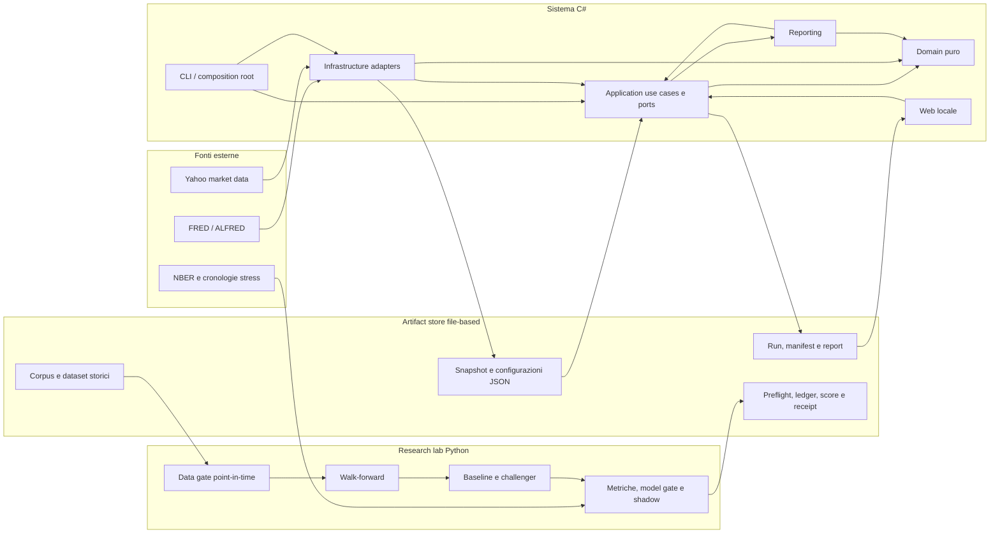
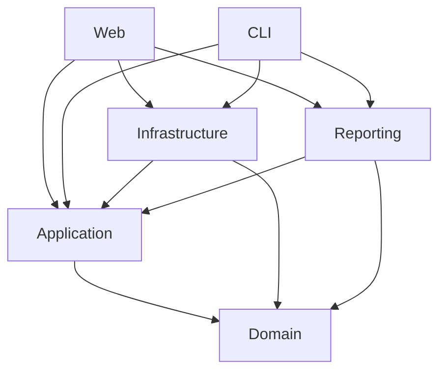
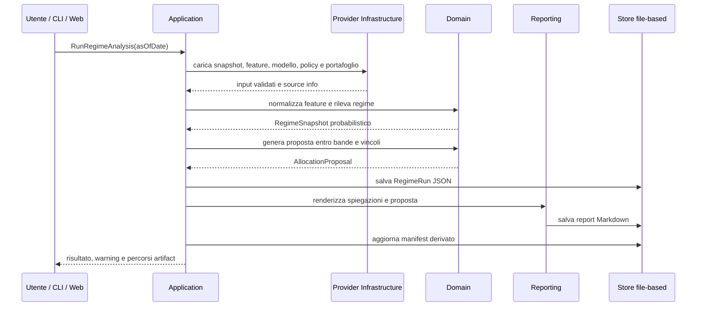
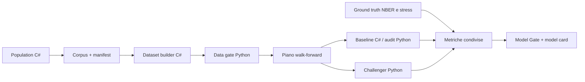
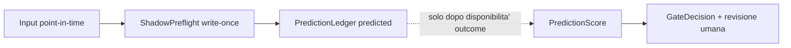

# Macro-Regime Engine: architettura, scelte operative, letteratura e glossario

Stato del documento: 2026-07-14
Ambito: repository `Macro/`, incluse applicazione C#, laboratorio Python e
Shadow Operations.
Destinatari: sviluppatori, revisori del modello e utilizzatori tecnici.

> Questo sistema e la relativa documentazione hanno finalita' informative e di
> ricerca. Non costituiscono consulenza finanziaria, raccomandazione di
> investimento o autorizzazione al trading automatico.

## 1. Sintesi esecutiva

Macro-Regime Engine e' un sistema informativo locale che ricostruisce cio' che
era conoscibile a una determinata data, calcola una distribuzione probabilistica
dei regimi macro-finanziari, produce spiegazioni e genera una proposta
allocativa entro vincoli prestabiliti. La proposta non e' una decisione
automatica: rimane subordinata a policy e revisione umana.

Il sistema e' composto da tre parti deliberatamente separate:

1. **runtime applicativo C#**: dominio puro, use case, adapter dati e
   persistenza, CLI, reportistica e interfaccia Web locale;
2. **laboratorio di ricerca Python**: validazione point-in-time, walk-forward,
   confronto baseline/challenger, metriche, model card e gate;
3. **Shadow Operations**: processo mensile che prepara gli input reali,
   congela una previsione senza outcome e consente lo scoring soltanto in un
   momento successivo.

La decisione architetturale centrale e' che il calcolo di dominio non conosce
database, file, HTTP, UI o clock di sistema. Le tecnologie esterne sono adapter
sostituibili. La decisione metodologica centrale e' che una buona performance
retrospettiva non basta: dati, modello e protocollo devono essere congelati
prima dell'osservazione degli outcome.

Al 14 luglio 2026:

- il runtime C# e la pipeline storica sono implementati e testati;
- la baseline di ricerca `v1.4` ha superato i gate tecnici, ma non e' una
  promozione operativa definitiva;
- i challenger k-means e Gaussian HMM v1 sono stati valutati e respinti;
- il primo ledger shadow-live, relativo al 30 giugno 2026, e' congelato;
- l'orchestratore E9.2 e' implementato;
- il primo ciclo prospettico end-to-end `full` resta da eseguire sul cutoff del
  31 luglio 2026, dopo la chiusura del mese e la disponibilita' degli input;
- non esiste esecuzione ordini o trading automatico.

## 2. Obiettivi e non-obiettivi

### 2.1 Obiettivi

Il sistema deve:

- ricostruire un `DataSnapshot` coerente con una `AsOfDate`;
- impedire che dati futuri, revisioni successive o label entrino nella
  previsione;
- conservare modello, feature set, input e output versionati;
- produrre probabilita', confidence, driver, segnali contrari e warning;
- tradurre il regime in una proposta entro bande di allocazione, turnover e
  costi;
- mantenere una baseline trasparente contro cui misurare i challenger;
- rendere riproducibili backtest, gate e previsioni live;
- conservare anche gli esperimenti negativi, evitando selezione opportunistica
  dei soli risultati favorevoli.

### 2.2 Non-obiettivi

Il sistema non deve:

- diagnosticare con certezza lo stato dell'economia;
- trasformare direttamente un'etichetta di regime in un ordine di mercato;
- sostituire la policy strategica o la decisione umana;
- fare tuning su un holdout gia' osservato;
- usare la ground truth durante una previsione shadow-live;
- nascondere costi, failure mode o qualita' insufficiente dei dati;
- introdurre un database finche' non emergono requisiti che lo giustifichino.

## 3. Vista complessiva



Le frecce rappresentano uso o flusso informativo, non tutte dipendenze di
compilazione. La regola di compilazione piu' importante e' che le dipendenze
puntano verso il core: `Application -> Domain`; gli adapter dipendono dalle
porte applicative, non il contrario.

## 4. Architettura del runtime C#

### 4.1 MacroRegime.Domain

E' il nucleo deterministico. Contiene:

- value object temporali: `AsOfDate`, `ObservationDate`, `PublicationDate`,
  `AvailabilityDate`;
- dati di dominio: `DataSnapshot`, `MacroObservation`, `MarketObservation`;
- feature: definizioni, normalizzazione, polarita', pesi e score;
- versioni: `FeatureSetVersion`, `ModelVersion`, `ModelRole`;
- classificazione: `BaselineRegimeDetector`, probabilita', confidence,
  spiegazioni e warning;
- allocazione: policy strategica, bande, portafoglio corrente, tilt e proposta.

Non contiene HTTP, filesystem, database, ASP.NET, configurazione runtime o
letture dell'orologio. Questa purezza consente test unitari del detector e
dell'allocazione con input interamente in memoria.

Il principale output del detector e' `RegimeSnapshot`, che conserva:

- data as-of;
- versione del modello e delle feature;
- regime primario e regime operativo;
- distribuzione completa delle probabilita';
- confidence e composite score;
- feature score, spiegazioni e warning.

Il regime primario e' la classe con probabilita' maggiore. Il regime operativo
puo' invece essere `UncertainTransition` quando confidence, qualita' o coerenza
dei segnali non giustificano un'azione confermata.

### 4.2 MacroRegime.Application

Contiene i casi d'uso e le porte. Coordina il dominio senza conoscere le
tecnologie concrete.

I casi d'uso principali sono:

- calcolo del regime;
- generazione della proposta allocativa;
- generazione del report;
- esecuzione completa dell'analisi;
- download macro e market attraverso porte esterne;
- lettura e confronto delle run salvate.

Le interfacce `IDataSnapshotProvider`, `IFeatureSetProvider`,
`IModelVersionProvider`, `IRegimeRunStore`, `IExternalMacroDataSource` e le
altre porte descrivono cio' che l'applicazione necessita. Le implementazioni
JSON, FRED o Yahoo vivono fuori da Application.

`RunRegimeAnalysisUseCase` orchestra la sequenza:

1. calcolo del regime;
2. proposta allocativa;
3. salvataggio opzionale della run;
4. generazione del report;
5. aggiornamento del manifest derivato.

### 4.3 MacroRegime.Infrastructure

Contiene gli adapter concreti:

- provider e mapper JSON;
- persistenza delle run e del manifest;
- store dei report;
- diagnostica degli import;
- stub deterministici per test e demo;
- client FRED/ALFRED e calendario vintage/release;
- client Yahoo per dati di mercato;
- population del corpus storico;
- costruzione del dataset e valutazione storica C#.

Infrastructure puo' recuperare o persistere dati, ma non deve decidere il
regime. Le formule e le invarianti restano nel dominio.

### 4.4 MacroRegime.Reporting

Trasforma output applicativi in documenti leggibili. Il renderer Markdown non
ricalcola feature, probabilita' o allocazioni. La separazione impedisce che il
testo mostrato all'utente diventi una seconda implementazione del modello.

### 4.5 MacroRegime.Cli

E' il composition root operativo e il principale ingresso batch. Seleziona gli
adapter e supporta, tra gli altri, questi flussi:

- analisi singola o batch;
- validazione import;
- download FRED e market data;
- population storica;
- costruzione dataset;
- evaluation della baseline storica.

La CLI e' l'unico punto C# autorizzato a comporre il download reale. La chiave
FRED viene letta da parametro controllato o ambiente, ma nell'orchestrazione
shadow non viene riportata nella command line o negli stati persistiti.

### 4.6 MacroRegime.Web

E' un'interfaccia Razor Pages locale orientata alla consultazione:

- esecuzione/visualizzazione dell'analisi locale;
- dettaglio delle run;
- confronto tra run;
- diagnostica import;
- riepilogo delle configurazioni.

Non accede alla rete e non contiene formule del modello. Consuma file locali e
use case applicativi. Le chiavi ASP.NET Core Data Protection sono generate in
`.tmp` e non sono versionate.

### 4.7 Dipendenze consentite



Sono vietate in particolare `Domain -> Infrastructure`,
`Application -> Infrastructure` e la presenza di logica di regime in Web o
Infrastructure.

## 5. Flusso applicativo ordinario



L'ordine e' significativo: dati e configurazioni vengono validati prima del
calcolo; la proposta dipende dal risultato di dominio; la persistenza e la
presentazione non alterano il risultato.

## 6. Modello temporale e dati point-in-time

### 6.1 Quattro date diverse

Il sistema distingue:

- **observation date**: periodo del fenomeno economico;
- **publication date**: data di pubblicazione della fonte;
- **availability date**: data effettiva dalla quale il sistema puo' usare il
  valore;
- **as-of date**: cutoff informativo della decisione.

Un dato entra nello snapshot soltanto se era disponibile entro la data as-of.
Per le serie macro revisionabili viene conservato, dove disponibile, il vintage
coerente con il cutoff. Questa scelta evita di applicare a una decisione storica
informazioni corrette o revisionate soltanto in seguito.

### 6.2 Fonti

Le fonti principali implementate sono:

- FRED per serie economiche e finanziarie;
- ALFRED/FRED vintage API per date di revisione e prime pubblicazioni;
- Yahoo come fonte pragmatica e sostituibile per serie market storiche;
- NBER come ground truth ex-post delle recessioni statunitensi;
- cronologia versionata di stress non recessivi, costruita con fonti
  istituzionali.

La storia giornaliera di alcune serie finanziarie FRED non e' vintage. Questo
limite e' esplicito: il dataset riduce il look-ahead macro, ma non e' una
ricostruzione perfetta di ogni dato finanziario come appariva in passato.

### 6.3 Manifest e hash

Corpus, dataset, evaluation, configurazioni e report sono collegati tramite
SHA-256. L'hash non dimostra che un modello sia corretto; dimostra che
l'artefatto valutato e' esattamente quello dichiarato e che una modifica
successiva puo' essere rilevata.

## 7. Baseline di regime e proposta allocativa

### 7.1 Perche' una baseline rule-based

Il primo modello e' deliberatamente trasparente. Aggrega dimensioni economiche
come crescita, inflazione, rischio, politica monetaria e credito, normalizza gli
indicatori e produce score relativi agli archetipi di regime.

La baseline ha quattro funzioni:

1. rendere esplicite le ipotesi economiche;
2. fornire spiegazioni stabili;
3. costituire un benchmark minimo per i modelli complessi;
4. impedire che la complessita' statistica venga scambiata per efficacia.

Il sistema salva la distribuzione delle probabilita', non soltanto l'etichetta
vincente. Una soglia di conferma separa il `PrimaryRegime` dal
`OperationalRegime` e rende possibile `UncertainTransition`.

### 7.2 Tassonomia corrente

La tassonomia include, tra gli altri:

- `Goldilocks`;
- `Reflation`;
- `LateCycleOverheating`;
- `Stagflation`;
- `DeflationBust`;
- `ZirpQeFinancialRepression`;
- `UncertainTransition`.

Questi stati sono archetipi compositi. Una sola dimensione, per esempio
inflazione elevata, non basta necessariamente a identificare un regime senza lo
stato contemporaneo di crescita, rischio, credito e condizioni monetarie.

### 7.3 Allocazione come proposta vincolata

Il regime non produce un portafoglio da zero. Il dominio parte da:

- policy strategica;
- bande minime e massime per asset class;
- portafoglio corrente;
- tilt massimi associati al regime;
- turnover e costo stimato.

Il risultato e' una `AllocationProposal` con suggerimento operativo e
motivazione. Questa struttura protegge l'ancora di lungo periodo e riduce il
rischio di market timing estremo.

## 8. Laboratorio di ricerca Python

Il laboratorio `research/regime-eval` non e' una dipendenza del runtime C#.
Serve a valutare modelli e protocolli con strumenti statistici separati.

### 8.1 Pipeline storica



Il data gate controlla schema, ordinamento temporale, disponibilita', feature,
forward return e fingerprint. Il piano walk-forward usa finestre di train e
test ordinate nel tempo; scaler, centroidi, HMM e mapping degli stati vengono
stimati sul solo train.

### 8.2 Train gate v2

Il gate separa due famiglie di criteri:

- **integrita'**: dati validi, fold coerenti, assenza di leakage, output
  riproducibili;
- **utilita' modellistica**: copertura dei regimi, concentrazione, saturazione,
  incertezza e comportamento sui periodi rilevanti.

Una candidate che fallisce il train gate non apre l'OOS. Il report negativo
viene comunque scritto. Cio' limita il riuso opportunistico dell'holdout e
mantiene una traccia degli esperimenti respinti.

### 8.3 Stato dei modelli

- **Baseline v1.4**: passa il train gate v2 e l'audit tecnico; sull'OOS NBER ha
  recall 100%, precision 20% e F1 33,33%. Il campione positivo e' troppo piccolo
  e la metrica e' insufficiente a validare una tassonomia multiregime.
- **K-means recession v1**: respinto; clustering e mapping recessivo risultano
  fragili con pochi mesi positivi nel train.
- **Gaussian HMM recession v1**: respinto; converge numericamente, ma perde
  marzo 2020, prolunga falsi segnali e peggiora recall/F1 rispetto alla
  baseline.
- **Stress non recessivi v1**: il confronto multi-label ha mostrato scarso
  allineamento. Il risultato negativo e' conservato e vieta conclusioni forti
  sull'efficacia attuale.

La conclusione corretta non e' che il sistema abbia gia' dimostrato capacita'
predittiva robusta. Ha invece dimostrato di saper rifiutare challenger e
candidate che non superano criteri preregistrati.

## 9. Backtest, shadow-live e scoring

### 9.1 Lifecycle separati

Il backtest conosce gli outcome storici; una previsione live no. Per questo il
sistema usa artifact distinti:

1. `PredictionLedger`: previsione congelata, senza label;
2. `PredictionScore`: valutazione successiva contro ground truth disponibile;
3. `GateDecision`: decisione automatica e revisione umana del modello.



Il comando di previsione non riceve la ground truth. Lo score riferisce l'hash
del ledger senza modificarlo. Una decisione umana non puo' approvare un modello
quando il gate automatico e' fallito.

### 9.2 ShadowPreflight

Prima del ledger verifica:

- mese informativo chiuso;
- dataset point-in-time e relativo hash;
- assenza di forward return;
- presenza delle nove serie macro richieste;
- freshness massima di tre mesi;
- coerenza fra model config ed evaluation;
- fingerprint del codice C# e Python responsabile della produzione.

### 9.3 Orchestratore E9.2

`shadow-operations` sceglie sempre il mese immediatamente successivo all'ultimo
ledger; non puo' saltare un cutoff. La state machine e':

```text
initialized/resuming
  -> population
  -> dataset build
  -> evaluation v1.4
  -> preflight
  -> prepared                  (prepare-only)
  -> ledger + derived index
  -> ledger-frozen             (full)
```

Se non esiste un mese chiuso eleggibile, produce `no-eligible-month` senza
avviare processi. Un fallimento conserva exit code, stdout/stderr e hash. La
retry con gli stessi input valida gli artifact completati e riparte dal primo
step incompleto; una modifica a un artifact gia' completato viene rifiutata.

`cycle-state.json` e' aggiornabile ma non autorevole. Preflight, ledger e
receipt sono write-once. `ShadowIndex` e' sempre ricostruibile dai ledger.

## 10. Persistenza, audit e sicurezza operativa

### 10.1 Persistenza file-based

La persistenza ufficiale corrente usa JSON e Markdown. I vantaggi nel contesto
attuale sono:

- ispezionabilita' diretta;
- schemi versionabili;
- audit trail leggibile;
- semplicita' locale;
- assenza di migrazioni e accoppiamento prematuro a EF Core.

Un database andra' rivalutato quando saranno necessarie query interattive su
molte run, concorrenza robusta, relazioni persistenti complesse o dataset non
piu' gestibili tramite manifest e indici derivati.

### 10.2 Write-once, idempotenza e viste derivate

Gli artifact probatori non vengono sovrascritti. Una retry identica puo'
restituire lo stesso artifact; una retry con hash differenti fallisce. Manifest
e indici sono viste derivate e ricostruibili, non fonti autorevoli.

Questa e' una scelta di auditabilita', non un sistema crittografico completo:
SHA-256 rileva modifiche, ma non sostituisce firma digitale, controllo accessi,
backup o timestamping esterno.

### 10.3 Isolamento della rete

La rete e' confinata negli adapter Infrastructure ed e' attivata esplicitamente
dalla CLI. Domain, Application e Web non scaricano dati. Lo stesso core puo'
quindi essere testato con stub deterministici e usato con file locali senza
connettivita'.

### 10.4 Gestione dei segreti e artefatti temporanei

Le chiavi non devono comparire in command line persistite, log, receipt o Git.
Le directory `.tmp`, incluse le chiavi Data Protection locali, sono ignorate.
La configurazione locale non trasforma tuttavia il progetto in un servizio
multiutente hardened: autenticazione, autorizzazione granulare e secret store
gestito restano fuori dall'ambito corrente.

## 11. Scelte operative e fondamento nella letteratura

La tabella distingue il fondamento scientifico dalla decisione ingegneristica.
Una fonte puo' motivare la direzione, ma non dimostra automaticamente che la
specifica implementazione sia ottimale.

| Scelta del sistema | Motivazione | Letteratura o riferimento | Limite / interpretazione |
|---|---|---|---|
| Regimi probabilistici, non etichette certe | Stati economici e finanziari sono latenti e persistenti | Hamilton (1989), [A New Approach...](https://doi.org/10.2307/1912559); Ang e Timmermann (2012), [Regime Changes and Financial Markets](https://www.nber.org/papers/w17182) | Un HMM puo' convergere ed essere comunque economicamente scadente, come osservato nel challenger v1 |
| Distribuzione completa delle probabilita' | Evita che il vincitore nasconda incertezza e segnali vicini | Guidolin e Timmermann (2007), [Asset Allocation Under Multivariate Regime Switching](https://www.sciencedirect.com/science/article/pii/S0165188906002272) | Le probabilita' dipendono dal modello e non sono verita' oggettive |
| Separare regime e allocazione | Le caratteristiche condizionali cambiano, ma la decisione dipende anche da orizzonte e asset disponibili | Ang e Bekaert (2003), [How Do Regimes Affect Asset Allocation?](https://www.nber.org/papers/w10080); Campbell, Chan e Viceira (2003), [A Multivariate Model of Strategic Asset Allocation](https://www.nber.org/papers/w8566) | Il progetto non ha ancora completato l'ottimizzazione allocativa della Fase F |
| Policy strategica, bande, turnover e costi | Riduce cambi estremi e rende la decisione eseguibile | Collin-Dufresne, Daniel e Saglam (2019), [Liquidity Regimes and Optimal Dynamic Asset Allocation](https://www.nber.org/papers/w24222); Blitz e van Vliet (2011), [Dynamic Strategic Asset Allocation](https://papers.ssrn.com/sol3/papers.cfm?abstract_id=1941777) | Fiscalita' reale dettagliata e slippage avanzato non sono ancora implementati |
| Dataset macro standardizzato e manifestato | Riduce selezione arbitraria e migliora replicabilita' | McCracken e Ng (2016), [FRED-MD](https://research.stlouisfed.org/wp/2015/2015-030.pdf) | Il corpus corrente e' piu' piccolo di FRED-MD e usa proxy espliciti |
| Dati vintage e semantica as-of | Le serie macro vengono revisionate; usare la storia corrente genera look-ahead | St. Louis Fed, [ALFRED Help](https://alfred.stlouisfed.org/help) e [FRED vintage dates API](https://fred.stlouisfed.org/docs/api/fred/series_vintagedates.html) | Non tutte le serie finanziarie giornaliere usate sono vintage |
| Ground truth NBER separata dalla previsione | Offre una cronologia istituzionale senza trasformarla in input live | NBER, [US Business Cycle Expansions and Contractions](https://www.nber.org/research/data/us-business-cycle-expansions-and-contractions) | NBER e' ex-post, binaria e annunciata con ritardo; non valida da sola una tassonomia multiregime |
| Walk-forward e ordine temporale | Simula stime disponibili nel tempo e riduce contaminazione train/test | Tashman (2000), *Out-of-sample tests of forecasting accuracy*, International Journal of Forecasting 16, 437-450; Bergmeir, Hyndman e Koo (2018), [Cross-validation for autoregressive time series](https://doi.org/10.1016/j.csda.2017.11.003) | Il protocollo riduce il leakage, ma non elimina selection bias dovuto a molte varianti |
| Preregistrazione e apertura condizionata dell'OOS | Limita tuning opportunistico sull'holdout | Bailey et al. (2015), [The Probability of Backtest Overfitting](https://doi.org/10.2139/ssrn.2326253) | Il numero di episodi recessivi OOS resta troppo piccolo per conclusioni forti |
| Model card e conservazione dei fallimenti | Rende espliciti uso previsto, metriche e limiti | Mitchell et al. (2019), [Model Cards for Model Reporting](https://doi.org/10.1145/3287560.3287596) | La documentazione non sostituisce monitoraggio prospettico |
| Manifest e documentazione del dataset | Collega composizione, origine, trasformazioni e usi consentiti | Gebru et al. (2021), [Datasheets for Datasets](https://doi.org/10.1145/3458723) | I manifest del progetto non implementano ogni campo proposto dal paper |
| Brier score e log loss nello score separato | Valutano probabilita', non solo classi | Brier (1950), *Verification of forecasts expressed in terms of probability*; Gneiting e Raftery (2007), [Strictly Proper Scoring Rules](https://doi.org/10.1198/016214506000001437) | Con pochi outcome le metriche hanno elevata varianza |
| Porte e adapter | Consente di testare il core senza UI, rete o database e sostituire fonti | Cockburn (2005), [Hexagonal Architecture](https://alistair.cockburn.us/hexagonal-architecture); Microsoft, [Clean Architecture](https://learn.microsoft.com/en-us/dotnet/architecture/modern-web-apps-azure/common-web-application-architectures) | Piu' interfacce e mapping aumentano il costo iniziale |
| Domain core puro e dipendenze verso l'interno | Protegge invarianti e logica dal framework | Evans (2003), *Domain-Driven Design*; Martin (2017), *Clean Architecture* | La struttura non garantisce da sola un buon dominio: servono test e review |
| File-based prima del database | Evita complessita' e schema relazionale prima di requisiti reali | Fowler (2002), *Patterns of Enterprise Application Architecture*, principi di Data Mapper e Gateway; decisione pragmatica formalizzata nell'ADR 0003 | E' soprattutto una scelta locale del progetto, non una prescrizione della letteratura finanziaria |
| Artifact immutabili, hash e viste ricostruibili | Separa evidenza primaria da indici e rende rilevabili modifiche | Principi di provenance e content addressing; decisione di governance E8-E9 | Non equivale a firma digitale o ledger distribuito |
| Revisione umana prima della promozione | Le metriche non catturano tutti i failure mode economici e operativi | Model Cards; governance interna del Model Gate | La revisione deve essere sostanziale e motivata, non una formalita' |

## 12. Valutazione critica dell'architettura

### 12.1 Punti forti

- confini di dipendenza chiari e verificabili;
- dominio testabile senza tecnologie esterne;
- semantica temporale esplicita;
- artifact leggibili, versionati e collegati tramite hash;
- separazione effettiva tra previsione e scoring;
- capacita' dimostrata di respingere modelli peggiori;
- recovery idempotente del ciclo mensile;
- nessuna esecuzione automatica di ordini.

### 12.2 Debolezze attuali

- una sola osservazione shadow-live non consente valutazione prospettica;
- ground truth NBER OOS molto piccola e inadatta a validare tutti i regimi;
- scarso allineamento sugli stress non recessivi;
- alcune serie finanziarie storiche non sono vintage;
- Yahoo e' una fonte pragmatica non ufficiale;
- `BAA10Y` e' un proxy di credito, non high-yield OAS semanticamente identico;
- la baseline v1.4 ha superato gate tecnici, non una prova economica definitiva;
- ottimizzazione con costi, fiscalita' e stress di portafoglio e' ancora futura;
- il file store non offre transazioni o concorrenza da database;
- la Web UI locale non e' ancora un'applicazione multiutente protetta.

### 12.3 Cosa dimostrera' efficacia

L'efficacia non sara' dimostrata da un altro backtest sullo stesso periodo.
Servono:

1. una sequenza plurimensile di ledger prospettici congelati;
2. scoring ritardato con ground truth versionata;
3. stabilita' di probabilita', warning e transizioni;
4. confronto con baseline semplici e challenger preregistrati;
5. valutazione di costi, turnover e utilita' allocativa;
6. stress test e analisi dei failure mode;
7. decisioni di promozione documentate e reversibili.

## 13. Glossario

### Adapter

Implementazione tecnologica di una porta applicativa. Esempi: provider JSON,
client FRED, client Yahoo, store delle run e renderer Markdown.

### Allocation Proposal

Proposta di variazione del portafoglio prodotta entro policy, bande, tilt,
turnover e costi. Non e' un ordine e non costituisce decisione automatica.

### ALFRED

Archivio della Federal Reserve Bank of St. Louis che conserva versioni vintage
dei dati economici, utili a ricostruire cio' che era disponibile nel passato.

### As-of Date

Data di conoscenza del sistema. Nessun dato pubblicato o disponibile dopo tale
data puo' entrare nel calcolo.

### Availability Date

Data dalla quale un'osservazione e' effettivamente utilizzabile dal sistema.
Puo' essere successiva alla data di pubblicazione.

### Backtest

Valutazione retrospettiva su dati storici in cui gli outcome esistono gia'. Non
equivale a evidenza prospettica, anche quando usa split temporali corretti.

### Baseline Model

Modello semplice, interpretabile e permanente usato come riferimento minimo.
Un challenger deve dimostrare valore rispetto alla baseline.

### Brier Score

Media dell'errore quadratico tra probabilita' prevista e outcome binario. Piu'
basso e' migliore; valuta la qualita' probabilistica, non solo la classe.

### Challenger Model

Modello sperimentale confrontato contro la baseline con protocollo congelato.
Non diventa operativo automaticamente se converge o migliora una sola metrica.

### Composite Score

Sintesi pesata degli score delle feature. E' un indicatore interno del modello,
non una probabilita' economica direttamente osservata.

### Confidence

Misura della forza del risultato operativo. Una confidence insufficiente puo'
portare a `UncertainTransition` anche quando esiste un regime primario.

### Cutoff informativo

Ultimo istante ammesso per gli input di una previsione. Nel ciclo shadow
mensile coincide con la data as-of controllata dal preflight.

### Data Gate

Insieme di controlli che impedisce l'apertura della valutazione quando dataset,
date, schema, feature o provenienza non rispettano il protocollo.

### Data Leakage

Uso, diretto o indiretto, di informazione che al momento della previsione non
sarebbe stata disponibile. Comprende revisioni future, scaler fit sull'intero
campione, label di test e selezione post-hoc.

### Data Snapshot

Insieme delle osservazioni macro e market utilizzabili a una specifica data
as-of. E' l'input informativo del calcolo di dominio.

### Decision Record / GateDecision

Artefatto che registra esito automatico, reviewer, motivazione e timestamp
della decisione umana relativa a un modello o una proposta.

### Economic Dimension

Categoria interpretativa di una feature: crescita, inflazione, rischio,
politica monetaria, credito, liquidita' o sentiment.

### Feature

Trasformazione versionata di una o piu' osservazioni. Include formula,
dimensione economica, polarita', peso e lookback.

### Feature Set Version

Versione immutabile dell'insieme di feature usato in una run.

### FRED

Federal Reserve Economic Data, piattaforma della Federal Reserve Bank of St.
Louis usata come fonte di serie macroeconomiche e finanziarie.

### Ground Truth

Cronologia esterna usata per lo scoring, per esempio le recessioni NBER. Non e'
necessariamente perfetta e non deve entrare nel comando di previsione live.

### Hash / SHA-256

Impronta del contenuto usata per collegare artifact e rilevare modifiche. Non
dimostra correttezza economica e non sostituisce una firma digitale.

### Hidden Markov Model (HMM)

Modello temporale con stati latenti, probabilita' di transizione ed emissioni
osservabili. Il challenger HMM v1 del progetto e' stato respinto.

### Idempotenza

Proprieta' per cui ripetere un'operazione con gli stessi input produce o
recupera lo stesso risultato senza duplicazioni. Input diversi sullo stesso
cutoff devono generare conflitto.

### Information Cutoff

Vedi cutoff informativo. Nel ledger identifica il confine temporale degli input
usati dalla previsione.

### Log Loss

Scoring rule probabilistica che penalizza fortemente previsioni molto sicure ma
sbagliate. Piu' bassa e' migliore.

### Look-ahead Bias

Distorsione causata dall'uso di dati o revisioni future in una simulazione
storica. La semantica as-of e i vintage servono a ridurla.

### Manifest

Indice con metadati, percorsi e hash di un corpus o insieme di run. E' una
vista derivata e ricostruibile, non necessariamente la fonte autorevole.

### Model Card

Documento che descrive scopo, configurazione, dati, metriche, limiti, failure
mode e decisione relativa a un modello.

### Model Gate

Insieme preregistrato di criteri tecnici e metodologici che regola l'accesso
all'OOS o la promozione di un modello.

### Model Version

Identita' versionata del modello, inclusi parametri, ruolo, descrizione e data
di efficacia.

### NBER Recession

Intervallo tra il mese successivo a un peak e il mese di trough secondo la
cronologia del Business Cycle Dating Committee. E' una label ex-post.

### Observation Date

Periodo economico a cui il valore si riferisce, distinto dalla data in cui il
valore viene pubblicato.

### Operational Regime

Regime utilizzabile dal flusso decisionale dopo soglie e warning. Puo' essere
`UncertainTransition` anche se il primary regime e' diverso.

### Point-in-time

Ricostruzione che usa esclusivamente informazione disponibile entro il cutoff,
incluse versioni vintage coerenti quando disponibili.

### Port

Interfaccia che esprime una necessita' dell'applicazione senza specificare la
tecnologia che la soddisfa.

### PredictionLedger

Artefatto write-once che congela una previsione, gli input hashati e il runtime
senza contenere outcome o ground truth.

### PredictionScore

Artefatto successivo che collega un ledger immutabile a una ground truth e
calcola metriche senza modificare la previsione originale.

### Primary Regime

Regime con probabilita' piu' alta prima dell'applicazione delle regole operative
di conferma e incertezza.

### Preregistrazione

Congelamento di configurazione, ipotesi e gate prima di osservare il risultato
di validation o test che si intende proteggere.

### Publication Date

Data ufficiale di pubblicazione di un'osservazione macroeconomica.

### Regime

Stato probabilistico del contesto macro-finanziario. E' un costrutto del
modello, non una diagnosi direttamente osservabile.

### Regime Run

Esecuzione completa a una data as-of, con input, versioni, probabilita',
spiegazioni, proposta e informazioni sulla fonte.

### ShadowIndex

Vista deterministica ricostruita dai ledger shadow-live. Non e' autorevole e
non contiene outcome.

### Shadow-live

Previsione prospettica congelata con timestamp reale prima della disponibilita'
dell'outcome. E' distinta da dry-run e backtest.

### ShadowPreflight

Gate write-once che verifica chiusura del mese, integrita', freshness,
point-in-time, assenza di forward return e fingerprint del codice.

### Strategic Allocation Policy

Ancora di lungo periodo contenente pesi target, bande, cash minimo, turnover
massimo e vincoli personali.

### Train Gate

Gate applicato alla sola area train/validation. Se fallisce, impedisce di
aprire l'OOS per quella candidate.

### UncertainTransition

Stato operativo legittimo quando confidence, coerenza o qualita' dati non
consentono una classificazione sufficientemente robusta. Non e' un errore.

### Vintage

Versione di una serie economica come risultava disponibile in una determinata
data storica.

### Walk-forward Validation

Valutazione temporale a fold ordinati: il modello viene stimato su osservazioni
precedenti e applicato a finestre successive, senza mescolare futuro e passato.

### Write-once

Vincolo per cui un artifact probatorio esistente non viene sovrascritto. Una
nuova evidenza richiede un nuovo path o una nuova versione esplicita.

## 14. Riferimenti interni principali

- `docs/adr/0001-restart-architetturale.md`
- `docs/adr/0002-dipendenze-layer.md`
- `docs/adr/0003-persistenza-locale-file-based.md`
- `docs/adr/0004-isolamento-rete-adapter-fred.md`
- `docs/domain/0003-domain-core-design.md`
- `docs/research/0001-stato-arte-regime-macro.md`
- `research/regime-eval/PROTOCOL.md`
- `research/regime-eval/model-cards/baseline-v1-4-candidate.md`
- `research/regime-eval/model-cards/gaussian-hmm-recession-v1.md`
- `docs/checkpoints/0040-fase-e-slice8-evaluation-contracts-shadow-ledger-done.md`
- `docs/checkpoints/0043-fase-e9-shadow-operations-incremento1-done.md`
- `docs/checkpoints/0044-fase-e9-shadow-operations-incremento2-done.md`

## 15. Regola di lettura finale

L'architettura protegge la qualita' del processo, ma non crea automaticamente
alpha, accuratezza o utilita' allocativa. Il risultato piu' solido raggiunto
finora e' la separazione tra ipotesi, dati, previsione, scoring e decisione.
Il prossimo salto di evidenza non verra' da ulteriore tuning retrospettivo, ma
da una sequenza di cicli shadow-live realmente prospettici e valutati soltanto
dopo la disponibilita' degli outcome.
