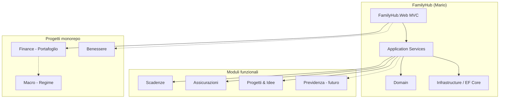

# FamilyHub — Pianificazione del sistema di gestione familiare

**Versione:** 0.1 — 6 luglio 2026  
**Workspace:** `Codex/Mario`  
**Stack:** ASP.NET Core, C#, Entity Framework Core, MVC  
**Repository:** `hol74/Codex` (monorepo)

---

## 1. Visione e obiettivo

Costruire un sistema informativo **self-hosted** per la gestione della vita familiare: finanza, patrimonio, assicurazioni, previdenza e aspetti non finanziari (scadenze, progetti, idee). Il software è pensato per **una famiglia** (non SaaS multi-tenant), senza necessità di utenti e ruoli.

### Principi guida


| Principio             | Descrizione                                                                                      |
| --------------------- | ------------------------------------------------------------------------------------------------ |
| **Modularità**        | Ogni area funzionale è un modulo distinto, aggiungibile nel tempo                                |
| **Privacy**           | Dati in locale o su infrastruttura controllata; niente cloud obbligatorio                        |
| **Contesto italiano** | Valute, fiscalità, previdenza e assicurazioni orientate al contesto IT                           |
| **Incrementale**      | Funzionalità distinte, rilasciate a fasi; niente big-bang                                        |


### Perimetro del progetto

**In scope:** gestione patrimoniale e finanziaria familiare, assicurazioni, fondo pensione, scadenze e promemoria, progetti e idee, dashboard unificata.

**Fuori scope iniziale:** .

---


## 2. Relazione con i progetti esistenti nel monorepo

Il repository `hol74/Codex` contiene altri progetti magari anche correlati ma FamilyHub non li sostituisce, non li coordina, non li referenzia è un sistema chiuso a se stante.


### Decisione architetturale proposta

FamilyHub è la **shell applicativa familiare** (dashboard, scadenze, assicurazioni, progetti, idee).

```
FamilyHub (nuovo)
├── Moduli non finanziari     → sviluppo in Mario/
├── Modulo Assicurazioni      → sviluppo in Mario/, ispirato a Surety/Renewals
├── Modulo Previdenza         → sviluppo in Mario/, contesto IT
└── Modulo Scadenze/Progetti  → sviluppo in Mario/
```

---


## 3. Analisi progetti GitHub di riferimento

Analisi basata su documentazione esistente in `Finance/github_personal_portfolio_management_projects_analysis.md` (2026-06-29) e ricerca aggiuntiva su progetti household, assicurazioni e scadenze (2026-07-06).

> Le metriche community (stelle, fork, release) sono indicative e vanno rivalutate prima di decisioni implementative.


### 3.1 Finanza familiare, budget e cash flow

| Progetto        | URL                                                                     | Stack       | Punti di forza                                                         | Rilevanza per FamilyHub                                     |
| --------------- | ----------------------------------------------------------------------- | ----------- | ---------------------------------------------------------------------- | ----------------------------------------------------------- |
| Keeping         | [nezinomas/keeping](https://github.com/nezinomas/keeping)               | Django      | Household collaborativo, spese, risparmi, pensioni, piani, moduli vita | **Alto** — modello modulare “finance + life”                |
| CookieJar       | [pokjay/CookieJar](https://github.com/pokjay/CookieJar)                 | —           | Dashboard famiglia, net worth per membro, cash flow, investimenti      | **Alto** — family-first, roll-up household                  |
| Finance-Manager | [Anfer410/Finance-Manager](https://github.com/Anfer410/Finance-Manager) | —           | Multi-utente per famiglia, prestiti, dashboard personalizzabile        | **Medio-alto** — isolamento per `family_id`, widget         |
| Bud-a           | [bprigent/bud-a](https://github.com/bprigent/bud-a)                     | Python + AI | Budget familiare, categorie, membri                                    | **Basso-medio** — interessante per AI categorization futura |


**Cosa prendiamo**

- Membri famiglia con vista individuale e aggregata household (CookieJar, Keeping)
- Modulo prestiti/amortamento come feature futura (Finance-Manager)
- Architettura modulare con motore statistiche centralizzato (Keeping → `bookkeeping`)


### 3.2 Assicurazioni, scadenze e documenti


| Progetto     | URL                                                                               | Stack          | Punti di forza                                               | Rilevanza per FamilyHub                                             |
| ------------ | --------------------------------------------------------------------------------- | -------------- | ------------------------------------------------------------ | ------------------------------------------------------------------- |
| Surety       | [nocoo/surety](https://github.com/nocoo/surety)                                   | TypeScript, D1 | Gestione polizze famiglia, membri, asset, calendario rinnovi | **Alto** — riferimento diretto modulo Assicurazioni                 |
| Renewals     | [ploughpuff/renewals](https://github.com/ploughpuff/renewals)                     | —              | Scadenze contratti, storico costi, flag obblighi legali      | **Alto** — modello semplice per Scadenze                            |
| Family Vault | [DEADSEC-SECURITY/family-vault](https://github.com/DEADSEC-SECURITY/family-vault) | Python/FastAPI | Vault documenti, assicurazioni, promemoria, crittografia     | **Medio** — vault documenti come fase avanzata                      |
| Warracker    | [sassanix/Warracker](https://github.com/sassanix/Warracker)                       | —              | Garanzie, ricevute, alert                                    | **Medio** — estensione scadenze su beni                             |
| Fynla        | [Stoff73/fynla](https://github.com/Stoff73/fynla)                                 | —              | Pianificazione olistica UK: protezione, pensioni, obiettivi  | **Medio** — ispirazione modulo Previdenza/Obiettivi (adattare a IT) |


**Cosa prendiamo**

- Anagrafica polizze con membri, asset e compagnie (Surety)
- Calendario rinnovi con urgenza e storico premi (Renewals, Surety)
- Scadenze generiche riusabili per assicurazioni, documenti, manutenzioni (Renewals)
- Vault documenti crittografato come fase avanzata, non MVP (Family Vault)


### 3.3 Progetti, idee e life management


| Progetto                      | URL                                                       | Note                                                                          |
| ----------------------------- | --------------------------------------------------------- | ----------------------------------------------------------------------------- |
| Keeping (`plans`)             | [nezinomas/keeping](https://github.com/nezinomas/keeping) | Budget e obiettivi finanziari a lungo termine                                 |
| Fynla (Goals & Life Events)   | [Stoff73/fynla](https://github.com/Stoff73/fynla)         | Obiettivi, eventi vita, piani unificati                                       |
| Vikunja / Planka / Focalboard | vari                                                      | Task e progetti Kanban self-hosted — riferimento UX, non integrazione diretta |


Per Progetti e Idee non esiste un riferimento GitHub dominante in C#. Si adotta un modello leggero interno (backlog idee + progetti con milestone) ispirato a tool Kanban minimali.

### 3.4 Sintesi: cosa studiare per modulo


| Modulo FamilyHub      | Progetti GitHub da studiare                                                          |
| --------------------- | ------------------------------------------------------------------------------------ |
| Cash flow / Budget    | Firefly III, Keeping, CookieJar                                                      |
| Assicurazioni         | Surety, Family Vault                                                                 |
| Scadenze              | Renewals, Warracker                                                                  |
| Previdenza            | Keeping (`pensions`), Fynla (Retirement) — adattare a fondi pensione IT              |
| Progetti / Idee       | Keeping (`plans`), Kanban open source                                                |
| Documenti             | Family Vault (fase avanzata)                                                         |


---


## 4. Specifiche funzionali


### 4.1 Funzionalità da implementare subito (MVP — Fase 0–2)

Priorità: infrastruttura + moduli a valore immediato.

#### 4.1.1 Piattaforma comune

- [ ] Solution ASP.NET Core MVC in `Mario/`
- [ ] Architettura a strati: `FamilyHub.Domain`, `Application`, `Infrastructure`, `Web`
- [ ] Database SQLite in sviluppo, migrabile a SQL Server/PostgreSQL
- [ ] Layout UI unificato, navigazione moduli, dashboard home
- [ ] Anagrafica **Membri famiglia** (nome, ruolo, data nascita opzionale)
- [ ] Audit log base (chi ha creato/modificato cosa)


#### 4.1.2 Modulo Scadenze

- [ ] CRUD scadenze: titolo, categoria, data, ricorrenza, membro associato
- [ ] Stati: attiva, completata, annullata
- [ ] Vista “in scadenza” (7/30/90 giorni) con urgenza visiva
- [ ] Flag “obbligo legale” (RC auto, bollo, ecc.)
- [ ] Storico rinnovi con costo precedente e nuovo (ispirato a Renewals)
- [ ] Notifiche: solo in-app per MVP (email in fase successiva)


#### 4.1.3 Modulo Progetti e Idee (versione leggera)

- [ ] **Idee**: inbox rapida (titolo, nota, tag, stato: nuova / in valutazione / archiviata)
- [ ] **Progetti**: titolo, descrizione, stato (pianificato / in corso / completato / sospeso), date, membro responsabile
- [ ] Task semplici per progetto (checklist, non Kanban completo)
- [ ] Link opzionale a scadenze


#### 4.1.4 Modulo Assicurazioni (MVP)

- [ ] Anagrafica compagnie / agenti
- [ ] Polizze: tipo (auto, casa, salute, vita, altro), numero, date inizio/fine, premio, membro/i coperti
- [ ] Asset collegati opzionali (veicolo, immobile — solo testo per MVP)
- [ ] Generazione automatica scadenza rinnovo nel modulo Scadenze
- [ ] Vista “coperture per membro”


### 4.2 Funzionalità future (backlog prioritizzato)


#### Priorità alta (Fase 3–5)


| Area                       | Funzionalità                                                                                      |
| -------------------------- | ------------------------------------------------------------------------------------------------- |
| **Previdenza**             | Anagrafica fondi pensione (PIP, fondo aziendale, TFR), versamenti, posizione, proiezione semplice |
| **Finanza integrata**      | API interne: patrimonio netto, allocazione, ultimo regime macro da `Macro`                        |
| **Assicurazioni avanzate** | Dettaglio coperture, franchigie, massimali, confronto anno su anno                                |
| **Scadenze**               | Notifiche email, ricorrenze complesse, allegati                                                   |
| **Import**                 | CSV polizze, export backup JSON                                                                   |
| **Budget / cash flow**     | Conti correnti, categorie spesa, flussi mensili (ispirato Firefly III / CookieJar)                |


#### Priorità media (Fase 6–8)


| Area             | Funzionalità                                                                |
| ---------------- | --------------------------------------------------------------------------- |
| **Progetti**     | Kanban leggero, milestone, budget progetto                                  |
| **Prestiti**     | Mutui e finanziamenti, piano ammortamento (Finance-Manager)                 |
| **Documenti**    | Upload allegati per polizze/scadenze; vault opzionale                       |
| **Salute**       | Collegamento modulo Benessere o integrazione dati sanitari base             |
| **Report**       | Report mensile famiglia (PDF): scadenze, assicurazioni, snapshot patrimonio |
| **Multi-utente** | Ruoli (admin, membro, sola lettura), permessi per modulo                    |


#### Priorità bassa / esplorativa (Fase 9+)


| Area                      | Funzionalità                                             |
| ------------------------- | -------------------------------------------------------- |
| **AI**                    | Categorizzazione spese, sintesi mensile (ispirato Bud-a) |
| **Mobile**                | PWA responsive prima di app nativa                       |
| **Integrazioni bancarie** | Import automatico estratti (non obbligatorio)            |
| **Crypto**                | Solo se necessario (Rotki come riferimento)              |
| **Estate planning**       | Beneficiari, testamento digitale (Family Vault)          |


### 4.3 Funzionalità escluse / non di interesse


| Funzionalità                                     | Motivo esclusione                                     |
| ------------------------------------------------ | ----------------------------------------------------- |
| SaaS multi-famiglia con billing                  | Progetto personale/familiare, non commerciale         |
| Contabilità partita doppia completa              | Fuori perimetro; eventuale link a Firefly III esterno |
| EMR / cartella clinica completa (Fasten)         | Troppo specialistico; al massimo promemoria sanitari  |
| Trading automatico / execution                   | Solo tracking e strategia informativa                 |
| Cloud obbligatorio                               | Violerebbe principio privacy/self-hosted              |
| Replica completa Portfolio Performance in fase 1 | Già coperto da progetto `Finance` dedicato            |
| Kanban enterprise (Jira-like)                    | Over-engineering per uso familiare                    |
| Localizzazione multi-paese                       | Focus Italia; i18n solo se necessario in futuro       |
| Integrazione FIPAV / sport                       | Resta in `AutomazioniFipav` separato                  |


---


## 5. Architettura tecnica proposta


### 5.1 Stack


| Componente | Scelta                         |
| ---------- | ------------------------------ |
| Runtime    | .NET 10 LTS                    |
| UI         | ASP.NET Core MVC + Razor Views |
| ORM        | Entity Framework Core          |
| DB dev     | SQLite                         |
| DB prod    | SQL Server o PostgreSQL        |
| Test       | xUnit                          |
| Auth       | ASP.NET Core Identity (cookie) |


### 5.2 Struttura solution

```text
Mario/
  FamilyHub.sln
  src/
    FamilyHub.Domain/           Entità, enum, regole dominio
    FamilyHub.Application/      Use case, DTO, interfacce servizi
    FamilyHub.Infrastructure/   EF Core, repository, notifiche
    FamilyHub.Web/              MVC, controllers, views
  tests/
    FamilyHub.Domain.Tests/
    FamilyHub.Application.Tests/
  docs/
    PIANO-PROGETTO.md           (questo file)
```


### 5.3 Modello dati iniziale (entità MVP)

```text
FamilyMember          Membro del nucleo familiare
Deadline              Scadenza (anche generata da polizza)
DeadlineHistory       Storico rinnovo/costo
InsuranceCompany      Compagnia / agente
InsurancePolicy       Polizza assicurativa
Idea                  Idea in inbox
Project               Progetto familiare
ProjectTask           Task/checklist progetto
AuditEvent            Tracciamento modifiche
```


### 5.4 Diagramma moduli




---


## 6. Fasi di costruzione del software


### Panoramica


| Fase | Nome                          | Obiettivo                       | Durata indicativa |
| ---- | ----------------------------- | ------------------------------- | ----------------- |
| 0    | Fondamenta                    | Scaffold, DB, auth, layout      | 1–2 settimane     |
| 1    | Scadenze                      | Modulo scadenze completo MVP    | 1–2 settimane     |
| 2    | Assicurazioni + Progetti/Idee | Moduli core non finanziari      | 2–3 settimane     |
| 3    | Integrazione Finance          | Dashboard unificata, link/API   | 1–2 settimane     |
| 4    | Previdenza                    | Fondo pensione e TFR            | 2 settimane       |
| 5    | Notifiche e report            | Email, export, report mensile   | 1–2 settimane     |
| 6    | Budget / cash flow            | Conti e flussi (se richiesto)   | 3–4 settimane     |
| 7    | Raffinatezza UX               | Widget, filtri, ricerca globale | 2 settimane       |
| 8    | Documenti e vault             | Allegati e archivio sicuro      | 2–3 settimane     |


---


### Fase 0 — Fondamenta

**Obiettivo:** solution compilabile, deployabile in locale, con navigazione moduli.

**Deliverable**

- [ ] `FamilyHub.sln` con progetti Domain, Application, Infrastructure, Web, Tests
- [ ] EF Core + migrations + SQLite
- [ ] Identity con utente admin seed
- [ ] `FamilyMember` CRUD
- [ ] Layout Bootstrap, menu moduli (Scadenze, Assicurazioni, Progetti, Finanza, Dashboard)
- [ ] Dashboard home vuota con card moduli
- [ ] README con istruzioni run locale

**Criteri di accettazione**

- `dotnet build` e `dotnet test` senza errori
- Login funzionante, CRUD membri famiglia
- Migrazioni applicabili da zero

---


### Fase 1 — Modulo Scadenze

**Obiettivo:** gestire tutte le scadenze familiari in un unico posto.

**Deliverable**

- [ ] CRUD scadenze con categoria e ricorrenza annuale
- [ ] Vista lista + vista calendario mensile
- [ ] Filtri: per membro, per urgenza, per categoria
- [ ] Azione “Rinnova” con storico costi
- [ ] Flag obbligo legale
- [ ] Test dominio su calcolo urgenza e roll-forward ricorrenze

**Criteri di accettazione**

- Scadenza RC auto rinnovabile con storico premio
- Vista “prossimi 30 giorni” corretta

---


### Fase 2 — Assicurazioni e Progetti/Idee

**Obiettivo:** completare i moduli non finanziari del MVP.

**Deliverable — Assicurazioni**

- [ ] CRUD compagnie e polizze
- [ ] Associazione polizza ↔ membri
- [ ] Creazione automatica scadenza alla scadenza polizza
- [ ] Vista coperture per membro

**Deliverable — Progetti/Idee**

- [ ] Inbox idee con tag e stati
- [ ] CRUD progetti con checklist task
- [ ] Conversione idea → progetto

**Criteri di accettazione**

- Polizza auto crea scadenza collegata
- Progetto “Ristrutturazione bagno” con task e responsabile

---


### Fase 3 — Integrazione Finance

**Obiettivo:** collegare FamilyHub al motore portafoglio esistente senza duplicarlo.

**Deliverable**

- [ ] Documento `docs/integrazione-finance.md` con API/contratto
- [ ] Configurazione URL Finance in `appsettings`
- [ ] Widget dashboard: patrimonio netto, allocazione (se API disponibile)
- [ ] Voce menu “Portafoglio” → Finance.Web
- [ ] Opzionale: client HTTP in FamilyHub per snapshot dashboard

**Criteri di accettazione**

- Navigazione seamless tra FamilyHub e Finance
- Dashboard mostra almeno un dato reale da Finance o placeholder documentato

---


### Fase 4 — Modulo Previdenza

**Obiettivo:** tracciare fondi pensione, versamenti e posizione attuale.

**Deliverable**

- [ ] Anagrafica veicoli previdenziali (PIP, fondo aziendale, TFR, altro)
- [ ] Registrazione versamenti (personali, datore, volontari)
- [ ] Posizione attuale (importo manuale + data valorizzazione)
- [ ] Scadenza versamenti periodici → modulo Scadenze
- [ ] Vista aggregata previdenza per membro e famiglia
- [ ] Proiezione semplice a pensione (tasso e età configurabili)

**Criteri di accettazione**

- Fondo pensione con versamenti mensili e proiezione visualizzata

---


### Fase 5 — Notifiche e report

**Obiettivo:** ridurre il rischio di scadenze dimenticate.

**Deliverable**

- [ ] Notifiche email configurabili (SMTP)
- [ ] Job schedulato (Hangfire o `IHostedService`) per scadenze imminenti
- [ ] Export JSON backup moduli FamilyHub
- [ ] Report mensile HTML: scadenze, polizze in scadenza, snapshot previdenza

---


### Fase 6 — Budget e cash flow (opzionale)

**Obiettivo:** flussi di cassa familiari se il portafoglio da solo non basta.

**Deliverable**

- [ ] Conti correnti per membro
- [ ] Categorie spesa/entrata
- [ ] Registrazione movimenti manuali
- [ ] Import CSV base
- [ ] Dashboard cash flow mensile

**Nota:** valutare integrazione con Firefly III esterno come alternativa più rapida.

---


### Fase 7 — UX e dashboard avanzata

**Obiettivo:** rendere il sistema usabile quotidianamente.

**Deliverable**

- [ ] Ricerca globale (scadenze, polizze, progetti, idee)
- [ ] Widget dashboard configurabili
- [ ] Tema scuro
- [ ] PWA / mobile-friendly

---


### Fase 8 — Documenti e vault (opzionale)

**Obiettivo:** allegare documenti a polizze, scadenze, progetti.

**Deliverable**

- [ ] Storage file locale (filesystem o MinIO)
- [ ] Upload/download allegati
- [ ] Valutazione crittografia client-side (Family Vault) per fase successiva

---


## 7. Rischi e mitigazioni


| Rischio                          | Mitigazione                                                          |
| -------------------------------- | -------------------------------------------------------------------- |
| Duplicazione logica Finance      | Finance resta source of truth per portafoglio; FamilyHub consuma API |
| Scope creep (troppe funzioni)    | MVP limitato a Scadenze + Assicurazioni + Progetti; resto in backlog |
| Over-engineering Kanban/docs     | Checklist semplice; vault solo in Fase 8                             |
| Notifiche email fragile          | In-app first; SMTP opzionale                                         |
| Contesto previdenza IT complesso | MVP manuale; normativa come documentazione, non automazione          |


---


## 8. Prossimi passi operativi

1. **Validare questo piano** — confermare perimetro MVP e relazione con Finance
2. **Scegliere nome definitivo** — FamilyHub è un working title
3. **Fase 0** — scaffold solution in `Mario/`
4. **Implementare Fase 1** — modulo Scadenze come primo valore utente

---


## 9. Riferimenti interni


| Documento                   | Path                                                                      |
| --------------------------- | ------------------------------------------------------------------------- |
| Piano Finance               | `Codex/Finance/first_plan.md`                                             |
| Analisi GitHub portafoglio  | `Codex/Finance/github_personal_portfolio_management_projects_analysis.md` |
| Analisi GitHub macro-regime | `Codex/Finance/macro_regime_github.md`                                    |
| Piano Benessere             | `Codex/Benessere/docs/PIANO-BENESSERE.md`                                 |


---


## Appendice A — Mappa funzionalità ↔ fase


| Funzionalità                | Subito          | Futuro       | Escluso       |
| --------------------------- | --------------- | ------------ | ------------- |
| Ledger portafoglio          | → Finance       | integrazione | duplicare     |
| Strategia regime-aware      | → Finance/Macro |              |               |
| Scadenze                    | ✓               | avanzate     |               |
| Assicurazioni               | ✓               | avanzate     |               |
| Progetti / Idee             | ✓               | Kanban       | enterprise PM |
| Previdenza / fondo pensione |                 | ✓            |               |
| Budget / cash flow          |                 | ✓            |               |
| Documenti / vault           |                 | ✓            |               |
| Notifiche email             |                 | ✓            |               |
| Multi-utente ruoli          | base            | avanzato     |               |
| EMR / clinica               |                 |              | ✓             |
| SaaS multi-tenant           |                 |              | ✓             |
| Trading live                |                 |              | ✓             |


