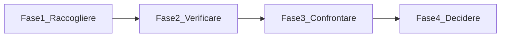

# Guida alla verifica dei fornitori e delle bollette

**Versione:** 1.0 — 6 luglio 2026  
**Contesto:** Italia (utenze domestiche)  
**Utenze coperte:** luce, gas, telefonia fissa, telefonia mobile  
**Progetto:** FamilyHub — `Codex/Mario`

---

## 1. Scopo del documento

Questa guida raccoglie linee guida, best practice, strumenti ufficiali, app e servizi web utili per:

1. **Verificare** che le bollette ricevute siano corrette (consumi, letture, voci di spesa).
2. **Confrontare** l'offerta attuale con quelle disponibili sul mercato.
3. **Decidere** se restare col fornitore, cambiare operatore o presentare un reclamo.
4. **Risparmiare** in modo consapevole, senza cadere in promozioni fuorvianti.

### Quando rivedere le utenze

| Evento | Azione consigliata |
|--------|-------------------|
| Arrivo bolletta con importo anomalo | Verifica immediata correttezza |
| Scadenza promo TLC (fisso/mobile) | Confronto offerte 30–60 giorni prima |
| Rinnovo polizza RC auto / assicurazioni | Incrociare con Switcho o comparatore dedicato |
| Cambio stagione (gas invernale) | Controllo consumi e autolettura |
| Periodicita' ordinaria | Revisione completa ogni **3–6 mesi** |

### Regola d'oro

**Prima verifica la correttezza della bolletta, poi confronta l'offerta sul mercato.** Un'offerta apparentemente conveniente non compensa errori di fatturazione o consumi stimati eccessivi.

---

## 2. Tipologie di strumenti

Non tutti i comparatori funzionano allo stesso modo. Conoscerne le differenze evita scelte sbagliate.

### 2.1 Strumenti istituzionali (imparziali)

Gestiti da **ARERA** (energia) o **AGCOM** (telecomunicazioni). Nessun accordo commerciale con i fornitori, copertura completa delle offerte obbligatorie.

| Strumento | Autorita' | URL |
|-----------|-----------|-----|
| Portale Offerte | ARERA | https://www.ilportaleofferte.it/ |
| Portale Consumi | ARERA | https://www.consumienergia.it/ |
| Sportello consumatore energia | ARERA | https://www.sportelloperilconsumatore.it/ |
| Confronta Offerte | AGCOM | https://www.confrontaofferte.agcom.it/ |
| Misura Internet | AGCOM | https://www.misurainternet.it/ |
| ConciliaWeb | AGCOM | https://conciliaweb.agcom.it/ |

**Quando usarli:** sempre, come riferimento primario per confronto offerte e verifica consumi.

### 2.2 Comparatori privati (broker)

Servizi gratuiti per l'utente, remunerati dai fornitori partner tramite commissioni di attivazione. Utili per consulenza e attivazione rapida, ma **mostrano solo un sottoinsieme di offerte**.

Esempi: Selectra, SOStariffe, Segugio, Facile.it, Comparafacile, Komparatore, Offerta-internet.it.

**Quando usarli:** come secondo parere, per consulenza telefonica o attivazione guidata. Incrociare sempre con i portali istituzionali.

### 2.3 App di analisi e switching

Analizzano la bolletta caricata (PDF) e propongono il cambio fornitore gestendo la burocrazia.

Esempi: **Switcho**, **Billoo**.

**Quando usarle:** per analisi rapida della bolletta energia e per delegare lo switch. Switcho copre anche TLC e assicurazioni; Billoo e' focalizzata su luce/gas.

---

## 3. Workflow unificato di verifica (4 fasi)

Procedura valida per tutte e quattro le utenze.

### Fase 1 — Raccogliere i dati

- [ ] Ultima bolletta in PDF o cartacea
- [ ] Contratto o scheda sintetica dell'offerta attiva
- [ ] Codici identificativi:
  - **POD** (luce) e **PDR** (gas) — in bolletta, non cambiano col fornitore
  - Codice cliente / numero di telefono (TLC)
- [ ] Storico consumi ultimi 12 mesi (Portale Consumi o area clienti)
- [ ] Data scadenza eventuale promozione

### Fase 2 — Controllare la correttezza

- [ ] Periodo di fatturazione coerente
- [ ] Lettura **RE** (reale) preferita a **ST** (stimata)
- [ ] Nessun doppio addebito o bolletta gia' pagata ripresentata
- [ ] Voci di spesa previste dal contratto (no servizi non richiesti)
- [ ] Imposte e aliquote IVA corrette
- [ ] Conguagli giustificati da stime precedenti

### Fase 3 — Confrontare il mercato

- [ ] Confronto su portale **istituzionale** (ARERA o AGCOM)
- [ ] Confronto su almeno un comparatore **privato** (secondo parere)
- [ ] Calcolo costo annuo stimato, non solo prezzo unitario (€/kWh, €/Smc, €/mese)
- [ ] Valutazione costi nascosti: attivazione, modem, penali recesso

### Fase 4 — Decidere e agire

| Esito verifica | Azione |
|----------------|--------|
| Bolletta errata | Reclamo al fornitore (sezione 9) |
| Offerta non competitiva | Cambio fornitore (switching gratuito, senza interruzione) |
| Consumi eccessivi | Ottimizzazione abitudini / efficienza energetica |
| Tutto corretto e conveniente | Annotare data prossima revisione |

---

## 4. Luce (energia elettrica)

### 4.1 Cosa controllare in bolletta

#### Dati identificativi

| Campo | Dove trovarlo | Perche' importa |
|-------|---------------|-----------------|
| **POD** | Prima pagina bolletta | Codice univoco del contatore; serve per reclami e switch |
| Potenza impegnata (kW) | Sezione tecnica | Costo fisso mensile; kW in eccesso = spreco |
| Tipo offerta | Scheda contrattuale | Fisso, variabile, indicizzato al PUN |
| Codice offerta | Bolletta o contratto | Per confronto su Portale Offerte |

#### Consumi e letture

- Consumi in **kWh**, eventualmente per fascia **F1/F2/F3** (contatori elettronici)
- Tipo rilevazione:
  - **RE** — lettura reale (distributore o telelettura)
  - **AU** — autolettura comunicata dal cliente
  - **ST** — **stimata**: rischio conguagli; da monitorare con attenzione

#### Le 4 macro-voci di spesa (ARERA)

1. **Spesa materia energia** — unica voce influenzabile dalla scelta del fornitore (prezzo energia + commercializzazione)
2. **Spesa trasporto e gestione contatore** — regolata ARERA, uguale per tutti
3. **Oneri di sistema** — regolati ARERA (incentivi rinnovabili, ecc.)
4. **Imposte** — accise e IVA

Solo la voce 1 dipende dal fornitore scelto. Confrontare offerte solo sul prezzo al kWh senza considerare quota fissa e spread e' un errore comune.

### 4.2 Strumenti consigliati

#### Ufficiali

| Strumento | URL | Uso |
|-----------|-----|-----|
| Portale Offerte ARERA | https://www.ilportaleofferte.it/ | Confronto tutte le offerte luce; ordinamento per **Costo Annuo Stimato (CAS)** |
| Portale Consumi | https://www.consumienergia.it/ | Verifica letture e consumi storici (SPID/CIE); incrocio con bolletta |
| Sportello consumatore | https://www.sportelloperilconsumatore.it/ | Informazioni e assistenza — tel. **800 166 654** |

**Suggerimento:** accedere al Portale Offerte con **SPID o CIE** per importare automaticamente i consumi reali dal Sistema Informativo Integrato (SII).

#### Privati e app

| Strumento | URL | Punto di forza |
|-----------|-----|----------------|
| Switcho | https://www.switcho.it/ | Analisi bolletta PDF, switch gestito, anche TLC |
| Billoo | https://www.billoo.it/ | Pagella convenienza 1–10, Billoo Switch |
| Selectra | https://selectra.net/ | Consulenza telefonica gratuita |
| SOStariffe | https://www.sostariffe.it/ | Comparatore multi-utenza, SOSradar mobile |
| Segugio | https://tariffe.segugio.it/ | Ampia copertura fornitori |
| Facile.it | https://www.facile.it/ | Comparatore noto, attivazione guidata |
| Comparafacile | https://www.comparafacile.com/ | Luce, gas, internet, mobile |

### 4.3 Errori comuni

| Errore | Come evitarlo |
|--------|---------------|
| Fidarsi solo del totale bolletta | Analizzare le 4 macro-voci |
| Ignorare letture ST (stimate) | Comunicare autolettura; confrontare con Portale Consumi |
| Potenza impegnata troppo alta | Valutare riduzione (es. da 4,5 kW a 3 kW se adeguato) |
| Confrontare solo €/kWh | Usare il CAS del Portale Offerte |
| Dimenticare fine mercato tutelato | Dal 1/7/2024 i clienti domestici sono in mercato libero; verificare di non essere in STG senza saperlo |

### 4.4 Come risparmiare

- **Confrontare offerte** sul Portale Offerte almeno ogni 6 mesi
- **Prezzo fisso** se si preferisce prevedibilita'; **indicizzato** se si vuole seguire il mercato (piu' rischio)
- **Ridurre potenza impegnata** se il contatore non scatta mai
- **Efficienza energetica:** LED, classe energetica A, eliminare standby
- **Monitorare consumi** via Portale Consumi (anche dati quartorari con contatore elettronico)
- **Autolettura** su contatori meccanici per evitare stime

---

## 5. Gas naturale

### 5.1 Cosa controllare in bolletta

#### Dati identificativi

| Campo | Dove trovarlo | Perche' importa |
|-------|---------------|-----------------|
| **PDR** | Prima pagina bolletta | Codice univoco punto di riconsegna gas |
| Consumi in **Smc** | Sezione consumi | Standard metri cubi corretti |
| Coefficiente **C** | Dettaglio conversione | Da mc a Smc; verificare coerenza |
| Tipologia contatore | Sezione tecnica | Elettronico vs meccanico (frequenza letture) |

#### Consumi e letture

Come per la luce: distinguere **RE**, **AU**, **ST**. Sul gas le stime errate generano conguagli particolarmente pesanti in inverno.

#### Imposte — attenzione all'IVA

| Consumo annuo | Aliquota IVA gas |
|---------------|------------------|
| Fino a ~480 Smc/anno | **10%** |
| Oltre ~480 Smc/anno | **22%** sulla parte eccedente |

Superare la soglia fa crescere il costo in modo non lineare: utile per pianificare il riscaldamento.

#### Macro-voci di spesa

Stessa struttura ARERA della luce: materia gas (scegli il fornitore), trasporto, oneri di sistema, imposte.

### 5.2 Strumenti consigliati

Gli stessi della sezione luce:

- https://www.ilportaleofferte.it/ — confronto offerte gas
- https://www.consumienergia.it/ — storico letture e consumi gas
- Switcho, Billoo, Selectra, SOStariffe, Segugio per analisi e switch

### 5.3 Errori comuni

| Errore | Come evitarlo |
|--------|---------------|
| Non comunicare l'autolettura | Su contatori meccanici, autolettura mensile o come indicato dal fornitore |
| Confondere mc e Smc | Verificare coefficiente C nella bolletta |
| Ignorare scaglione IVA 22% | Monitorare consumo annuo cumulato |
| Bollette solo stimate in inverno | Foto contatore + autolettura per bollette basate su consumi reali |
| Non manutenere la caldaia | Rendimento basso = piu' Smc per lo stesso calore |

### 5.4 Come risparmiare

- **Autolettura regolare** — giorno fisso ogni mese
- **Temperatura impianto:** 19–20°C in zona giorno, 16–17°C in notte
- **Valvole termostatiche** sui radiatori
- **Manutenzione caldaia** annuale (obbligo di legge + efficienza)
- **Confronto offerte** su Portale Offerte (fisso vs indicizzato PSv)
- **Isolamento termico** (infissi, spifferi) per ridurre i consumi strutturali

---

## 6. Telefonia fissa (ADSL / Fibra / FWA)

### 6.1 Cosa controllare in bolletta

| Voce | Cosa verificare |
|------|-----------------|
| Canone mensile | Prezzo promo vs prezzo di listino dopo scadenza sconto |
| Costi una tantum | Attivazione, installazione, spedizione modem |
| Modem/router | Comodato d'uso gratuito o acquisto/vendita? |
| Penali recesso | Durata vincolo, costo uscita anticipata |
| Velocita' dichiarata | Confrontare con misurazione reale (Misura Internet) |
| Chiamate | Incluse verso fissi/mobili/estero o a consumo? |
| Servizi aggiuntivi | Pay TV, numeri premium, antivirus, cloud — disattivare se non usati |
| Tecnologia | FTTH, FTTC, FWA: la velocita' reale dipende dalla tecnologia disponibile al tuo indirizzo |

### 6.2 Strumenti consigliati

#### Ufficiali

| Strumento | URL | Uso |
|-----------|-----|-----|
| Confronta Offerte AGCOM | https://www.confrontaofferte.agcom.it/ | Comparatore istituzionale; inserire profilo di consumo e ubicazione |
| Misura Internet | https://www.misurainternet.it/ | Misura certificata velocita' download/upload e latenza |
| Trasparenza tariffaria | Pagina su sito di ogni operatore | Elenco offerte vigenti (obbligo Delibera AGCOM 252/16/CONS) |
| ConciliaWeb | https://conciliaweb.agcom.it/ | Controversie con operatori TLC |
| AGCOM diritti utente | https://www.agcom.it/agcom-per-te/i-miei-diritti/trasparenza-delle-offerte-dei-servizi-di-telecomunicazione | Informazioni su diritti e trasparenza |

#### Privati

| Strumento | URL | Note |
|-----------|-----|------|
| Segugio | https://tariffe.segugio.it/migliori-tariffe/migliori-tariffe-adsl-telefono.aspx | Confronto fisso + energia |
| SOStariffe | https://www.sostariffe.it/ | Internet casa e mobile |
| Selectra | https://selectra.net/ | Consulenza gratuita |
| Offerta-internet.it | https://offerta-internet.it/tariffe | Comparatore con copertura per indirizzo |
| Komparatore | https://www.komparatore.it/ | Principalmente mobile, anche bundle |
| Comparafacile | https://www.comparafacile.com/ | Multi-utenza |
| Switcho | https://www.switcho.it/ | Analisi e attivazione internet casa |

### 6.3 Errori comuni

| Errore | Come evitarlo |
|--------|---------------|
| Guardare solo il prezzo promo (es. 6 mesi) | Calcolare costo totale su 24 mesi |
| Non verificare copertura reale | Controllare FTTH/FTTC/FWA al proprio indirizzo prima di ordinare |
| Modem non restituito a fine contratto | Addebito automatico; restituire entro i termini |
| Servizi premium attivati per errore | Controllare voce "Servizi e contenuti" in bolletta |
| Velocita' inferiore a quella contrattata | Misura su misurainternet.it; reclamo se difformita' persistente |
| Bundle fisso+mobile conveniente solo sulla carta | Confrontare costi separati vs convergenti |

### 6.4 Come risparmiare

- Confrontare su **Confronta Offerte AGCOM** prima di ogni rinnovo
- Scegliere la **tecnologia adeguata** (FWA solo se fibra non disponibile)
- **Disattivare opzioni** non utilizzate (extra chiamate, IP statico, servizi cloud)
- **Negoziare** con operatore attuale: spesso offrono retention discount se minacci il port-out
- Valutare **operatori secondari** (Fastweb, Tiscali, Linkem, EOLO) vs incumbent
- Usare **Wi-Fi domestico** per ridurre traffico dati mobile

---

## 7. Telefonia mobile

### 7.1 Cosa controllare

| Voce | Cosa verificare |
|------|-----------------|
| Giga inclusi vs usati | Downgrade se si usano meno del 50% del bundle |
| Minuti e SMS | Offerte "voce" vs "dati" — pagare solo cio' che serve |
| Roaming | Costi UE (generalmente inclusi) vs extra-UE |
| Servizi a pagamento | Abbonamenti SMS, ringtone, scommesse, charity |
| Rinnovo offerta | Data rinnovo e prezzo post-promo |
| Portabilita' | Offerte "port in" spesso 2–5 €/mese meno costose |
| Multi-SIM famiglia | Piani famiglia vs singole SIM MVNO |

### 7.2 Strumenti consigliati

#### Fonte primaria: app e area clienti operatore

| Operatore | Canale | Note |
|-----------|--------|------|
| TIM | App MyTIM / 40916 | Mobile e fisso |
| Vodafone | App My Vodafone / 414 | — |
| WINDTRE | App WINDTRE / 4242 | Mobile e fisso |
| Iliad | Area Personale web / SMS al 400 | Nessuna app dedicata |
| ho. Mobile | App ho. / 42121 | MVNO Vodafone |
| Kena Mobile | App / 40181 | MVNO TIM |
| Very Mobile | App / 1929 | MVNO Vodafone |
| Fastweb Mobile | App / 4046 | — |
| Spusu | App / sito | MVNO low-cost |

#### Comparatori e istituzionali

| Strumento | URL | Uso |
|-----------|-----|-----|
| Confronta Offerte AGCOM | https://www.confrontaofferte.agcom.it/ | Confronto istituzionale |
| Komparatore | https://www.komparatore.it/tariffe-cellulari | Filtri giga, prezzo, 5G, port in |
| SOStariffe | https://www.sostariffe.it/ | SOSradar per scoring offerte |
| Segugio | https://tariffe.segugio.it/ | Offerte aggiornate quotidianamente |
| Selectra | https://selectra.net/ | Consulenza |
| Switcho | https://www.switcho.it/ | Analisi e cambio SIM |

#### Controllo traffico dati sullo smartphone

- **Android:** Impostazioni → Rete e Internet → Utilizzo dati
- **iPhone:** Impostazioni → Cellulare
- App di terze parti (opzionali): My Data Manager, Traffic Monitor

### 7.3 Errori comuni

| Errore | Come evitarlo |
|--------|---------------|
| Piani da 100+ GB con uso reale sotto i 20 GB | Passare a offerta da 20–50 GB |
| Servizi premium attivi (5–10 €/mese) | Controllare dettaglio traffico in app |
| Roaming extra-UE senza pacchetto | Attivare add-on prima del viaggio |
| Dimenticare scadenza promo | Annotare in calendario (modulo Scadenze FamilyHub) |
| Non usare portabilita' | Offerte port in piu' vantaggiose del nuovo numero |
| Pagare per il 5G senza telefono 5G | Verificare compatibilita' dispositivo |

### 7.4 Come risparmiare

- **Confrontare MVNO** (Iliad, ho., Very, Kena, Spusu, Lyca) vs operatori tradizionali
- **Wi-Fi a casa** per streaming e aggiornamenti
- **Disattivare servizi SMS premium** (verificare in app operatore)
- **Offerte port in** al rinnovo contratto
- **Piani famiglia** se 3+ linee nella stessa famiglia
- **Monitorare consumi** ogni mese via app operatore

---

## 8. Catalogo strumenti riepilogativo

| Nome | Tipo | Utenze | Gratuito | Punto di forza | Limiti |
|------|------|--------|:--------:|----------------|--------|
| [Portale Offerte ARERA](https://www.ilportaleofferte.it/) | Istituzionale | Luce, gas | Si' | Tutte le offerte, CAS imparziale | Non gestisce lo switch |
| [Portale Consumi](https://www.consumienergia.it/) | Istituzionale | Luce, gas | Si' | Storico letture/consumi da SII | Richiede SPID/CIE |
| [Sportello consumatore](https://www.sportelloperilconsumatore.it/) | Istituzionale | Luce, gas | Si' | Assistenza tel. 800 166 654 | Solo informativo |
| [Confronta Offerte AGCOM](https://www.confrontaofferte.agcom.it/) | Istituzionale | Fisso, mobile | Si' | Comparatore TLC ufficiale | UX datata |
| [Misura Internet](https://www.misurainternet.it/) | Istituzionale | Fisso | Si' | Misura certificata velocita' | Solo rete fissa |
| [ConciliaWeb](https://conciliaweb.agcom.it/) | Istituzionale | Fisso, mobile, Pay TV | Si' | Conciliazione gratuita | Solo controversie |
| [Switcho](https://www.switcho.it/) | App / web | Luce, gas, fisso, mobile, RC auto | Si' | Analisi bolletta, switch gestito, trasparenza | Partner commerciali |
| [Billoo](https://www.billoo.it/) | App / web | Luce, gas | Si' / freemium | Pagella convenienza, switch rapido | Premium a pagamento (Billoo Pass) |
| [Selectra](https://selectra.net/) | Comparatore | Luce, gas, fisso, mobile, assicurazioni | Si' | Consulenza telefonica estesa | Solo fornitori partner |
| [SOStariffe](https://www.sostariffe.it/) | Comparatore | Luce, gas, fisso, mobile, TV | Si' | SOSradar scoring, ampia copertura | Solo fornitori partner |
| [Segugio](https://tariffe.segugio.it/) | Comparatore | Luce, gas, fisso, mobile | Si' | Molti fornitori, offerte giornaliere | Solo fornitori partner |
| [Facile.it](https://www.facile.it/) | Comparatore | Luce, gas, fisso, mobile | Si' | Brand noto, attivazione guidata | Richiede dati personali |
| [Comparafacile](https://www.comparafacile.com/) | Comparatore | Luce, gas, fisso, mobile, TV | Si' | Multi-utenza, consulenza | Solo fornitori partner |
| [Komparatore](https://www.komparatore.it/) | Comparatore | Mobile (anche fisso) | Si' | Filtri dettagliati, port in | Principalmente mobile |
| [Offerta-internet.it](https://offerta-internet.it/) | Comparatore | Fisso, mobile | Si' | Copertura per indirizzo | Focus telecom |
| [Altroconsumo](https://www.altroconsumo.it/) | Comparatore / tutela | Luce, gas | Abbonamento | Modelli reclamo, indipendenza | Comparatore a pagamento per soci |
| [Conciliazione ARERA](https://www.arera.it/consumatori/conciliazione) | Istituzionale | Luce, gas, acqua, rifiuti | Si' | Conciliazione obbligatoria pre-giudizio | Solo post-reclamo |

### Disclaimer sui comparatori privati

I comparatori privati sono **broker**: mostrano offerte di fornitori partner e percepiscono commissioni sulle attivazioni. Le condizioni possono essere uguali o migliori rispetto al sito diretto del fornitore, ma **non sostituiscono** il Portale Offerte ARERA o Confronta Offerte AGCOM per una visione completa del mercato.

---

## 9. Reclami, contestazioni e tutela

### 9.1 Energia (luce e gas)

#### Step 1 — Reclamo al fornitore

Inviare comunicazione scritta via **PEC** o **raccomandata A/R** includendo:

- Nome, cognome, indirizzo fornitura
- Codice **POD** (luce) e/o **PDR** (gas)
- Codice cliente
- Descrizione sintetica dell'anomalia
- Allegati: bollette contestate, foto contatore, ricevute pagamento, contratto

**Motivi frequenti di contestazione:**

- Consumi stimati (ST) troppo alti
- Doppio addebito o bolletta gia' pagata
- Voci non previste dal contratto
- Variazioni tariffarie non comunicate
- Conguagli non giustificati

**Termine risposta fornitore:** **40 giorni** (50 per telecalore).

#### Step 2 — Servizio Conciliazione ARERA

Se la risposta e' insoddisfacente o assente:

1. Registrarsi al servizio online: https://www.arera.it/consumatori/conciliazione
2. Compilare la domanda allegando reclamo e documentazione
3. Partecipare alla sessione di conciliazione (web o telefono) con operatore terzo neutrale

**Gratuito**, obbligatorio prima di azione legale. Conclusione entro **90 giorni** dalla domanda completa.

#### Modelli utili

- Altroconsumo — contestazione bolletta: https://www.altroconsumo.it/casa-energia/elettricita-e-gas/modelli-lettere/contestazione-bolletta-elettricitgas

### 9.2 Telecomunicazioni (fisso e mobile)

#### Step 1 — Reclamo all'operatore

Via PEC, raccomandata o form online dell'operatore. Includere codice cliente, numero di telefono, descrizione e allegati.

#### Step 2 — ConciliaWeb AGCOM

Se il reclamo non viene risolto: https://conciliaweb.agcom.it/

Piattaforma gratuita per controversie su telefonia, internet e Pay TV.

### 9.3 Cambio fornitore (switching)

| Utenza | Costo switch | Interruzione servizio | Chi gestisce |
|--------|:------------:|:---------------------:|--------------|
| Luce | Gratuito | Nessuna | Nuovo venditore |
| Gas | Gratuito | Nessuna | Nuovo venditore |
| Fisso | Variabile (verificare penali) | Breve interruzione possibile | Nuovo operatore |
| Mobile | Gratuito (portabilita' numero) | Nessuna | Nuovo operatore |

Per luce e gas lo switch e' puramente amministrativo: non cambiano contatore, POD o PDR.

---

## 10. Checklist operativa rapida

Usare questa checklist a ogni revisione periodica o quando arriva una bolletta sospetta.

### Correttezza bolletta

- [ ] Periodo fatturato corretto
- [ ] Lettura RE o AU (non solo ST)
- [ ] Consumi coerenti con storico (Portale Consumi / app operatore)
- [ ] Nessun servizio non richiesto addebitato
- [ ] Imposte e IVA corrette
- [ ] POD/PDR e importi corrispondono alla fornitura giusta

### Convenienza offerta

- [ ] Confronto su portale istituzionale (ARERA o AGCOM)
- [ ] Confronto su almeno un comparatore privato
- [ ] Costo annuo stimato calcolato (non solo prezzo unitario)
- [ ] Costi nascosti verificati (attivazione, modem, penali)
- [ ] Scadenza promo annotata

### Decisione

- [ ] **Restare** — offerta ancora competitiva e bolletta corretta
- [ ] **Cambiare** — attivare switch (Switcho, fornitore diretto o comparatore)
- [ ] **Reclamare** — inviare contestazione scritta al fornitore
- [ ] **Ottimizzare** — ridurre consumi, potenza, servizi aggiuntivi

### Documentazione

- [ ] Data revisione annotata
- [ ] Esito decisione registrato (futuro modulo Utenze FamilyHub)
- [ ] Prossima revisione in calendario (+3 o +6 mesi)

---

## 11. Collegamento con FamilyHub

Questa guida si integra con il progetto FamilyHub descritto in [`PIANO-PROGETTO.md`](../PIANO-PROGETTO.md):

| Modulo FamilyHub | Utilizzo di questa guida |
|------------------|-------------------------|
| **Scadenze** | Rinnovi offerte luce/gas, fine promo TLC, autolettura gas, revisione semestrale |
| **Progetti** | Progetto "Ottimizzazione utenze" con task per ogni fornitore |
| **Idee** | Note su offerte interessanti da valutare |
| **Assicurazioni** | Switcho copre anche RC auto/moto — verifica incrociata |
| **Utenze** (futuro) | Archivio bollette PDF, storico fornitori, CAS al momento del switch |

Per la gestione finanziaria del risparmio ottenuto, fare riferimento al progetto `Finance` nel monorepo Codex.

---

## 12. Riferimenti

| Risorsa | URL |
|---------|-----|
| ARERA — Consumatori | https://www.arera.it/consumatori |
| ARERA — Portale Offerte | https://www.ilportaleofferte.it/ |
| ARERA — Portale Consumi | https://www.consumienergia.it/ |
| AGCOM — I miei diritti | https://www.agcom.it/agcom-per-te/i-miei-diritti |
| AGCOM — Confronta Offerte | https://www.confrontaofferte.agcom.it/ |
| AGCOM — ConciliaWeb | https://conciliaweb.agcom.it/ |
| Sportello consumatore energia | https://www.sportelloperilconsumatore.it/ |
| Piano FamilyHub | [`../PIANO-PROGETTO.md`](../PIANO-PROGETTO.md) |

---

*Documento redatto per uso familiare. Le condizioni di mercato, le offerte e la normativa evolvono: verificare sempre i portali istituzionali per informazioni aggiornate.*
